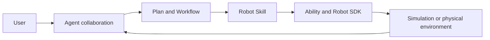



Architecture, user, and developer documentation for embodied applications

From Agent collaboration and task planning to Robot Skill, Ability, Robot SDK, simulation, and real-robot execution.

  <a class="btn btn-lg btn-light me-3 mb-2" href="">Understand Semantic</a>
  <a class="btn btn-lg btn-secondary me-3 mb-2" href="">Get started</a>
  <a class="btn btn-lg btn-secondary mb-2" href="">Build extensions</a>



{}

## One complete embodied task

Semantic keeps user goals, environment understanding, multi-Agent collaboration, and physical robot actions in the same Project.

  

    <h4>Architecture</h4>
    
Learn how Project, environments, Agents, Workflow, Robot execution, and extension points form the framework.

    <a href="">Read architecture →</a>
  

  

    <h4>User Guide</h4>
    
Use Semantic Studio to connect environments and Robots, plan through Conversation, and observe execution.

    <a href="">Open User Guide →</a>
  

  

    <h4>Developer Guide</h4>
    
Build Agent Skills, Robot Skills, Abilities, Robot SDKs, Scenes, Runtimes, and core framework extensions.

    <a href="">Open Developer Guide →</a>
  

{}
