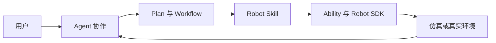



面向具身应用的架构、使用与开发文档

从 Agent 协作和任务规划，到 Robot Skill、Ability、Robot SDK、仿真与真机执行。

  <a class="btn btn-lg btn-light me-3 mb-2" href="">了解 Semantic</a>
  <a class="btn btn-lg btn-secondary me-3 mb-2" href="">开始使用</a>
  <a class="btn btn-lg btn-secondary mb-2" href="">开发扩展</a>



{}

## 一条完整的具身任务

Semantic 将用户目标、环境理解、多个 Agent 的协作和 Robot 的实际行动组织在同一个 Project 中。

  

    <h4>架构文档</h4>
    
理解 Project、环境、Agent、Workflow、Robot 执行和扩展模型如何组成完整的具身应用框架。

    <a href="">进入架构 →</a>
  

  

    <h4>用户手册</h4>
    
使用 Semantic Studio 连接环境与 Robot，通过 Conversation 规划任务，并观察和控制实际执行。

    <a href="">进入用户手册 →</a>
  

  

    <h4>开发者文档</h4>
    
开发 Agent Skill、Robot Skill、Ability、Robot SDK、Scene 和 Runtime，并参与 Semantic 核心开发。

    <a href="">进入开发者文档 →</a>
  

{}
