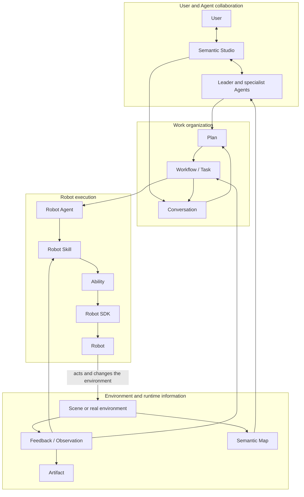
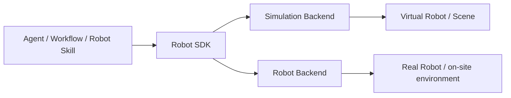

Semantic is built for embodied AI applications that work in real or simulated environments. A user goal usually names objects, spatial relations, and completion requirements. It has to be completed step by step through environment understanding, task planning, and Robot capabilities. For example:

> Move the top-layer tote on pallet A to an empty stacking column on pallet B.

To finish that goal, the system first has to understand the totes, pallets, free space, and Robot in the environment, then organize work that can keep progressing, and finally have the Robot act in the environment. After the action happens, the system has to obtain environment information again, judge the result, and decide what to do next.

Semantic organizes this process as a continuous embodied loop:

```text
Understand the user goal and the environment
→ Organize the work that needs to be done
→ Choose Agents, Robots, and embodied capabilities
→ The Robot acts in the environment
→ Obtain Feedback and Observation
→ Update task and environment information
→ Continue, adjust the work, or complete the goal
```

This chapter starts from that main line and introduces how Project, Agent, Workflow, Robot execution, and environment information together make up Semantic. Later chapters expand each part.

## The full course of one embodied task

The diagram below uses depalletizing as an example. It shows how a goal moves from Conversation into Robot execution, and how environment change then drives later work.



The diagram contains two connected loops.

The first loop runs among the user, Agents, and Workflow. The user states a goal. Agents understand the goal and the environment, form a plan, and organize Tasks. Workflow keeps the confirmed work and lets different Tasks continue when the right conditions are met.

The second loop runs between the Robot and the environment. Robot Skill drives the Robot through Ability and Robot SDK. The Robot's actions change the environment. Execution produces Feedback, and an Agent or Robot Skill can also obtain Observation on demand. That information returns to the current execution and to Workflow, so the system can judge whether an action is complete and what should happen next.

The two loops together make one embodied task. Upper-level work does not stop at a written plan, and lower-level Robot action does not happen outside the user goal and task context.

## Project provides a shared working environment

A Project is the workspace of one embodied application. It places users, Agents, the environment, Robots, and runtime history in one continuing context, so development, debugging, and production runs all center on the same application.

In a Project, a user can:

- collaborate with multiple Agents through Conversation;
- choose or develop Scenes, Layouts, and other environment resources;
- use Semantic Map to understand objects, regions, and spatial relations in the environment;
- configure Agents, Robots, and Skills that can take part in the work;
- review Plans and observe Workflow and Robot execution;
- inspect Artifacts such as images, depth, point clouds, reports, and logs.

Semantic Studio is the main interface for a Project. Conversation, environment, tasks, and Robot runs are connected as different views of the same embodied application. For example, a user can propose a transfer goal in Conversation, select the target tote in Semantic Map, watch the task progress in Workflow, and then open Robot Execution to observe grasp and place.

How a Project organizes resources, development content, and runtime views is covered further in the "Project and Studio" chapter.

## Users collaborate with multiple Agents

An embodied task usually needs continuous understanding, planning, execution, and adjustment. Semantic lets multiple Agents with different roles collaborate around the same Project and the same task system.

### Leader connects the user goal to the overall work

Leader is the user's main collaborator in Conversation. It understands what the user wants to finish, forms an overall plan from the current environment and Project information, and coordinates work that different Agents or Robots need to complete.

When a goal involves a business choice, an authorization requirement, or something that cannot be determined from environment information, an Agent can keep asking the user through an Interaction. The user's answer returns to the original work context. Later planning continues from information that already exists, instead of starting an isolated conversation again.

### Different Agents take different work

One Workflow can contain Tasks of different kinds. Environment analysis, engineering development, runtime monitoring, and Robot operation can each go to an Agent that is good at that work. An Agent plans and executes from its role, available Skills, tools, and task context.

Robot Agent is the role that faces embodied execution. It represents one concrete Robot, understands the current Robot Task, chooses a suitable Robot Skill, and adjusts when execution meets change. Robot Agent handles task semantics and action choice. Concrete motion, control, and sensing are done by Robot Skill, Ability, and Robot SDK.

An Agent can also request a short consultation to analyze existing information or add a specialist judgment. A consultation serves the current work. It does not automatically expand into another long-lived task structure.

### Collaboration is built on clear information

Multiple Agents exchange information through Conversation, Task goals and inputs, predecessor Task results, Interaction answers, and runtime results. Each Agent understands and judges from the information the current work needs. All Agents are not required to share one ever-growing model history.

An Agent's identity and task context can persist. The model runs only when understanding, planning, decision, or summarization is needed. Robot execution and environment waits continue through the runtime system, so a long embodied task does not need one permanently resident model call.

## Agents and Workflow advance the work together

Agents and Workflow each take one of two kinds of work in an embodied task.

An Agent is responsible for decisions that need semantic understanding, for example:

- understanding the user goal;
- querying and selecting objects or regions in the environment;
- splitting the goal into Tasks that different roles can finish;
- planning steps for the current Task;
- adjusting work that has not started yet when new environment information arrives;
- asking the user to decide when needed.

Workflow is responsible for organizing work that already exists: the Tasks that need to be finished, the relations among Tasks, current progress, and execution results. It lets one piece of work keep progressing across many Agent runs, many Robot actions, and long physical waits.

The relationship can be summarized as:

> Agents decide how work should be organized and adjusted. Workflow lets confirmed work keep progressing.

When the work reaches a point that needs semantic judgment, the Framework starts the corresponding Agent. When the next step is already clear, Workflow advances the Task or SubTask. After a Robot finishes an action, a user answers a question, or available resources change, the new runtime information drives the next step.

In a single-tote transfer, the overall work can be expressed as one Robot Task. The Robot Agent that owns that Task then organizes it into source navigation, grasp, loaded travel, and place. Workflow cares whether those steps can start and whether they are already finished. Robot Agent cares which operation to choose now and how to adjust after change.

The detailed relationships among Plan, Workflow, Task, and SubTask are covered in the "Planning and Workflow" chapter.

## Robot execution connects semantics to the body

Robot Agent faces a goal with business meaning, such as "grasp the specified tote" or "place the current tote into the target stacking column". When the Robot actually executes, those goals are realized through several layers:

```text
Robot Agent
→ Robot Skill
→ Ability
→ Robot SDK
→ Robot
```

### Robot Skill organizes one embodied operation

A Robot Skill expresses a reusable embodied operation, such as grasping an object, semantic navigation, or placing an object. It organizes one operation as a continuous execution process, advances the current motion from Feedback, and actively observes the environment at key points.

Robot Skill handles the local loop inside an operation. Grasp does not mean sending one gripper-close command. It also includes re-observing the target, planning an approach, executing motion, checking tool and object state, and returning a result after the completion requirements are met.

### Ability provides composable Robot capabilities

Ability provides navigation, manipulator motion, end-effector control, Robot state, sensor capture, object perception, and grasp planning. Robot Skill uses these capabilities to observe the current environment and execute actions, without needing to know the concrete interface of every Robot or Backend.

### Robot SDK connects a concrete Robot

Robot SDK gives one Robot model a consistent control, state, and sensing interface, and connects a real Robot or a simulation Runtime through different Backends. Differences in Robot model, coordinate frames, joints, tools, and device interfaces are adapted at this layer.

This layering keeps a clear link between upper-level semantics and lower-level bodily capability: Agents understand the business goal, Robot Skill organizes the embodied operation, Ability provides composable capabilities, and Robot SDK connects the concrete Robot.

## Environment information returns to the task

Robot actions change the environment. Semantic expresses execution and environment information through Feedback, Observation, Semantic Map, and Artifact, so a task can keep progressing from the new situation on site.

### Feedback expresses the execution process

Feedback is information the execution layer actively returns upward during an action, such as motion progress, control error, tool state, sensor readings, and error changes. Robot Skill uses Feedback to understand how the current Action is advancing. Studio can also use it to show a continuous execution process.

### Observation actively inspects the current state

Observation is an inspection that an Agent or Robot Skill starts in order to judge the current situation. For example:

- relocate the tote that is about to be grasped;
- check whether both tools are still in contact with the same object;
- observe whether the target stacking column is currently available;
- confirm that the object stays stable after place.

Observation answers "what is actually happening now". It comes from the current environment and Robot state, not from the expected state in the plan.

### Semantic Map expresses environment semantics

Semantic Map expresses objects, regions, and the spatial relations among them. An Agent can use it to understand semantic targets such as "the top-layer tote on pallet A", "an empty position in the target region", or "the region where the Robot currently is".

In form, Semantic Map is like environment memory. It gathers information from Scene, perception, task results, and user corrections, and helps Agents plan and choose targets. When a Robot Skill actually grasps, moves, or places, it still obtains the current Observation through Ability and finishes the concrete action from the on-site state.

### Artifact stores resources that can be viewed and reused

An Artifact is a data resource or runtime product that is stored, viewed, referenced, and reused in a Project, including images, depth, point clouds, video, models, reports, and logs. Users can view them, and later Agent work and tasks can keep using them.

## Event-driven continuous operation

An embodied task contains activities on many time scales: a model may finish planning in seconds, a Robot action may last minutes, and the environment may change at any time. Semantic perceives these changes through events and drives related work to continue.

Typical changes include:

- a user answered an Interaction;
- a Task or Robot operation finished;
- a Robot became available;
- Robot execution met a situation that needs an Agent;
- a Scene started, reset, or stopped;
- an Agent finished one planning, adjustment, or summary.

An event expresses "what changed". Conversation, Task, Interaction, and execution results express the business content associated with that change. The Framework combines both to decide the next action, such as advancing the next piece of work, starting an Agent to keep judging, waiting for a user answer, or updating runtime state in Studio.

For example:

```text
The Robot finishes the grasp
→ the current operation returns a result
→ Workflow advances to loaded travel
→ Robot Agent prepares the next Robot Skill
```

And another example:

```text
Robot Skill meets a situation it cannot handle locally
→ execution asks Robot Agent to decide
→ Robot Agent adjusts from the current Task and runtime information
→ execution continues, or the issue is handed to the user
```

Event-driven operation lets Agent collaboration, Workflow progress, and Robot execution run on their own suitable time scales, while keeping one embodied task continuous.

## Scene lifecycle works with Robot execution

In a simulation application, Scene provides the environment in which the Robot acts. After a Project chooses a Scene and Layout, the simulation Runtime creates a concrete Scene Instance and loads Robots, objects, regions, sensors, and the physical environment.

A Virtual Robot in a Scene takes part in tasks as an ordinary Robot. Robot Skill still controls it through Ability and Robot SDK. Actions happen in the current Scene Instance and change Robot and object state in the scene. Environment information produced by the Scene can enter Semantic Map, Observation, Artifact, and Studio Viewer.

Scene lifecycle and Robot execution look at the same runtime environment, but they take different work:

- Scene lifecycle prepares, resets, and ends the environment;
- Robot execution completes embodied actions in an environment that is already running.

When a Scene needs to reset or stop, the Framework coordinates the current Robot action with the environment lifecycle, so new work continues from a consistent environment state. Concrete Runtime start, Robot attach, and stop processes are covered in the deployment and implementation documents.

## Simulation and real robots share the same task semantics

Project, Conversation, Agent, Plan, Workflow, Robot Skill, and runtime information in Semantic apply to both simulated Robots and real Robots.

In simulation, Robot SDK connects the Virtual Robot in the Runtime through a simulation Backend, and Robot actions change physical state in the Scene. In a real environment, Robot SDK connects Robot hardware through a device Backend, and perception systems and Robot sensors provide on-site information.



The two run modes share task goals and Robot Skill semantics, so developers can build and debug an embodied application in simulation and then connect the same upper-level working style to a real Robot. Physical models, sensors, and safety requirements in different environments are expressed by the corresponding Backend and deployment configuration.

## From the overall run into later chapters

This chapter introduced the full runtime main line of a Semantic embodied system:

```text
Users and multiple Agents understand the goal
→ Workflow organizes and advances the work
→ The Robot executes embodied actions
→ Environment information returns to the system
→ Events drive the next collaboration and execution
```

Later chapters expand along this main line:

- **Project and Studio**: how an embodied application organizes resources, development, and runtime;
- **Environment, perception, and Semantic Map**: how the system expresses the environment and obtains current information;
- **Agents and collaboration**: how Agents use Skills, tools, and context to finish work together;
- **Planning and Workflow**: how a goal becomes Tasks and keeps progressing;
- **Robot execution and the embodied loop**: how Robot Skill, Ability, and Robot SDK complete an action;
- **Semantic extension model**: how developers add new Agent, Skill, Robot, and Scene capabilities;
- **Simulation, real robots, and deployment**: how the same design enters different runtime environments.
