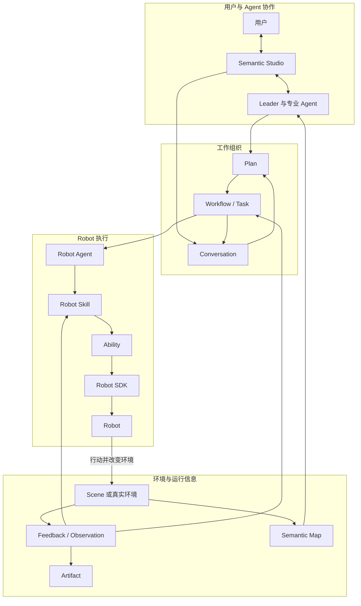
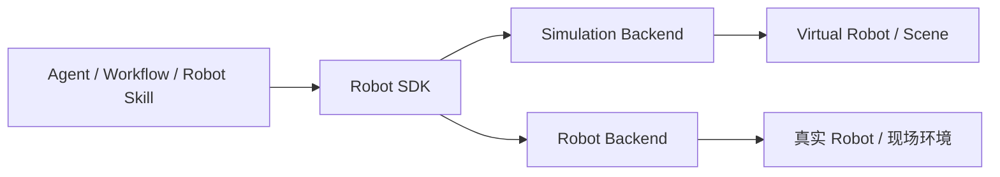

Semantic 面向在真实或仿真环境中工作的具身智能应用。用户目标通常包含对象、空间关系和完成要求，需要结合环境理解、任务规划与 Robot 能力逐步完成，例如：

> 把托盘 A 顶层的周转箱搬到托盘 B 的空闲堆叠列。

完成这个目标，需要先理解环境中的箱体、托盘、可用空间和 Robot，再把目标组织成可以持续推进的工作，最后由 Robot 在环境中执行行动。行动发生后，系统还要重新获得环境信息，判断结果并决定下一步。

Semantic 将这个过程组织为一个持续的具身闭环：

```text
理解用户目标和环境
→ 组织需要完成的工作
→ 选择 Agent、Robot 和具身能力
→ Robot 在环境中行动
→ 获取 Feedback 和 Observation
→ 更新任务与环境信息
→ 继续执行、调整工作或完成目标
```

本章从这条主线出发，介绍 Project、Agent、Workflow、Robot 执行和环境信息如何共同组成 Semantic。后续章节再分别展开各部分的设计。

## 一项具身任务的完整过程

下面的示意图以拆码垛为例，展示一个目标如何从 Conversation 进入 Robot 执行，并由环境变化推动后续工作。



这张图包含两个相互连接的循环。

第一个循环发生在用户、Agent 和 Workflow 之间。用户说明目标，Agent 理解目标和环境，形成计划并组织 Task；Workflow 保存已经确认的工作，并让不同 Task 在合适的条件下继续推进。

第二个循环发生在 Robot 和环境之间。Robot Skill 通过 Ability 和 Robot SDK 驱动 Robot，Robot 的行动改变环境；执行过程产生 Feedback，Agent 或 Robot Skill 也可以主动取得 Observation。这些信息回到当前执行和 Workflow，使系统能够判断行动是否完成以及下一步应该做什么。

两个循环共同构成一项具身任务。上层工作不会停留在文字计划中，底层 Robot 行动也不会脱离用户目标和任务上下文独立发生。

## Project 提供共同工作的环境

Project 是一项具身应用的工作空间。它把用户、Agent、环境、Robot 和运行过程放在同一个持续上下文中，使开发、调试和正式运行围绕同一项应用展开。

在一个 Project 中，用户可以：

- 通过 Conversation 与多个 Agent 协作；
- 选择或开发 Scene、Layout 和其他环境资源；
- 使用 Semantic Map 理解环境中的对象、区域和空间关系；
- 配置可以参与工作的 Agent、Robot 和 Skill；
- 审阅 Plan，观察 Workflow 和 Robot 执行；
- 查看图像、深度、点云、报告和日志等 Artifact。

Semantic Studio 是 Project 的主要交互界面。Conversation、环境、任务和 Robot 运行以同一项具身应用的不同视角相互连接。例如，用户可以从 Conversation 中提出搬运目标，在 Semantic Map 中选择目标箱体，在 Workflow 中查看任务推进，再进入 Robot Execution 观察抓取和放置过程。

Project 如何组织资源、开发内容和运行视图，将在“Project 与 Studio”一章进一步说明。

## 用户与多个 Agent 协作

具身任务通常需要连续的理解、规划、执行和调整。Semantic 让多个具有不同角色的 Agent 围绕同一个 Project 和任务体系协作。

### Leader 连接用户目标与整体工作

Leader 是用户在 Conversation 中的主要协作对象。它理解用户希望完成什么，结合当前环境和 Project 信息形成整体计划，并协调需要由不同 Agent 或 Robot 完成的工作。

当目标存在业务选择、授权要求或无法从环境信息中确定的内容时，Agent 可以通过 Interaction 继续向用户询问。用户的回答会回到原来的工作上下文，后续规划从已经形成的信息继续，而不是重新开始一次孤立的对话。

### 不同 Agent 承担不同工作

一项 Workflow 可以包含不同性质的 Task。环境分析、工程开发、运行监测和 Robot 操作可以分别交给擅长这些工作的 Agent。Agent 根据自己的角色、可用 Skill、工具和任务上下文完成规划与执行。

Robot Agent 是其中面向具身执行的角色。它代表一台具体 Robot 参与工作，理解当前 Robot Task，选择合适的 Robot Skill，并在执行遇到变化时作出调整。Robot Agent 处理的是任务语义和行动选择；具体运动、控制和传感处理由 Robot Skill、Ability 和 Robot SDK 完成。

Agent 也可以请求短时咨询，用于分析已有信息或补充专业判断。咨询服务于当前工作，不会自动扩展为另一套长期任务结构。

### 协作建立在清晰的信息上

多个 Agent 通过 Conversation、Task 目标与输入、前置 Task 结果、Interaction 回答和运行结果交换信息。每个 Agent 都从当前工作需要的信息出发进行理解和判断，不要求所有 Agent 共享一段不断增长的模型历史。

Agent 的身份和任务上下文可以持续存在，模型只在需要理解、规划、决策或总结时运行。Robot 执行和环境等待由运行系统继续推进，因此一个耗时较长的具身任务不需要维持一次常驻的模型调用。

## Agent 与 Workflow 共同推进工作

Agent 和 Workflow 分别承担具身任务中的两类工作。

Agent 负责需要语义理解的决定，例如：

- 理解用户目标；
- 查询和选择环境中的对象或区域；
- 将目标拆分为适合不同角色完成的 Task；
- 为当前 Task 规划步骤；
- 根据新的环境信息调整尚未执行的工作；
- 在需要时请求用户决定。

Workflow 负责组织已经形成的工作，包括需要完成的 Task、Task 之间的关系、当前进展和执行结果。它让一项工作可以跨越多次 Agent 运行、多个 Robot 行动和较长的物理等待持续推进。

两者的关系可以概括为：

> Agent 决定工作应该如何组织和调整，Workflow 让已经确认的工作持续推进。

当工作进入需要语义判断的位置时，Framework 启动相应 Agent 继续处理；当下一步已经明确时，Workflow 推进 Task 或 SubTask 执行。Robot 完成行动、用户回答问题或可用资源发生变化后，新的运行信息又会推动下一步工作。

以单箱搬运为例，整体工作可以表达为一个 Robot Task；负责这项任务的 Robot Agent 再将它组织为来源导航、抓取、携物导航和放置等步骤。Workflow 关注这些步骤是否能够开始和是否已经完成，Robot Agent 关注当前应该选择什么操作以及出现变化后如何调整。

Plan、Workflow、Task 和 SubTask 的详细关系将在“任务规划与 Workflow”一章展开。

## Robot 执行连接语义与身体

Robot Agent 面对的是带有业务含义的目标，例如“抓取指定箱体”或“将当前箱体放入目标堆叠列”。Robot 真正执行时，这些目标会经过多个层次逐步落实：

```text
Robot Agent
→ Robot Skill
→ Ability
→ Robot SDK
→ Robot
```

### Robot Skill 组织一项具身操作

Robot Skill 表达可以复用的具身操作，例如抓取物体、语义导航和放置物体。它将一次操作组织为连续的执行过程，根据 Feedback 推进当前动作，并在关键位置主动观察环境。

Robot Skill 处理操作过程中的局部闭环。例如，抓取不只意味着发送一次夹具闭合命令，还包括重新观察目标、规划接近方式、执行运动、检查工具与物体状态，并在满足完成要求后返回结果。

### Ability 提供可组合的 Robot 能力

Ability 提供导航、机械臂运动、末端工具控制、Robot 状态、传感采集、物体感知和抓取规划等能力。Robot Skill 通过这些能力观察当前环境并执行动作，而不需要了解每一种 Robot 或 Backend 的具体接口。

### Robot SDK 连接具体 Robot

Robot SDK 面向一个 Robot 型号提供一致的控制、状态和传感接口，并通过不同 Backend 连接真实 Robot 或仿真 Runtime。Robot 型号、坐标系、关节、工具和设备接口的差异在这一层得到适配。

这样的分层让上层语义和下层身体能力保持清晰联系：Agent 理解业务目标，Robot Skill 组织具身操作，Ability 提供可组合能力，Robot SDK 连接具体 Robot。

## 环境信息返回任务过程

Robot 行动会改变环境。Semantic 通过 Feedback、Observation、Semantic Map 和 Artifact 表达执行过程与环境信息，使任务可以根据新的现场情况继续推进。

### Feedback 表达执行过程

Feedback 是执行层在行动过程中主动向上返回的信息，例如运动进度、控制偏差、工具状态、传感器读数和错误变化。Robot Skill 使用 Feedback 了解当前 Action 如何推进，Studio 也可以据此展示连续的执行过程。

### Observation 主动观察当前状态

Observation 是 Agent 或 Robot Skill 为了判断当前情况而主动发起的观察。例如：

- 重新定位准备抓取的箱体；
- 检查两侧工具是否仍接触同一个物体；
- 观察目标堆叠列当前是否可用；
- 确认物体放置后是否保持稳定。

Observation 回答的是“现在实际发生了什么”。它来自当前环境和 Robot 状态，而不是由计划中的预期代替。

### Semantic Map 表达环境语义

Semantic Map 表达环境中的对象、区域以及它们之间的空间关系。Agent 可以通过它理解“托盘 A 顶层箱体”“目标区域中的空闲位置”或“Robot 当前所在区域”等语义目标。

Semantic Map 在形式上类似环境记忆。它汇集来自 Scene、感知、任务结果和用户修正的信息，帮助 Agent 规划和选择目标。Robot Skill 在真正执行抓取、移动或放置时，仍通过 Ability 取得当前 Observation，以现场状态完成具体行动。

### Artifact 保存可查看和复用的资源

Artifact 是在 Project 中保存、查看、引用和复用的数据资源或运行产物，包括图像、深度、点云、视频、模型、报告和日志。它们可以由用户查看，也可以在后续 Agent 工作和任务中继续使用。

## 事件驱动持续运行

具身任务中存在大量不同时间尺度的活动：模型可能在数秒内完成规划，Robot 行动可能持续数分钟，环境变化也可能随时发生。Semantic 通过事件感知这些变化，并推动相关工作继续运行。

典型变化包括：

- 用户回答了一个 Interaction；
- 某个 Task 或 Robot 操作完成；
- Robot 变为可用；
- Robot 执行遇到需要 Agent 处理的情况；
- Scene 启动、重置或停止；
- Agent 完成一次规划、调整或总结。

事件表达“发生了什么变化”。Conversation、Task、Interaction 和执行结果则表达变化所关联的业务内容。Framework 结合二者决定后续行动，例如推进下一项工作、启动 Agent 继续判断、等待用户回答或更新 Studio 中的运行状态。

例如：

```text
Robot 完成抓取
→ 当前操作返回结果
→ Workflow 推进到携物导航
→ Robot Agent 准备下一项 Robot Skill
```

又例如：

```text
Robot Skill 遇到无法局部处理的情况
→ 执行请求 Robot Agent 决定
→ Robot Agent 结合当前 Task 和运行信息进行调整
→ 执行继续，或将问题交给用户处理
```

事件驱动使 Agent 协作、Workflow 推进和 Robot 执行能够在各自合适的时间尺度上运行，同时保持同一项具身任务的连续性。

## Scene 生命周期与 Robot 执行协同

在仿真应用中，Scene 提供 Robot 行动所处的环境。Project 选择 Scene 和 Layout 后，仿真 Runtime 创建具体的 Scene Instance，并加载 Robot、物体、区域、传感器和物理环境。

Scene 中的 Virtual Robot 以普通 Robot 身份参与任务。Robot Skill 仍然通过 Ability 和 Robot SDK 控制它，行动发生在当前 Scene Instance 中，并改变场景里的 Robot 和物体状态。Scene 产生的环境信息可以进入 Semantic Map、Observation、Artifact 和 Studio Viewer。

场景生命周期和 Robot 执行关注同一个运行环境，但承担不同工作：

- Scene 生命周期负责准备、重置和结束环境；
- Robot 执行负责在已经运行的环境中完成具身行动。

当 Scene 需要重置或停止时，Framework 协调当前 Robot 行动与环境生命周期，确保新的任务从一致的环境状态继续。具体的 Runtime 启动、Robot 接入和停止过程将在部署与实现文档中展开。

## 仿真与真机使用同一套任务语义

Semantic 中的 Project、Conversation、Agent、Plan、Workflow、Robot Skill 和运行信息同时适用于仿真 Robot 与真实 Robot。

在仿真环境中，Robot SDK 通过仿真 Backend 连接 Runtime 中的 Virtual Robot，Robot 行动改变 Scene 中的物理状态；在真实环境中，Robot SDK 通过设备 Backend 连接 Robot 硬件，感知系统和 Robot 传感器提供现场信息。



两种运行方式共享任务目标和 Robot Skill 语义，使开发者能够在仿真中构建和调试具身应用，再将同一套上层工作方式连接到真实 Robot。不同环境中的物理模型、传感器和安全要求由相应 Backend 与部署配置表达。

## 从总体运行进入后续章节

本章介绍了 Semantic 具身系统的完整运行主线：

```text
用户与多个 Agent 理解目标
→ Workflow 组织并推进工作
→ Robot 执行具身行动
→ 环境信息返回系统
→ 事件推动下一次协作和执行
```

后续章节将沿着这条主线逐步展开：

- **Project 与 Studio**：具身应用如何组织资源、开发和运行；
- **环境、感知与 Semantic Map**：系统如何表达环境并取得当前信息；
- **Agent 与协作**：Agent 如何使用 Skill、工具和上下文共同完成工作；
- **任务规划与 Workflow**：目标如何形成 Task 并持续推进；
- **Robot 执行与具身闭环**：Robot Skill、Ability 和 Robot SDK 如何完成行动；
- **Semantic 扩展模型**：开发者如何增加新的 Agent、Skill、Robot 和 Scene 能力；
- **仿真、真机与部署**：同一套设计如何进入不同运行环境。
