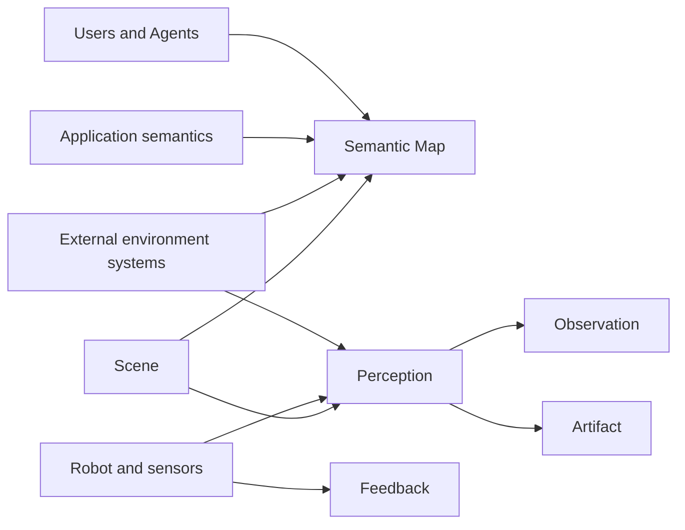
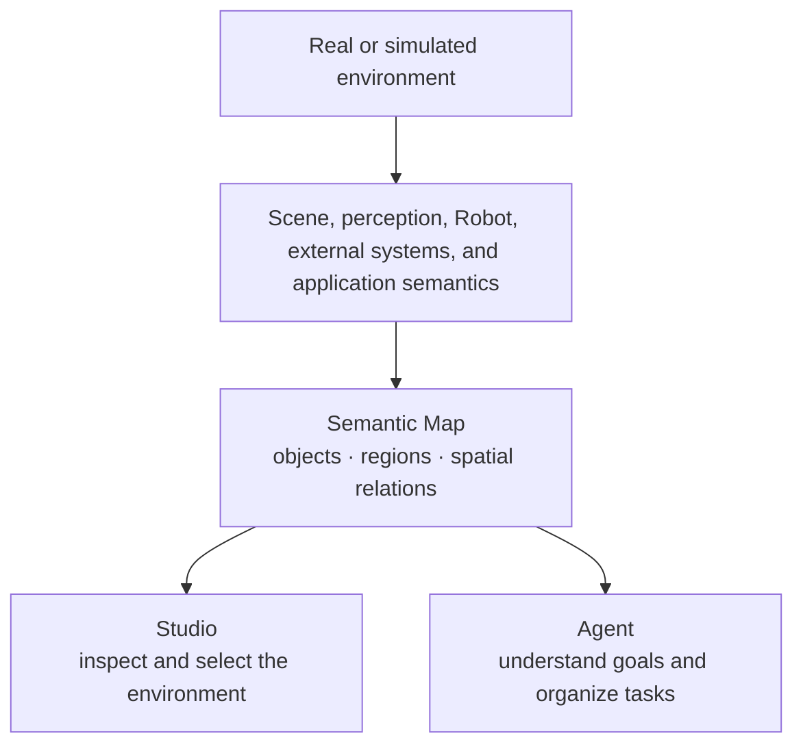
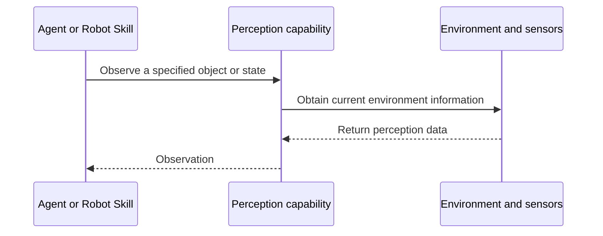
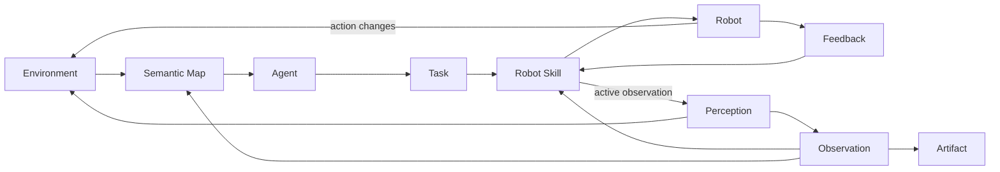
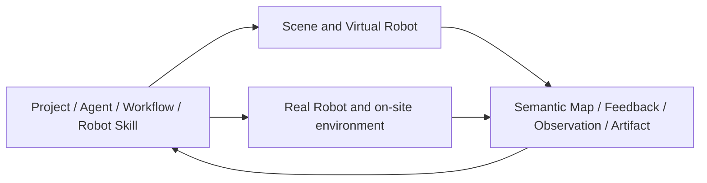

An embodied application happens in a real or simulated space. Users and Agents need to understand which objects exist in the environment, where those objects are, and what spatial relations they have. While acting, a Robot also needs continuous motion, contact, tool, and target state.

Semantic organizes this information as a continuous environment-information chain:

```text
Objects and spatial relations in the environment
→ Semantic Map forms a semantic expression
→ Agents understand the environment and choose action targets
→ Robot Skill actively observes the current state
→ The Robot continuously reports execution progress in Feedback
→ Robot actions change the environment
→ New environment information enters later understanding and action
```

This chapter introduces how the environment enters Semantic, how Semantic Map expresses the environment, and how perception, Observation, Feedback, and Artifact connect Agent understanding to Robot action.

## An embodied application starts from understanding the environment

In a depalletizing application, "transfer one tote" involves a related set of environment information:

- which totes are on the source pallet;
- which totes are on the currently operable upper layer;
- which stacking positions are available on the target pallet;
- where the Robot currently is;
- whether the Robot can approach the source and the target;
- after grasp, move, and place, what changed in the relations between totes and pallets.

This information comes from the environment itself, and also from the meaning the application gives the environment. A geometric object can mean "a tote waiting to be transferred" in a depalletizing application. A volume of space can mean "a target stacking region". The vertical positions of two objects can express "the upper tote is supported by the lower tote".

Semantic uses environment semantics to help users and Agents understand these business objects and their relations, then uses perception and Robot state at execution time to support concrete actions.

## How the environment enters Semantic

Environment information can come from several sources together:

- **Scene** describes Robots, objects, regions, sensors, and spatial layout in a simulation environment;
- **Robot and sensors** provide self state, vision, depth, force, contact, and other on-site data;
- **external environment systems** provide existing maps, localization, perception results, or facility information;
- **application semantics** describe an object's business class, purpose, and relations relevant to the current task;
- **users and Agents** can choose targets, add names, and confirm what an environment object means in the current application.

These sources together describe the same embodied environment. Semantic organizes the parts that are suitable for long-term understanding and query into Semantic Map, expresses current state obtained on demand at execution time as Observation, expresses information produced continuously during Robot action as Feedback, and stores images, depth, point clouds, and other data resources through Artifact.



## Semantic expression of the environment

Semantic Map uses objects, regions, and relations to express the environment. They keep spatial meaning in environment information, and they can also enter Conversation, Agent planning, Studio display, and later tasks.

### Objects

An object is something in the environment that can be recognized, referenced, and observed, for example:

- a Robot;
- totes and pallets;
- grippers, cameras, and other devices;
- workbenches, shelves, and fixed facilities.

An object has an identity and class that are understandable in the current application. A user can select an object in Studio. An Agent can build a task around the same object. Perception can also re-observe its current state before the Robot acts.

### Regions

A region is a location with a spatial extent and an application meaning, for example:

- a work region;
- a source region and a target region;
- traversable space;
- an observation region;
- a stacking position on a pallet.

Regions help an Agent connect goals such as "go next to the pallet" or "place into an empty stacking column" to concrete space in the environment.

### Relations

A relation expresses a spatial link between objects, between an object and a region, or between regions, for example:

- a tote is on the source pallet;
- one box is supported by another box;
- a Robot is inside a work region;
- a target position is adjacent to a source position;
- a stacking position is currently occupied by a box.

Objects, regions, and relations together form the semantic structure of the environment. An Agent can use that structure to understand business objects the user mentioned, and can also organize transfer order and target choice from spatial relations.

## Semantic Map continuously expresses the environment

Semantic Map is a Project's continuing semantic expression of objects, regions, and spatial relations in the environment. It organizes information from different sources into an environment view that users and Agents can understand, query, and reference.



Semantic Map supports one embodied application as it keeps understanding the same environment. After a Robot moves a tote away, that tote is still the same business object. Its position, support relations, and region update as the environment changes. A later Agent can keep choosing the next tote or target position from the updated environment expression.

Semantic Map gives Agents environment semantics and spatial reference. When a Robot Skill executes grasp, move, and place, it obtains the current Observation through Ability and finishes the local action with Robot Feedback. Task planning and physical execution therefore share the same business object, while each uses the environment information that fits the current work.

## Perception and Observation

Perception is the process of actively obtaining the current environment state. An Agent or Robot Skill can start an observation around an object, a region, or a Robot state. Perception capabilities obtain information from sensors, the simulation environment, or other environment sources, and form an Observation.



An Observation expresses the result of one active inspection. It usually contains:

- the object or question being observed;
- the time the observation happened;
- current state and spatial information;
- the information source;
- related Artifacts.

For example, `grasp-object` can observe the tote's current pose and size before approaching, observe tool contact and tote state after clamping, and observe again after lift to see whether the tote moves with the Robot. `place-object` can observe the target position before release, and observe after release whether the tote has seated stably.

Observation lets execution keep progressing from the current environment. The same Robot Skill can face different totes, different positions, and different runtime environments, and obtain the information this action needs through active observation.

## Feedback expresses the execution process

Feedback is information the Robot execution layer continuously returns upward while an Action is running. It reflects how the current action is advancing, for example:

- motion progress of the Robot and end effectors;
- current position, velocity, and control error;
- tool opening and contact state;
- force, torque, and other sensor readings;
- Action state changes.

Observation answers one actively asked environment question. Feedback describes the process an action is going through. Robot Skill uses both to organize the embodied loop: Feedback supports continuous following of execution, and Observation supports re-judging the environment at key moments.

```text
Robot Skill starts an Action
→ the Robot continuously returns Feedback
→ Robot Skill advances the current Stage from that progress
→ Robot Skill actively obtains Observation at key points
→ continue, adjust, or finish the action from the current environment
```

Studio can connect Feedback with Robot Execution, so a user can inspect Robot motion, tool state, and environment change along Stages and Actions.

## Artifact stores environment data and runtime products

An embodied application produces data that is suitable to store, view, and reuse on its own, for example:

- RGB images;
- depth maps and point clouds;
- video and sensor data;
- Scene, object, and spatial models;
- perception result files;
- runtime reports and logs.

Semantic organizes this content as Artifacts. An Observation can contain a structured result and associate the corresponding Artifacts. Conversation, Task, and Robot Execution can also reference them. Users can view this data in Studio. Agents can read it on demand in later analysis. Application developers can also use it to keep debugging perception, Robot Skills, or Scenes.

Artifact keeps the data itself. Observation expresses the structured result one inspection gives for the current question. Together they connect the runtime site to later understanding.

## Environment information forms an embodied loop

Environment information runs through goal understanding, task planning, and Robot execution.



This loop contains three continuous processes:

1. **Understand the environment**: Semantic Map helps users and Agents recognize objects, regions, and their spatial relations.
2. **Act in the environment**: Robot Skill drives the Robot through Ability and Robot SDK, and uses Feedback to follow the execution process.
3. **Obtain new environment information**: Perception actively forms Observation before and after actions, and environment change continues into Semantic Map and later tasks.

Changes in environment information can also drive later work. For example, after a tote is placed, the new object position and stacking relations enter the Project. Workflow can advance Tasks that depend on that result, and an Agent can start the next round of judgment from the new environment state.

## How users, Agents, and Robots use environment information

The same set of environment information gives different views to different participants in an embodied application.

### User

The user inspects Scene, Viewer, and Semantic Map in Studio, selects objects or regions in the environment, and understands action results together with Robot Execution, Observation, and Artifact.

### Leader and specialist Agents

Leader uses environment semantics to understand the user goal, choose source objects and target regions, and organize the work that needs to be finished. Agents that own map, monitoring, or other specialist work can query related environment information and form judgments and results for the current Task.

### Robot Agent

Robot Agent connects business objects and target regions to the current Robot's capabilities, chooses a suitable Robot Skill, and prepares the current Robot SubTask. It focuses on "which object to operate, which target to reach, and what result to finish".

### Robot Skill

Robot Skill actively observes objects, regions, tools, and Robot state through Ability, and advances Stages and Actions from Feedback. It focuses on current pose, contact, motion, and perception results at execution time.

This division of work lets environment semantics keep passing from the user goal to Robot action, and also lets new information produced by Robot action return to Agents and the user.

## Simulated environments and real environments

Semantic uses the same set of environment concepts for simulated and real applications: objects, regions, relations, Semantic Map, Feedback, Observation, and Artifact.

In a simulated environment, Scene provides a runnable space, Virtual Robots, objects, sensors, and physical state. Perception can form Observation from virtual sensors and Scene state. Robot actions directly change the current Scene.

In a real environment, Robot sensors, external perception systems, and localization and mapping systems together provide on-site information. Robot actions change the physical environment. New sensor data and perception results keep updating the Project's expression of the environment.



Simulation and real robots share the upper-level environment semantics and task style. Each provides runtime information and action capability through the corresponding Scene, sensors, Robot SDK, and Backend.

## Depalletizing environment-information example

The following example uses one complete single-tote transfer to connect the concepts in this chapter.

1. Scene or a real perception system provides the source pallet, target pallet, totes, Robot, and work region.
2. Semantic Map expresses that totes are on the source pallet, the layer relations among totes, and occupancy of target stacking positions.
3. The user selects a tote and a target position in Studio, or Leader queries and selects them from the goal.
4. Workflow hands the transfer goal to Robot Agent. Robot Agent chooses navigation, grasp, and place Robot Skills.
5. Before grasp, Robot Skill actively observes the tote's current pose, size, and surrounding space.
6. During approach, clamp, and lift, the Robot continuously returns motion, contact, and tool Feedback.
7. After grasp, Robot Skill actively observes tote and tool state and confirms the current action result.
8. Loaded travel and place keep advancing with the current Feedback and Observation.
9. Images, depth, point clouds, and runtime reports enter the Project as Artifacts.
10. After place, tote position, support relations, and target occupancy enter the updated environment expression. Later tasks continue from the new state.

This process shows how Semantic divides environment information: Semantic Map continuously expresses business objects and spatial relations in the environment, perception produces the current Observation, Robot execution returns the action process through Feedback, and Artifact stores environment data and runtime products.

## Relation to later chapters

This chapter introduced the semantic expression and information loop of an embodied environment in Semantic. Later chapters continue:

- **Agents and collaboration**: how Agents use environment information, Skills, tools, Context, and Memory in a Project;
- **Planning and Workflow**: how objects and targets in the environment enter Plan, Task, and continuing execution;
- **Robot execution and the embodied loop**: how Robot Skill, Ability, and Robot SDK use Feedback and Observation to complete an action;
- **Semantic extension model**: how developers extend perception, Robot capabilities, Skills, and environment resources;
- **Simulation, real robots, and deployment**: how Scene, Runtime, and real Robots provide a concrete runtime environment.
