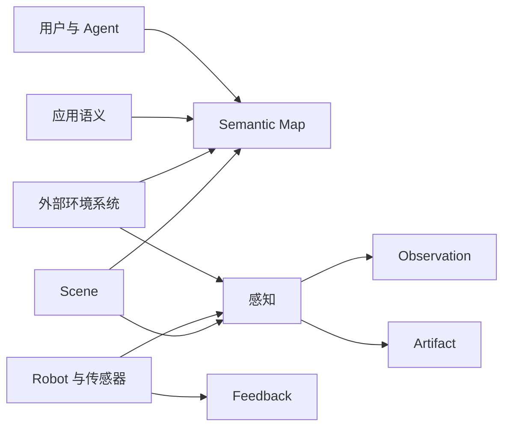
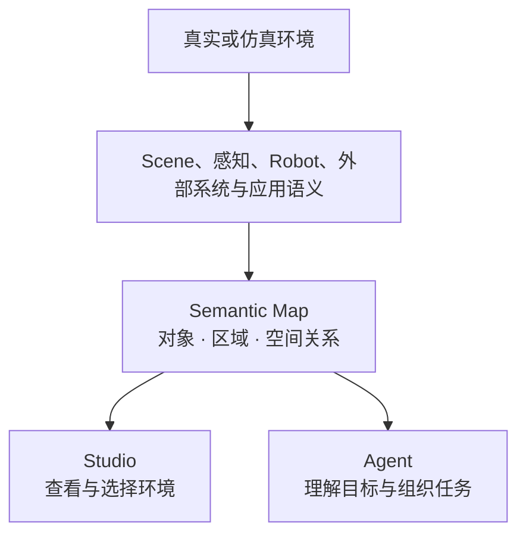
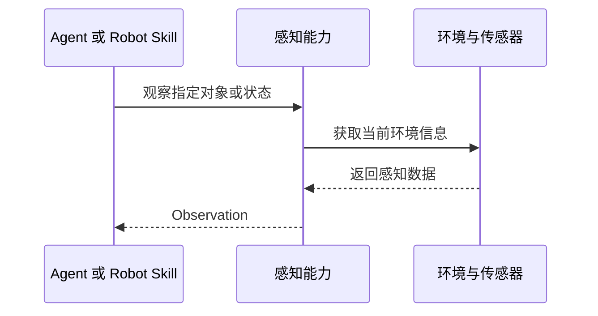
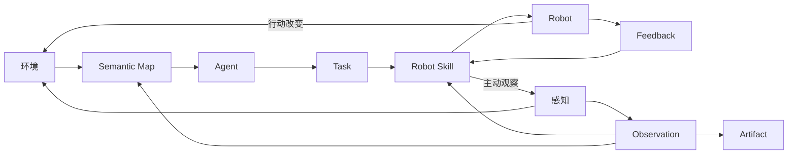
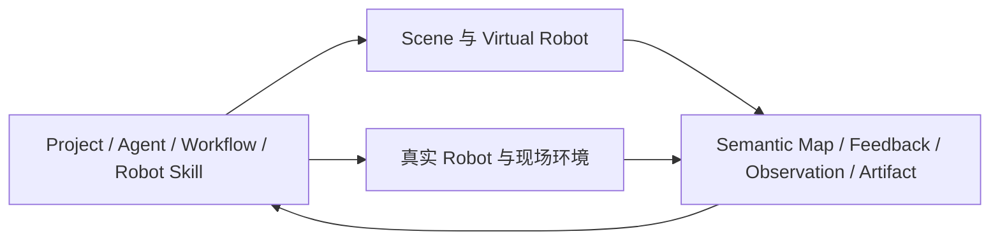

具身应用发生在真实或仿真的空间中。用户和 Agent 需要理解环境中有哪些对象、这些对象位于哪里、彼此具有怎样的空间关系；Robot 在行动时，还需要持续获得当前的运动、接触、工具和目标状态。

Semantic 将这些信息组织为一条连续的环境信息链：

```text
环境中的对象与空间关系
→ Semantic Map 形成语义表达
→ Agent 理解环境并选择行动目标
→ Robot Skill 主动观察当前状态
→ Robot 在 Feedback 中持续报告执行进展
→ Robot 行动改变环境
→ 新的环境信息进入后续理解与行动
```

本章介绍环境如何进入 Semantic，Semantic Map 如何表达环境，以及感知、Observation、Feedback 和 Artifact 如何连接 Agent 的理解与 Robot 的行动。

## 具身应用从理解环境开始

在拆码垛应用中，“搬运一个周转箱”会涉及一组彼此关联的环境信息：

- 来源托盘上有哪些周转箱；
- 哪些周转箱位于当前可操作的上层；
- 目标托盘有哪些可用堆叠位置；
- Robot 当前位于哪里；
- Robot 能否接近来源和目标；
- 抓取、移动和放置之后，箱体与托盘的关系发生了什么变化。

这些信息来自环境本身，也来自应用赋予环境的含义。一个几何物体在拆码垛应用中可以表示“待搬运周转箱”，一片空间可以表示“目标堆叠区域”，两个物体的垂直位置可以表达“上层箱体由下层箱体支撑”。

Semantic 通过环境语义帮助用户和 Agent 理解这些业务对象及其关系，再通过执行时的感知和 Robot 状态支持具体行动。

## 环境如何进入 Semantic

环境信息可以由多个来源共同提供：

- **Scene**描述仿真环境中的 Robot、物体、区域、传感器和空间布置；
- **Robot 与传感器**提供自身状态、视觉、深度、力、接触和其他现场数据；
- **外部环境系统**提供已有地图、定位、感知结果或生产设施信息；
- **应用语义**说明对象的业务类别、用途以及与当前任务有关的关系；
- **用户与 Agent**可以选择目标、补充名称，并确认环境对象在当前应用中的含义。

这些来源共同描述同一个具身环境。Semantic 将其中适合长期理解和查询的部分组织进 Semantic Map，将执行时主动获得的当前状态表达为 Observation，将 Robot 行动期间连续产生的信息表达为 Feedback，并通过 Artifact 保存图像、深度、点云和其他数据资源。



## 环境的语义表达

Semantic Map 使用对象、区域和关系表达环境。它们让环境信息保持空间含义，也能够进入 Conversation、Agent 规划、Studio 展示和后续任务。

### 对象

对象表示环境中可以被识别、引用和观察的事物，例如：

- Robot；
- 周转箱和托盘；
- 夹具、相机和其他设备；
- 工作台、货架和固定设施。

对象具有在当前应用中可理解的身份与类别。用户可以在 Studio 中选择一个对象，Agent 可以围绕同一个对象建立任务，感知也可以在 Robot 行动前重新观察它的当前状态。

### 区域

区域表示具有空间范围和应用含义的位置，例如：

- 工作区域；
- 来源区域与目标区域；
- 可通行空间；
- 观察区域；
- 托盘上的堆叠位置。

区域帮助 Agent 将“到托盘旁边”“放入空闲堆叠列”一类目标与环境中的具体空间联系起来。

### 关系

关系表达对象与对象、对象与区域以及区域之间的空间联系，例如：

- 一个周转箱位于来源托盘上；
- 一个箱体由另一个箱体支撑；
- 一个 Robot 位于某个工作区域内；
- 一个目标位置与来源位置相邻；
- 一个堆叠位置当前由某个箱体占用。

对象、区域和关系共同形成环境的语义结构。Agent 可以借助这些结构理解用户提到的业务对象，也可以根据空间关系组织搬运顺序和目标选择。

## Semantic Map 持续表达环境

Semantic Map 是 Project 对环境中对象、区域和空间关系的持续语义表达。它把不同来源提供的信息组织成用户和 Agent 可以理解、查询和引用的环境视图。



Semantic Map 支持一项具身应用持续理解同一环境。Robot 搬走一个箱体后，这个箱体仍然是同一个业务对象，它的位置、支撑关系和所在区域随环境变化而更新。后续 Agent 可以从更新后的环境表达继续选择下一个箱体或目标位置。

Semantic Map 为 Agent 提供环境语义和空间参考。Robot Skill 在执行抓取、移动和放置时，通过 Ability 主动取得当前 Observation，并结合 Robot Feedback 完成局部行动。这样，任务规划与物理执行共享同一业务对象，同时各自使用适合当前工作的环境信息。

## 感知与 Observation

感知是系统主动取得当前环境状态的过程。Agent 或 Robot Skill 可以围绕一个对象、区域或 Robot 状态发起观察，感知能力从传感器、仿真环境或其他环境来源获取信息，并形成 Observation。



Observation 表达一次主动观察得到的结果。它通常包含：

- 观察的对象或问题；
- 观察发生的时间；
- 当前状态与空间信息；
- 信息来源；
- 相关 Artifact。

例如，`grasp-object` 可以在接近箱体前观察箱体当前位姿和尺寸，在夹紧后观察工具接触与箱体状态，在抬升后再次观察箱体是否随 Robot 移动。`place-object` 可以在释放前观察目标位置，在释放后观察箱体是否已经稳定落座。

Observation 让执行依据当前环境继续推进。同一个 Robot Skill 可以面向不同箱体、不同位置和不同运行环境，通过主动观察获得本次行动需要的信息。

## Feedback 表达执行过程

Feedback 是 Robot 执行层在 Action 运行期间持续向上返回的信息。它反映当前行动怎样推进，例如：

- Robot 和末端的运动进度；
- 当前位置、速度和控制偏差；
- 工具开合与接触状态；
- 力、力矩和其他传感器读数；
- Action 的状态变化。

Observation 回答一次主动提出的环境问题，Feedback 描述一项行动正在经历的过程。Robot Skill 同时使用二者组织具身闭环：Feedback 支持连续跟随执行，Observation 支持在关键时刻重新判断环境。

```text
Robot Skill 发起 Action
→ Robot 持续返回 Feedback
→ Robot Skill 根据进展推进当前 Stage
→ Robot Skill 在关键位置主动取得 Observation
→ 根据当前环境继续、调整或完成行动
```

Studio 可以将 Feedback 与 Robot Execution 联系起来，让用户沿着 Stage 和 Action 查看 Robot 的运动、工具状态和环境变化。

## Artifact 保存环境数据与运行产物

具身应用会产生适合独立保存、查看和复用的数据，例如：

- RGB 图像；
- 深度图和点云；
- 视频与传感器数据；
- Scene、对象和空间模型；
- 感知结果文件；
- 运行报告与日志。

Semantic 将这些内容组织为 Artifact。Observation 可以包含结构化结果并关联相应 Artifact，Conversation、Task 和 Robot Execution 也可以引用它们。用户能够在 Studio 中查看这些数据，Agent 可以在后续分析中按需读取，应用开发者也可以使用它们继续调试感知、Robot Skill 或 Scene。

Artifact 保留数据本身，Observation 表达一次观察对当前问题给出的结构化结果。二者共同连接运行现场与后续理解。

## 环境信息形成具身闭环

环境信息贯穿目标理解、任务规划和 Robot 执行。



这条闭环包含三个连续过程：

1. **理解环境**：Semantic Map 帮助用户和 Agent 认识对象、区域及其空间关系。
2. **在环境中行动**：Robot Skill 通过 Ability 和 Robot SDK 驱动 Robot，并使用 Feedback 掌握执行过程。
3. **取得新的环境信息**：感知在行动前后主动形成 Observation，环境变化继续进入 Semantic Map 和后续任务。

环境信息的变化也可以推动后续工作。例如，箱体完成放置后，新的对象位置和堆叠关系进入 Project，Workflow 可以推进依赖这项结果的 Task，Agent 也可以从新的环境状态开始下一轮判断。

## 用户、Agent 与 Robot 如何使用环境信息

同一套环境信息面向具身应用中的不同参与者提供不同视角。

### 用户

用户通过 Studio 查看 Scene、Viewer 和 Semantic Map，选择环境中的对象或区域，并结合 Robot Execution、Observation 和 Artifact 理解行动结果。

### Leader 与专业 Agent

Leader 使用环境语义理解用户目标，选择来源对象和目标区域，并组织需要完成的工作。负责地图、监测或其他专业工作的 Agent 可以查询相关环境信息，形成面向当前 Task 的判断和结果。

### Robot Agent

Robot Agent 将业务对象和目标区域与当前 Robot 能力联系起来，选择适合的 Robot Skill，并准备当前 Robot SubTask。它关注“操作哪个对象、到达哪个目标、完成什么结果”。

### Robot Skill

Robot Skill 通过 Ability 主动观察物体、区域、工具和 Robot 状态，并根据 Feedback 推进 Stage 与 Action。它关注执行时的当前位姿、接触、运动和感知结果。

这种分工让环境语义从用户目标持续传递到 Robot 行动，也让 Robot 行动产生的新信息回到 Agent 与用户。

## 仿真环境与真实环境

Semantic 使用同一组环境概念表达仿真与真实应用：对象、区域、关系、Semantic Map、Feedback、Observation 和 Artifact。

在仿真环境中，Scene 提供可运行的空间、Virtual Robot、物体、传感器和物理状态。感知可以从虚拟传感器和 Scene 状态形成 Observation，Robot 行动直接改变当前 Scene。

在真实环境中，Robot 传感器、外部感知系统、定位与地图系统共同提供现场信息。Robot 行动改变物理环境，新的传感器数据和感知结果继续更新 Project 对环境的表达。



仿真与真机共享上层的环境语义和任务方式，各自通过相应的 Scene、传感器、Robot SDK 与 Backend 提供运行信息和行动能力。

## 拆码垛环境信息示例

下面以一项完整的单箱搬运为例，串联本章介绍的概念。

1. Scene 或真实感知系统提供来源托盘、目标托盘、周转箱、Robot 和工作区域。
2. Semantic Map 表达箱体位于来源托盘、箱体之间的层次关系以及目标堆叠位置的占用情况。
3. 用户在 Studio 中选择箱体和目标位置，或者由 Leader 根据目标查询并选择它们。
4. Workflow 将搬运目标交给 Robot Agent，Robot Agent 选择导航、抓取和放置 Robot Skill。
5. 抓取前，Robot Skill 主动观察箱体的当前位姿、尺寸和周围空间。
6. 接近、夹紧和抬升过程中，Robot 持续返回运动、接触和工具 Feedback。
7. 抓取完成后，Robot Skill 主动观察箱体和工具状态，确认当前行动结果。
8. 携物导航与放置继续使用当前 Feedback 和 Observation 推进。
9. 图像、深度、点云和运行报告作为 Artifact 进入 Project。
10. 放置后的箱体位置、支撑关系和目标占用进入更新后的环境表达，后续任务从新的状态继续。

这个过程体现了 Semantic 的环境信息分工：Semantic Map 持续表达环境中的业务对象与空间关系，感知产生当前 Observation，Robot 执行通过 Feedback 返回行动过程，Artifact 保存环境数据与运行产物。

## 与后续章节的关系

本章介绍了具身环境在 Semantic 中的语义表达与信息循环。后续章节继续展开：

- **Agent 与协作**：Agent 如何在 Project 中使用环境信息、Skill、工具、Context 和 Memory；
- **任务规划与 Workflow**：环境中的对象和目标如何进入 Plan、Task 与持续执行；
- **Robot 执行与具身闭环**：Robot Skill、Ability 和 Robot SDK 如何使用 Feedback 与 Observation 完成行动；
- **Semantic 扩展模型**：开发者如何扩展感知、Robot 能力、Skill 和环境资源；
- **仿真、真机与部署**：Scene、Runtime 和真实 Robot 如何提供具体的运行环境。
