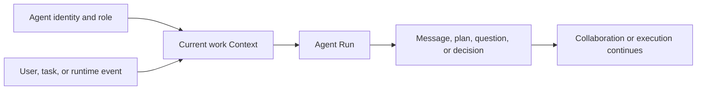
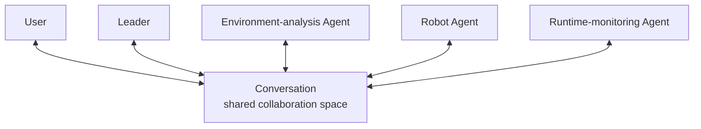
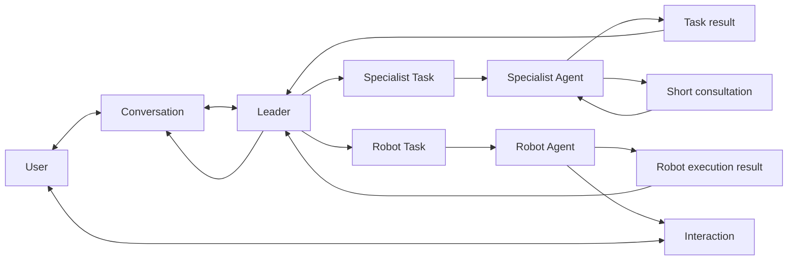
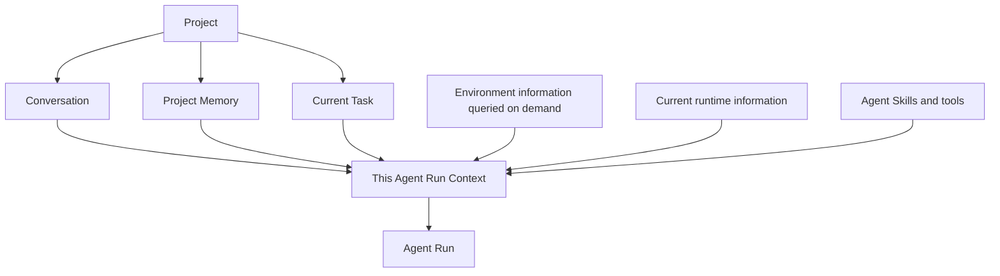
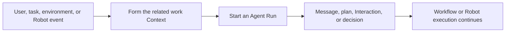
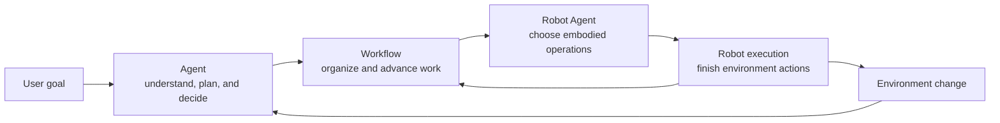

A goal in an embodied application has to go through understanding, planning, execution, and adjustment, and finally become an action in a real or simulated environment. That process usually needs users, multiple Agents, and Robots to take part together. They share goals and results around the same Project, and they keep working after the environment changes.

Semantic treats an Agent as an intelligent collaborator that keeps taking part in work inside a Project. Leader understands the user's overall goal. Specialist Agents handle work that fits their capabilities. Robot Agent connects task semantics to a concrete Robot. Conversation, Task, Interaction, and events organize these participants in one continuous embodied application.

```text
The user proposes a goal
→ Leader understands the goal and the environment
→ Multiple Agents take different work
→ Robot Agent organizes embodied operations
→ The Robot acts in the environment
→ Runtime results and environment change return to the Project
→ Users and Agents keep collaborating
```

This chapter introduces the Agent participant model, role division, collaboration style, Context and Project Memory, and event-driven collaboration across different time scales.

## An embodied task is continuous collaboration

Take "move the top layer of totes from the source pallet to the target pallet" as an example. That goal goes through a series of related pieces of work:

- understand the objects the user wants to transfer and the completion requirements;
- query totes, pallets, target positions, and Robots in the environment;
- judge which totes can be operated now;
- organize multiple transfer tasks and their relations;
- choose embodied operations from Robot capabilities;
- handle new situations that appear during execution;
- summarize the result of each piece of work and of the overall goal.

These pieces of work have different specialties and time scales. An Agent can finish one analysis in seconds. A user may add information later. A Robot action may last minutes. The environment also changes as actions happen.

Semantic lets each participant work around its own responsibility, while the Project keeps the shared goal, environment, and runtime process connected.

## An Agent is an intelligent participant in a Project

An Agent is defined together by identity, role, capabilities, and work context:

- **identity** lets users and other Agents recognize the current participant;
- **role** describes the work the Agent is responsible for in the Project;
- **Agent Skill** provides domain knowledge and working methods;
- **tools** connect Project, environment, and runtime capabilities;
- **Context** lets the Agent understand the current goal and related information;
- **Model** completes language understanding, reasoning, and decision.

An Agent's identity and work relations can persist. A user can keep talking with the same Leader. An Agent that owns a Task can keep handling later situations around the same work. A Robot Agent can also represent the same Robot in a Project over a long time.

### Agent Run

An Agent Run is a model run that an Agent starts in order to finish one understanding, planning, decision, or summary.



One Run can contain multiple rounds of model and tool interaction. For example, Leader can first understand the user goal, then query Semantic Map, and then form a plan from the query result. After the Run finishes, the Agent's identity, Conversation, and Task relations remain. When a new user message, Interaction answer, or Robot execution result arrives, the corresponding Agent continues from the current work.

This runtime style lets model understanding, user collaboration, and Robot action develop on their own time scales, while keeping one piece of work continuous.

## Agent roles

Semantic uses roles to express the responsibilities of different Agents in an embodied application. A Project can choose and compose these roles according to application needs.

### Leader

Leader is the user's main collaborator for the overall goal. It is responsible for:

- understanding user goals and business requirements;
- forming an overall picture from Project and environment information;
- organizing the main work that needs to be finished;
- coordinating specialist Agents and Robots;
- handling issues that cross Tasks;
- summarizing the overall result to the user.

Leader focuses on the final goal an embodied application wants to achieve, and on the relations among different pieces of work.

### Specialist Agents

A specialist Agent handles one class of work according to its role, for example:

- environment and map analysis;
- application development;
- runtime monitoring;
- Artifact analysis;
- other domain tasks.

A specialist Agent can own a formal Task in a Workflow, or provide a short consultation around a clear question. The architecture uses "the Agent that owns a Task" to describe this responsibility.

### Robot Agent

A Robot Agent represents one concrete Robot in a Project. It connects a business task to that Robot's capabilities:

- understand the current Robot Task;
- inspect the Robot's capabilities and runtime state;
- choose a suitable Robot Skill;
- organize Robot SubTasks;
- prepare business inputs for the current embodied step;
- handle semantic decisions requested by a Robot Skill;
- return a planning summary and execution results.

Robot Agent works at the level of business intent and Robot Skill. Robot Skill organizes one embodied operation. Ability provides composable perception, planning, and control capabilities. Robot SDK connects the action to a concrete Robot.

### Short consultation

An Agent can request a short consultation around a clear question, for example:

- compare several environment targets;
- analyze a set of Observations;
- read an Artifact;
- judge whether an existing result meets the business requirements;
- add a specialist opinion to the current decision.

The consultation conclusion returns to the initiating Agent's current work. Work that has an independent business result, continuing progress, or resource needs is carried by a formal Task.

## Conversation is the shared collaboration space

Conversation is the space where users and multiple Agents talk together. It lets a user start from the overall goal and see questions raised by different Agents, plans they form, and results they finish.



A Conversation can carry:

- user goals and additional information;
- Leader's understanding of the goal and plan explanation;
- analysis results from specialist Agents;
- Robot Agent Task planning summaries;
- Interactions started by Agents;
- important Task and Robot execution results;
- Leader's final summary of the overall work.

Leader is the user's main entry for the overall goal. Agents that own concrete work can also return planning summaries, questions, and results under their own identity, so the user understands each participant's contribution to the current work.

Changes such as Task assignment, Agent Run start, Robot Execution start, and resource waits appear as system activity. Agent messages express business content formed by the model. System activity expresses changes that happen during the run. Task, Robot Execution, and Trace provide a more detailed work process.

## How multiple Agents collaborate

Multiple Agents advance work together through Conversation, Task, Interaction, short consultation, and events.



### Collaborate through Conversation

Conversation is suitable for goals, questions, decisions, and results that users and multiple Agents care about together. It forms a collaboration process that can keep developing in the Project.

### Collaborate through Task

A Task carries work that needs to keep progressing and produce an independent result. The Agent that owns a Task can obtain:

- the Task goal;
- confirmed business inputs;
- completion requirements;
- predecessor work results;
- environment information related to the current work.

After a Task finishes, the result enters later work that depends on it, and also returns to Leader or Conversation. Task structure, dependencies, and progress style are covered in the next chapter.

### Collaborate through short consultation

A short consultation serves the initiating Agent's current question. The initiating Agent keeps judging from the consultation conclusion and its own work Context.

### Collaborate through events

User answers, Task completion, Robot execution state changes, and environment changes can drive related Agents to keep working. Events connect participants on different time scales into the same embodied task.

## Agent Skills and tools

An Agent obtains domain knowledge and working methods through Agent Skills, and obtains information and takes part in Project runtime through tools.

### Agent Skill

An Agent Skill can describe:

- objects, goals, and terms in a domain;
- a method for understanding one class of task;
- steps for organizing work;
- how to use related tools;
- how results should be expressed.

For example, a depalletizing-planning Agent Skill can help Leader understand currently transferable totes, target stacking positions, source layer relations, and how to organize tasks. An Agent Skill for Robot Tasks can help Robot Agent organize a single-tote transfer as source navigation, grasp, loaded travel, and place.

### Tools

Tools let an Agent interact with the Project, the environment, and the runtime system, for example:

- query Semantic Map;
- read Project resources;
- inspect Robot and runtime state;
- read Artifacts;
- start an Interaction;
- submit a Plan;
- start a Robot Skill.

An Agent's role, current work, and capabilities in the Project together decide which Skills and tools this work can use.

### Agent Skill and Robot Skill

```text
Agent Skill
→ helps an Agent understand the domain, use tools, and organize work

Robot Skill
→ lets a Robot finish one reusable embodied operation
```

Agent Skill connects domain knowledge to Agent judgment. Robot Skill connects business intent to Robot action. Together they turn a user goal into the embodied environment step by step.

## Context lets an Agent understand the current work

Context is the view an Agent uses to understand the current work in one Run. It selects and composes information related to this judgment from the Project.



Context can include:

- the Agent's identity, role, and the purpose of this run;
- the current user request;
- Conversation content related to the current question;
- the current Task goal and business inputs;
- predecessor Task results;
- Agent Skills and tools;
- environment information the Agent queries on demand;
- the current Robot and execution state;
- related application knowledge in Project Memory;
- the Interaction, event, or execution result that triggered this Run.

### Leader work Context

Leader forms Context around Conversation, the user goal, Project information, and the overall work. It needs to understand confirmed goals, the current environment, existing plans, progress of different Tasks, and results returned by other Agents.

### Work Context of an Agent that owns a Task

An Agent that owns a Task forms work Context around the current Task, including the Task goal, business inputs, predecessor results, current environment queries, available Skills, existing progress, and the current question.

### Short-consultation Context

A short consultation forms Context around one clear question. It composes the information needed to finish the current analysis, and returns the conclusion to the initiating Agent.

The Project stores the complete application, collaboration, and runtime relations. Each Agent Run forms a Context that fits this work according to the current responsibility.

## Project Memory and work continuity

Project Memory stores knowledge in an application that is suitable to keep using across Conversations, Tasks, and Workflows, for example:

- project conventions;
- user preferences;
- domain terms;
- verified working experience;
- methods the application adopts over a long time.

Different information in a Project together supports Agent work:

```text
Conversation
  stores the collaboration process between the user and multiple Agents

Project Memory
  stores application knowledge reused across work

Task
  expresses the result that currently needs to be finished

Semantic Map
  expresses environment objects, regions, and spatial relations

Observation and Feedback
  express the current observation and execution process

Context
  composes information related to this Agent Run
```

Agent identity, Conversation, and Task relations can continue across many Runs. A new Agent Run forms Context from the Project's current content, so the Agent can keep working from existing goals, environment, and results.

Context summarization, length control, persistence, and recovery are covered further in the implementation design documents.

## Interaction lets users take part in Agent decisions

An Interaction is a structured collaboration style in which an Agent invites the user to keep taking part during work. It is suitable for:

- adding business information;
- choosing among several targets;
- confirming work scope;
- entering parameters, files, images, or map objects;
- business and safety decisions.

```text
An Agent finds that user participation is needed
→ it starts an Interaction in Conversation
→ the user answers, rejects, or cancels
→ the original Agent keeps judging from the Interaction result
```

An Interaction stays connected to the Agent that started it, the Conversation, and the current work. The user's handling result returns to the original work Context, so planning, execution, or recovery can continue from current progress.

Concrete presentation and operation flows are covered in the Studio design and the user guide.

## Event-driven Agent collaboration

Model understanding, user responses, Robot actions, and environment changes happen on different time scales. Semantic uses events to perceive these changes and drive related work to keep running.

Events can come from:

- a user sending a message or handling an Interaction;
- an Agent finishing one planning, decision, or summary;
- a Task gaining new execution conditions;
- a Robot Skill finishing an action;
- Robot Execution asking an Agent to judge;
- Robot, resource, or environment state changing.



An event expresses a change in the current work. The Framework starts the next needed Agent Run from the Conversation, Task, Agent, or Robot Execution associated with the event. An Agent runs when semantic understanding is needed. Robot and environment processes keep going on their own time scales.

## Agents, Workflow, and Robots

Agents, Workflow, and Robot execution each take different work in an embodied application, and they form a continuous relation:

> Agents understand goals and make semantic decisions. Workflow organizes work that needs to keep progressing. The Robot execution system turns embodied intent into actions in the environment.



Agents form or adjust work from goals, environment, and runtime results. Workflow keeps Tasks and their relations progressing. Robot Agent organizes a Robot Task into embodied steps that fit the current Robot. Robot execution results and environment change keep driving Agent and Workflow work.

The next chapter expands the design of Plan, Workflow, Task, and SubTask. The Robot execution chapter continues with Robot Skill, Ability, Robot SDK, and Robot Execution.

## Depalletizing collaboration example

The following example uses transferring the top layer of totes from the source pallet to connect the collaboration design in this chapter.

1. The user proposes a transfer goal in Conversation.
2. Leader queries Semantic Map and understands source totes, upper/lower-layer relations, and target positions.
3. Leader forms an overall plan with the depalletizing Agent Skill, and explains the main work in Conversation.
4. After the user approves the plan, multiple tote-transfer Tasks enter Workflow.
5. Each Robot Task is owned by a suitable Robot Agent.
6. Robot Agent plans source navigation, grasp, loaded travel, and place from the current Robot, environment, and Robot Skills.
7. Robot execution continues in the physical environment. Robot Agent identity and Task work relations remain.
8. When a Robot Skill requests a semantic decision, a runtime event drives Robot Agent to start a new Run.
9. When a business choice is involved, Robot Agent invites the user through an Interaction.
10. Robot Agent returns the Task planning summary, questions, and execution results to Conversation.
11. Leader summarizes the whole-layer transfer result to the user from all Task results.
12. Later work continues from the updated Semantic Map, current Project Memory, and Task results.

This process shows Agent collaboration in Semantic: different participants divide work around the same goal, Context supports each Agent Run in understanding the current work, Conversation, Task, and Interaction pass collaboration information, and events connect model runs, user participation, and Robot action.

## Relation to later chapters

This chapter introduced the core design of Agents as Project participants, and how users and multiple Agents keep collaborating. Later chapters continue:

- **Planning and Workflow**: how work formed by Agents enters Plan, Task, and SubTask, and keeps progressing from dependencies and results;
- **Robot execution and the embodied loop**: how Robot Agent, Robot Skill, Ability, and Robot SDK finish environment actions;
- **Semantic extension model**: how developers add Agents, Agent Skills, tools, and Robot capabilities;
- **Simulation, real robots, and deployment**: how Agents and Robots enter a concrete runtime environment.

## Related layers

- Design contracts and extension guidance: [Core modules · Agent roles and Team](../developer/core-modules/intelligent/agent-profile.en.md)
- Server / frontend implementation details: [Internals · Server, Agent, and Workflow](../developer/reference/internals/server-agent-and-workflow.en.md)
