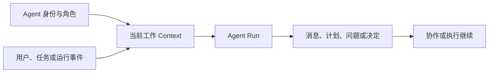
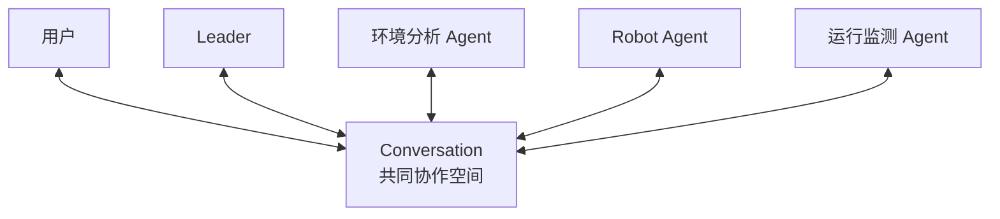
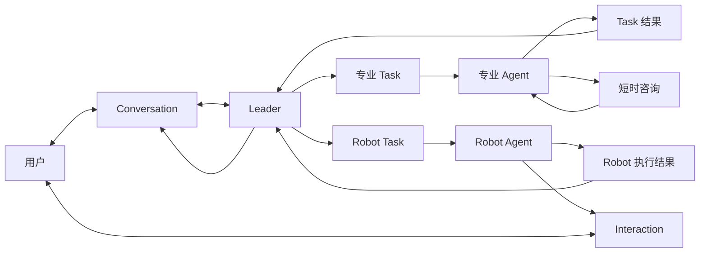
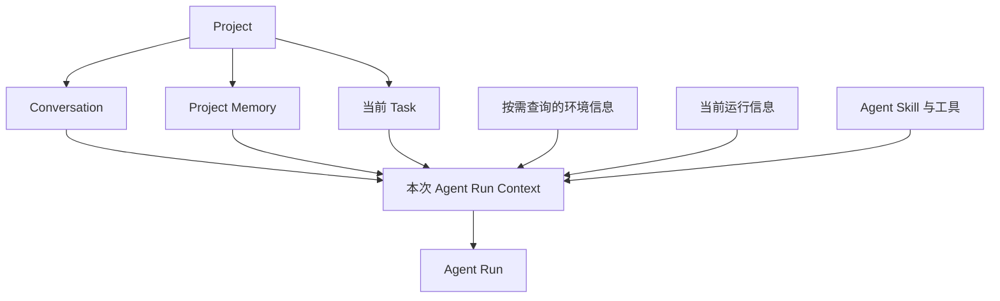
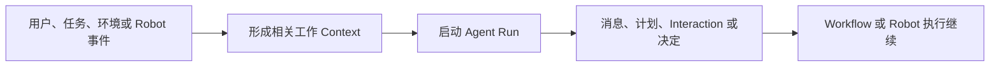
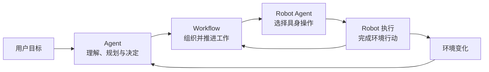

具身应用中的目标需要经过理解、规划、执行和调整，最终落实为真实或仿真环境中的行动。这个过程通常需要用户、多个 Agent 和 Robot 共同参与。它们围绕同一个 Project 分享目标与结果，并在环境变化后继续工作。

Semantic 将 Agent 作为 Project 中持续参与工作的智能协作者。Leader 理解用户的整体目标，专业 Agent 处理适合自身能力的工作，Robot Agent 将任务语义连接到具体 Robot。Conversation、Task、Interaction 和事件把这些参与者组织在一项连续的具身应用中。

```text
用户提出目标
→ Leader 理解目标与环境
→ 多个 Agent 承担不同工作
→ Robot Agent 组织具身操作
→ Robot 在环境中行动
→ 运行结果与环境变化返回 Project
→ 用户和 Agent 继续协作
```

本章介绍 Agent 的参与者模型、角色分工、协作方式、Context 与 Project Memory，以及不同时间尺度下的事件驱动协作。

## 具身任务是一项持续协作

以“将来源托盘顶层的一层周转箱搬到目标托盘”为例，这个目标会经历一系列相互关联的工作：

- 理解用户希望搬运的对象和完成要求；
- 查询环境中的箱体、托盘、目标位置和 Robot；
- 判断当前可以操作哪些箱体；
- 组织多个搬运任务及其关系；
- 根据 Robot 能力选择具身操作；
- 处理执行过程中产生的新情况；
- 汇总每项工作和整体目标的结果。

这些工作具有不同的专业性和时间尺度。Agent 可以在数秒内完成一次分析，用户可能稍后补充信息，Robot 行动可能持续数分钟，环境也会随着行动发生变化。

Semantic 让每个参与者围绕自己的职责工作，同时通过 Project 保持共同目标、环境和运行过程的联系。

## Agent 是 Project 中的智能参与者

一个 Agent 由身份、角色、能力和工作上下文共同定义：

- **身份**让用户和其他 Agent 识别当前参与者；
- **角色**说明 Agent 在 Project 中负责的工作；
- **Agent Skill**提供领域知识和工作方法；
- **工具**连接 Project、环境和运行能力；
- **Context**让 Agent 理解当前目标和相关信息；
- **Model**完成语言理解、推理和决策。

Agent 的身份和工作关系可以持续存在。用户能够持续与同一个 Leader 交流，承担 Task 的 Agent 可以围绕同一项工作继续处理后续情况，Robot Agent 也可以长期代表同一台 Robot 参与 Project。

### Agent Run

Agent Run 是 Agent 为完成一次理解、规划、决策或总结而启动的模型运行。



一个 Run 内可以进行多轮模型与工具交互。例如，Leader 可以先理解用户目标，再查询 Semantic Map，随后根据查询结果形成计划。Run 完成后，Agent 的身份、Conversation 和 Task 关系继续保留。新的用户消息、Interaction 回答或 Robot 执行结果到来时，相应 Agent 从当前工作继续运行。

这种运行方式让模型理解、用户协作和 Robot 行动按照各自的时间尺度发展，并保持同一项工作的连续性。

## Agent 的角色

Semantic 使用角色表达不同 Agent 在具身应用中的职责。Project 可以根据应用需要选择和组合这些角色。

### Leader

Leader 是用户处理整体目标的主要协作对象。它负责：

- 理解用户目标和业务要求；
- 结合 Project 与环境信息形成整体认识；
- 组织需要完成的主要工作；
- 协调专业 Agent 和 Robot；
- 处理跨 Task 的问题；
- 向用户汇总整体结果。

Leader 关注一项具身应用希望实现的最终目标，以及不同工作之间的关系。

### 专业 Agent

专业 Agent 根据自身角色处理某一类工作，例如：

- 环境与地图分析；
- 应用开发；
- 运行监测；
- Artifact 分析；
- 其他领域任务。

专业 Agent 可以承担 Workflow 中的正式 Task，也可以围绕一个明确问题提供短时咨询。架构中使用“承担某项 Task 的 Agent”描述这种责任关系。

### Robot Agent

Robot Agent 代表一台具体 Robot 参与 Project。它将业务任务与这台 Robot 的能力联系起来：

- 理解当前 Robot Task；
- 查看 Robot 的能力和运行状态；
- 选择合适的 Robot Skill；
- 组织 Robot SubTask；
- 为当前具身步骤准备业务输入；
- 处理 Robot Skill 请求的语义决定；
- 返回规划摘要和执行结果。

Robot Agent 在业务意图和 Robot Skill 层面工作。Robot Skill 组织一次具身操作，Ability 提供可组合的感知、规划和控制能力，Robot SDK 将行动连接到具体 Robot。

### 短时咨询

Agent 可以围绕一个明确问题请求短时咨询，例如：

- 比较多个环境目标；
- 分析一组 Observation；
- 阅读一个 Artifact；
- 判断已有结果是否满足业务要求；
- 为当前决定补充专业意见。

咨询结论回到发起 Agent 的当前工作。具有独立业务结果、持续进度或资源需求的工作由正式 Task 承载。

## Conversation 是共同协作空间

Conversation 是用户与多个 Agent 共同交流的空间。它让用户能够从整体目标出发，看到不同 Agent 提出的问题、形成的计划和完成的结果。



Conversation 可以承载：

- 用户目标和补充信息；
- Leader 对目标的理解与计划说明；
- 专业 Agent 的分析结果；
- Robot Agent 的 Task 规划摘要；
- Agent 发起的 Interaction；
- Task 和 Robot 执行的重要结果；
- Leader 对整体工作的最终汇总。

Leader 是用户处理整体目标的主要入口。承担具体工作的 Agent 也可以使用自己的身份返回规划摘要、问题和结果，让用户了解每个参与者在当前工作中的贡献。

Task 分配、Agent Run 启动、Robot Execution 开始和资源等待等变化以系统活动呈现。Agent 消息表达模型形成的业务内容，系统活动表达运行过程中发生的变化。Task、Robot Execution 和 Trace 则提供更详细的工作过程。

## 多个 Agent 如何协作

多个 Agent 通过 Conversation、Task、Interaction、短时咨询和事件共同推进工作。



### 通过 Conversation 协作

Conversation 适合承载用户和多个 Agent 共同关心的目标、问题、决定与结果。它形成 Project 中可持续发展的协作过程。

### 通过 Task 协作

Task 承载需要持续推进并产生独立结果的工作。承担 Task 的 Agent 可以获得：

- Task 目标；
- 已确认的业务输入；
- 完成要求；
- 前置工作结果；
- 与当前工作相关的环境信息。

Task 完成后，结果进入依赖它的后续工作，并回到 Leader 或 Conversation。Task 的结构、依赖和推进方式将在下一章展开。

### 通过短时咨询协作

短时咨询服务于发起 Agent 的当前问题。发起 Agent 结合咨询结论和自己的工作 Context 继续判断。

### 通过事件协作

用户回答、Task 完成、Robot 执行状态变化和环境变化可以推动相关 Agent 继续工作。事件将不同时间尺度上的参与者连接到同一项具身任务中。

## Agent Skill 与工具

Agent 通过 Agent Skill 获得领域知识和工作方法，通过工具取得信息并参与 Project 运行。

### Agent Skill

Agent Skill 可以说明：

- 领域中的对象、目标和术语；
- 理解一类任务的方法；
- 组织工作的步骤；
- 使用相关工具的方式；
- 形成结果的表达方式。

例如，拆码垛规划 Agent Skill 可以帮助 Leader 理解当前可搬运箱体、目标堆叠位置、来源层次关系和任务组织方式。面向 Robot Task 的 Agent Skill 可以帮助 Robot Agent 将单箱搬运组织为来源导航、抓取、携物导航和放置。

### 工具

工具让 Agent 与 Project、环境和运行系统交互，例如：

- 查询 Semantic Map；
- 读取 Project 资源；
- 查看 Robot 和运行状态；
- 读取 Artifact；
- 发起 Interaction；
- 提交 Plan；
- 启动 Robot Skill。

Agent 的角色、当前工作和 Project 中的能力共同决定本次工作可以使用的 Skill 与工具。

### Agent Skill 与 Robot Skill

```text
Agent Skill
→ 帮助 Agent 理解领域、使用工具和组织工作

Robot Skill
→ 让 Robot 完成一次可复用的具身操作
```

Agent Skill 连接领域知识与 Agent 判断，Robot Skill 连接业务意图与 Robot 行动。两者共同将用户目标逐步落实到具身环境中。

## Context 让 Agent 理解当前工作

Context 是 Agent 在一次 Run 中理解当前工作的视图。它从 Project 中选择并组合与本次判断有关的信息。



Context 可以包括：

- Agent 的身份、角色和本次运行目的；
- 当前用户请求；
- Conversation 中与当前问题相关的内容；
- 当前 Task 的目标和业务输入；
- 前置 Task 结果；
- Agent Skill 与工具；
- Agent 按需查询的环境信息；
- 当前 Robot 和执行状态；
- Project Memory 中相关的应用知识；
- 触发本次 Run 的 Interaction、事件或执行结果。

### Leader 的工作 Context

Leader 围绕 Conversation、用户目标、Project 信息和整体工作形成 Context。它需要理解已经确认的目标、当前环境、已有计划、不同 Task 的进展以及其他 Agent 返回的结果。

### 承担 Task 的 Agent 的工作 Context

承担 Task 的 Agent 围绕当前 Task 形成工作 Context，包括 Task 目标、业务输入、前置结果、当前环境查询、可用 Skill、已有进展和当前问题。

### 短时咨询 Context

短时咨询围绕一个明确问题形成 Context。它组合完成当前分析需要的信息，并将结论返回发起 Agent。

Project 保存完整的应用、协作和运行关系。每次 Agent Run 根据当前职责形成适合本次工作的 Context。

## Project Memory 与工作连续性

Project Memory 保存一项应用中适合跨 Conversation、Task 和 Workflow 继续使用的知识，例如：

- 项目约定；
- 用户偏好；
- 领域术语；
- 已验证的工作经验；
- 应用长期采用的方法。

Project 中的不同信息共同支持 Agent 工作：

```text
Conversation
  保存用户与多个 Agent 的协作过程

Project Memory
  保存跨工作复用的应用知识

Task
  表达当前需要完成的结果

Semantic Map
  表达环境对象、区域和空间关系

Observation 与 Feedback
  表达当前观察和执行过程

Context
  组合与本次 Agent Run 有关的信息
```

Agent 身份、Conversation 和 Task 关系可以跨多次 Run 延续。新的 Agent Run 从 Project 当前内容中形成 Context，使 Agent 能够从已有目标、环境和结果继续工作。

Context 的摘要、长度控制、持久化和恢复机制在实现设计文档中进一步展开。

## Interaction 让用户参与 Agent 决策

Interaction 是 Agent 在工作过程中邀请用户继续参与的结构化协作方式。它适合处理：

- 业务信息补充；
- 多个目标之间的选择；
- 工作范围确认；
- 参数、文件、图像或地图对象输入；
- 业务与安全决定。

```text
Agent 发现需要用户参与
→ 在 Conversation 中发起 Interaction
→ 用户回答、拒绝或取消
→ 原 Agent 根据 Interaction 结果继续判断
```

Interaction 与发起它的 Agent、Conversation 和当前工作保持联系。用户的处理结果回到原来的工作 Context，使规划、执行或恢复过程能够从当前进展继续。

具体的呈现方式与操作流程将在 Studio 设计和用户指南中展开。

## 事件驱动的 Agent 协作

模型理解、用户响应、Robot 行动和环境变化发生在不同时间尺度上。Semantic 使用事件感知这些变化，并推动相关工作继续运行。

事件可以来自：

- 用户发送消息或处理 Interaction；
- Agent 完成一次规划、决定或总结；
- Task 具备新的执行条件；
- Robot Skill 完成行动；
- Robot Execution 请求 Agent 判断；
- Robot、资源或环境状态发生变化。



事件表达当前工作发生的变化。Framework 根据事件关联的 Conversation、Task、Agent 或 Robot Execution，启动下一次需要的 Agent Run。Agent 在需要语义理解时运行，Robot 与环境过程按照自身时间尺度持续进行。

## Agent、Workflow 与 Robot

Agent、Workflow 和 Robot 执行分别承担具身应用中的不同工作，并形成连续关系：

> Agent 理解目标并作出语义决定，Workflow 组织需要持续推进的工作，Robot 执行系统将具身意图落实为环境中的行动。



Agent 根据目标、环境和运行结果形成或调整工作。Workflow 保持 Task 及其关系持续推进。Robot Agent 将 Robot Task 组织为适合当前 Robot 的具身步骤。Robot 执行结果和环境变化继续推动 Agent 与 Workflow 工作。

下一章将展开 Plan、Workflow、Task 和 SubTask 的设计；Robot 执行章节将继续展开 Robot Skill、Ability、Robot SDK 与 Robot Execution。

## 拆码垛协作示例

下面以搬运来源托盘顶层的一层周转箱为例，串联本章介绍的协作设计。

1. 用户在 Conversation 中提出搬运目标。
2. Leader 查询 Semantic Map，理解来源箱体、上下层关系和目标位置。
3. Leader 结合拆码垛 Agent Skill 形成整体计划，并在 Conversation 中说明主要工作。
4. 用户批准计划后，多个箱体搬运 Task 进入 Workflow。
5. 每项 Robot Task 由适合的 Robot Agent 承担。
6. Robot Agent 根据当前 Robot、环境和 Robot Skill 规划来源导航、抓取、携物导航和放置。
7. Robot 执行在物理环境中持续进行，Robot Agent 身份和 Task 工作关系继续保留。
8. Robot Skill 请求语义决定时，运行事件推动 Robot Agent 启动新的 Run。
9. 涉及业务选择时，Robot Agent 通过 Interaction 邀请用户参与。
10. Robot Agent 将 Task 规划摘要、问题和执行结果返回 Conversation。
11. Leader 结合所有 Task 结果向用户汇总整层搬运结果。
12. 后续工作从更新后的 Semantic Map、当前 Project Memory 和 Task 结果继续。

这个过程体现了 Semantic 中的 Agent 协作：不同参与者围绕同一目标分工，Context 支持每次 Agent Run 理解当前工作，Conversation、Task 和 Interaction 传递协作信息，事件连接模型运行、用户参与和 Robot 行动。

## 与后续章节的关系

本章介绍了 Agent 作为 Project 参与者的核心设计，以及用户和多个 Agent 如何持续协作。后续章节继续展开：

- **任务规划与 Workflow**：Agent 形成的工作如何进入 Plan、Task 与 SubTask，并根据依赖和结果持续推进；
- **Robot 执行与具身闭环**：Robot Agent、Robot Skill、Ability 和 Robot SDK 如何完成环境行动；
- **Semantic 扩展模型**：开发者如何增加 Agent、Agent Skill、工具和 Robot 能力；
- **仿真、真机与部署**：Agent 与 Robot 如何进入具体运行环境。

## 相关层次

- 设计契约与扩展指引：[核心模块 · Agent 角色与 Team](/developer/core-modules/intelligent/agent-profile/)
- 服务端/前端实现细节：[内部实现 · Server、Agent 与 Workflow](/developer/reference/internals/server-agent-and-workflow/)
