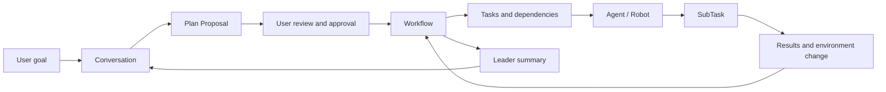
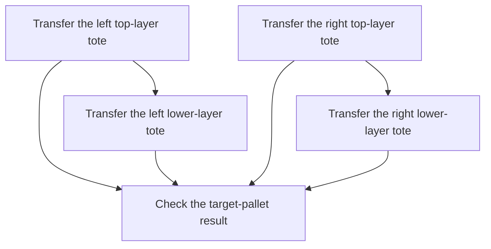
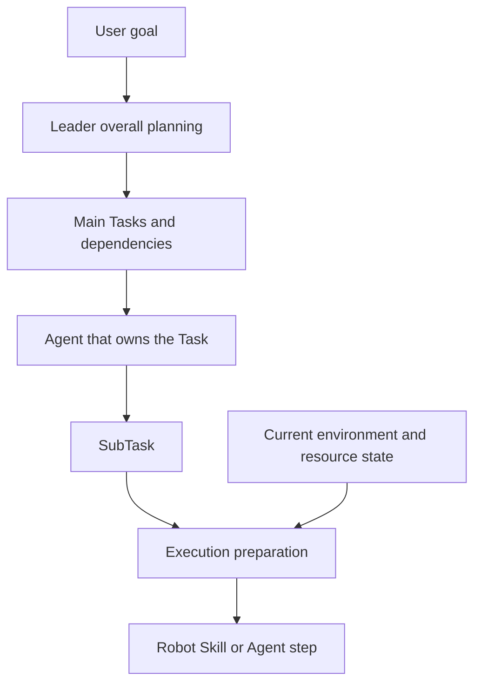
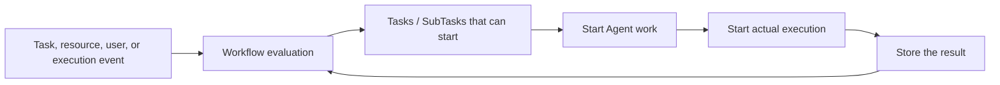

The goal a user proposes in an embodied application is usually a business goal, for example:

> Move the top layer of totes from the source pallet to the target pallet.

That goal has to form main work from the current environment, be handed to suitable Agents and Robots, and keep progressing through a long physical execution. Semantic uses Plan Proposal to express a reviewable plan, Workflow to organize confirmed work, and Task and SubTask to turn a goal into executable steps.

```text
User goal
→ Leader understands and clarifies
→ Plan Proposal
→ User review and approval
→ Workflow
→ Tasks and dependencies
→ Agents and Robots take the work
→ SubTask execution
→ Results and environment change
→ Leader summarizes
```

This chapter introduces how a goal becomes a plan, how a Task expresses result ownership, and how Workflow keeps progressing from dependencies, resources, user participation, and runtime events.

## From a goal to sustainable execution

"Transfer one layer of totes" contains a set of questions that have to be determined step by step:

- which totes currently need to be transferred;
- what upper/lower-layer relations the totes have;
- which target position each tote should enter;
- which work can happen at the same time;
- which work needs to wait for a predecessor result;
- what Agent, Robot, and capabilities each piece of work needs;
- after the environment changes, how later work continues.

Agents are responsible for understanding these questions and organizing the work. Workflow stores confirmed goals, Tasks, relations, and results, so the work can keep developing across many Agent Runs, Robot actions, and user Interactions.



## Plan Proposal expresses a reviewable plan

A Plan Proposal is Leader's structured understanding of the user goal and the main work. It can express:

- the goal that should be finished;
- the scope the plan covers;
- the main Tasks;
- the relations among Tasks;
- business constraints;
- completion conditions;
- the range of Agents, Robots, and capabilities that can be used.

A Plan Proposal forms both a semantic structure for the Framework and a plan view for the user to read. The user can keep discussing in Conversation. Leader adjusts the plan from new information, then hands the updated plan to the user for review.

### Environment understanding during planning

Leader obtains related information from the current goal, for example:

- query objects, regions, and spatial relations in Semantic Map;
- inspect application knowledge and resources in the Project;
- understand Agents, Robots, and capabilities that can take part;
- read Artifacts and predecessor results related to the current goal;
- use information already confirmed in Conversation.

Environment information helps Leader choose business objects and organize tasks. At execution time, Robot Skill obtains the current Observation through Ability and turns the planned business goal into the on-site state.

### Users take part in forming the plan

When a plan involves user preference, business scope, authorization, or target choice, Leader invites the user through an Interaction. The user's answer returns to the original Conversation and planning work. The plan keeps forming from understanding that already exists.

User approval means the goal, scope, main Tasks, and relations described by the current plan can enter formal execution. After approval, Semantic creates a Workflow and the main Tasks, and starts evaluating work that can progress.

## Workflow organizes confirmed work

A Workflow is a whole piece of work that the user has confirmed and that can keep progressing. It connects:

- the original Conversation;
- the approved goal and scope;
- the main Tasks;
- the relations among Tasks;
- the Agents and Robots that actually take part;
- SubTasks and execution results;
- the final overall result.

```text
Conversation
└── Plan Proposal
    └── Workflow
        ├── Task
        │   ├── SubTask
        │   └── SubTask
        └── Task
            └── SubTask
```

Workflow lets one piece of work span many Agent Runs, multiple Agents, many Robot Skill executions, resource waits, and environment change. It keeps the goal, work relations, and progress. Agents keep taking part at points that need understanding, planning, and decision.

## A Task expresses clear result ownership

A Task is a work unit in a Workflow that one Agent is responsible for finishing. A Task needs the Agent that owns it to understand:

```text
What result needs to be finished
What business information has already been provided
What conditions the work must meet
Which predecessor results it depends on
What role, capabilities, and resources it needs
What result was finally produced
```

### Task goal

A Task goal describes the business result that needs to be finished, for example:

> Transfer the specified tote to the target stacking column.

It keeps the work at the business-result level. The Agent that owns the Task then organizes concrete steps from its role, capabilities, and the current environment.

### Task Input

Task Input is business information that Leader or predecessor work hands to the owner. It can contain:

- a chosen source object;
- a chosen target object or region;
- constraints confirmed by the user;
- application parameters;
- predecessor Task results;
- environment-object references;
- planning hints related to the current work.

For example:

```text
Task: transfer one tote

Goal
  Place the specified tote on the source pallet into the target stacking column

Input
  Source tote
  Target stacking column
  Keep tote orientation

Completion conditions
  The tote is placed stably
  The Robot tool has released
  The Robot has returned to a movable posture
```

Tasks of different roles form corresponding inputs from business needs. Shared goal, input, completion-condition, dependency, and result semantics let them enter the same Workflow.

### Completion conditions and results

Completion conditions describe what should be true when a Task obtains the expected result. They can involve business output, environment change, Robot state, or Artifacts that need to be produced.

A Task result expresses to later collaboration what the current work obtained, including:

- a business-result summary;
- a structured result;
- related Artifacts;
- changes produced in the environment;
- information later Tasks can use.

Agent Run, Trace, and Robot Execution store a more detailed work process. Task results connect later Tasks, Leader, and Conversation.

## Tasks form a work structure through dependencies

Dependencies among Tasks express business order. Source relations in depalletizing can be expressed as:



This set of relations expresses:

- a lower-layer tote becomes operable after its upper-layer tote is moved away;
- the left and right source columns can progress according to environment and resource conditions;
- the final check gathers the related transfer results.

Task dependencies describe business conditions. Actual parallelism is also affected by Agents, Robots, workspace, and other resources.

### Dependencies and resources

A business dependency means a predecessor result is still forming. A resource wait means the needed Agent, Robot, or workspace is currently in use. When dependencies are satisfied and resources are available, a Task enters actual planning and execution.

Multiple independent Tasks can progress at the same time. Tasks that share the same Robot or workspace obtain execution conditions in turn from resource availability.

## Agents and Robots are determined when a Task starts

A Plan Proposal describes the role, capabilities, and resources a Task needs, for example:

- a Robot role;
- grasp, navigation, and place capabilities;
- a Robot that fits the specified tote type;
- Project workspace write capability;
- environment-analysis capability.

When a Task has execution conditions, Workflow chooses the owner from Agents, Robots, and capabilities that are actually available.

```text
The Task has execution conditions
→ inspect currently available Agents, Robots, and capabilities
→ choose a suitable owner
→ establish the work relation for this Task
→ the Agent starts planning and execution
```

The plan expresses business needs. Actual execution uses participants and resources available at that time. After a Robot Task establishes an execution relation, the related Robot keeps serving that Task during physical work. After the work finishes and the Robot returns to an available state, it can take a new task.

## A SubTask expresses a step inside a Task

A Task expresses a result one Agent is responsible for. A SubTask expresses a local step that needs to progress in order to finish that result.

For example, a single-tote transfer Task can form:

```text
Task: move the tote to the target stacking column
├── Source navigation
├── Grasp the tote
├── Loaded travel
└── Place the tote
```

Robot Agent organizes these SubTasks from the Task goal and inputs, the current Robot, the current environment, and installed Robot Skills.

```text
Task
  expresses one Agent's responsibility for a business result

SubTask
  expresses the execution steps this Agent organizes to finish the result

Robot Execution
  expresses the real execution process inside one Robot Skill
```

A Robot Skill's Stages, Actions, Feedback, and Observation unfold in Robot Execution. Workflow uses a Robot SubTask to express the result one embodied step wants to obtain.

A specialist Agent can also use SubTasks to organize local work, such as reading application content, modifying resources, running tests, analyzing results, and generating reports.

## Three layers of planning

Semantic splits planning into overall planning, Task planning, and execution preparation.

### Overall planning

Leader starts from the user goal and forms the main Tasks, Task relations, required roles, capabilities, and completion requirements. Overall planning focuses on the business goal and the main results.

### Task planning

The Agent that owns a Task organizes SubTasks from the Task goal, business inputs, actual capabilities, and the current environment. Task planning focuses on how the current Agent takes responsibility for this result.

### Execution preparation

When the current SubTask is about to execute, the owner prepares the information this execution needs from the current environment, resource state, and Skill input/output description. Robot Skill then obtains the current Observation through Ability and finishes the embodied action.



This layering keeps the main plan in business semantics, lets the Agent that owns a Task organize steps from the actual participants, and lets execution use environment information close to the time of action.

## Workflow adapts to environment and execution change

An embodied task keeps obtaining new information during execution, for example:

- positions and relations of environment objects change;
- Robot capabilities or state change;
- a SubTask returns a new result;
- a Robot Skill asks an Agent to decide;
- a user adds information through an Interaction;
- the actual result of a predecessor Task brings new work conditions.

The Agent that owns a Task can adjust later steps from the current goal and work scope:

```text
Obtain new runtime information
→ the Agent understands the change
→ keep results that have already formed
→ adjust steps that have not started yet
→ continue execution, ask the user, or end the current Task
```

Changes that involve the overall goal, business scope, or main Task relations are handled by Leader continuing to collaborate with the user and forming an updated plan. Workflow therefore both keeps confirmed work and lets future steps adapt to a new environment and execution results.

## Wait, pause, and continue

Work in a Workflow can wait for information from different sources:

- a predecessor Task result;
- an Agent or Robot resource;
- a user handling an Interaction;
- an Agent analyzing an adjustment;
- Robot Execution returning a result;
- environment or device state becoming clear.

Each wait has a clear reason, a current owner, and a continue condition.

```text
Waiting for user input
→ the user handles the Interaction
→ the original Agent continues

Waiting for a Robot
→ the Robot becomes available again
→ Workflow re-evaluates the Task

Waiting for an Agent decision
→ the Agent returns an adjustment
→ the current Task continues

Waiting for an execution result
→ Robot Execution returns a clear state
→ Workflow advances or requests handling
```

Work the user paused is continued by the user. Waits related to environment, device, or execution state are driven by the corresponding events. When a Workflow is stopped, the runtime system stops starting new work. Steps that have already entered physical execution are stopped safely by the Robot execution system.

## Event-driven Workflow keeps progressing

Workflow re-judges which work can continue from task, resource, user, and execution events. Events can come from:

- a Plan being approved;
- a predecessor Task finishing;
- an Agent or Robot becoming available;
- an Agent finishing Task planning;
- a SubTask finishing;
- Robot Execution returning a result;
- a user handling an Interaction;
- environment information changing;
- a user starting a pause or stop.



Workflow evaluates dependencies and resources, chooses work that can progress now, establishes Agent and resource relations, and receives execution results. Points that need semantic understanding start an Agent Run. Dependencies and execution steps that are already clear continue through the runtime system.

## Workflow completion and Leader summary

After the main Tasks form results, Workflow gathers overall work information. Leader forms a user-facing summary from the user goal, the approved plan, Task results, the final environment state, Robot execution results, and related Observations and Artifacts.

```text
The main Tasks form results
→ Workflow gathers the overall result
→ Leader starts a summary Run
→ Conversation returns the completion status
```

The summary can describe which work was finished, what changed for objects in the environment, the current Robot state, and matters that need later attention. After a Workflow finishes, Conversation and Project remain. The user can start the next piece of work from the new environment state.

## Depalletizing Workflow example

The following example uses transferring the top layer of totes from the source pallet to connect the design in this chapter.

1. The user proposes a one-layer transfer goal in Conversation.
2. Leader queries Semantic Map and identifies the current top-layer totes, source layer relations, target positions, and available Robots.
3. Leader generates a Plan Proposal that expresses the main Robot Task for each tote, source dependencies, target assignment, and completion conditions.
4. After the user approves, Semantic creates a Workflow and the main Robot Tasks.
5. Tasks whose dependencies are satisfied and whose resources are available enter execution. Multiple compatible Robots can own independent Tasks.
6. Robot Agent plans source navigation, grasp, loaded travel, and place SubTasks for each tote-transfer Task.
7. Robot Skill finishes the actual actions. Results keep returning to Workflow.
8. After a tote is moved away, source layer relations and target occupancy change. Related events drive later Tasks to continue.
9. After all transfer Tasks form results, Leader summarizes the transferred totes, target positions, final environment, and Robot state in the original Conversation.

This process shows the layers of task planning: Leader organizes the main business results, the Agent that owns a Task plans local steps, execution preparation forms action inputs from the current environment, and Workflow uses events to keep them connected.

## Relation to later chapters

This chapter introduced how a user goal becomes a Plan Proposal, Workflow, Task, and SubTask, and how work keeps progressing from dependencies, resources, and runtime results. Later chapters continue:

- **Robot execution and the embodied loop**: how a Robot SubTask finishes an environment action through Robot Skill, Ability, and Robot SDK;
- **Semantic extension model**: how developers add new Agents, Task capabilities, Robot Skills, and environment support;
- **Simulation, real robots, and deployment**: how Robots and environments used by Workflow enter a concrete runtime instance.

## Related layers

- Design contracts and extension guidance: [Core modules · Workflow and task orchestration](../developer/core-modules/orchestration/_index.en.md)
- Server / frontend implementation details: [Internals · Server, Agent, and Workflow](../developer/reference/internals/server-agent-and-workflow.en.md)
