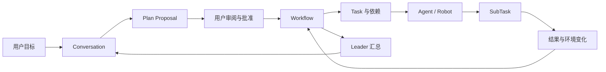
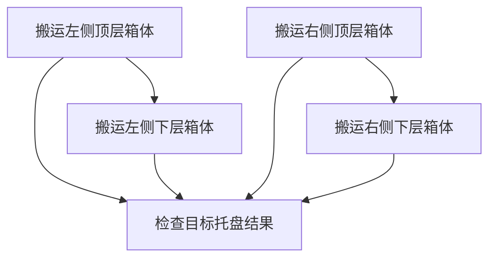
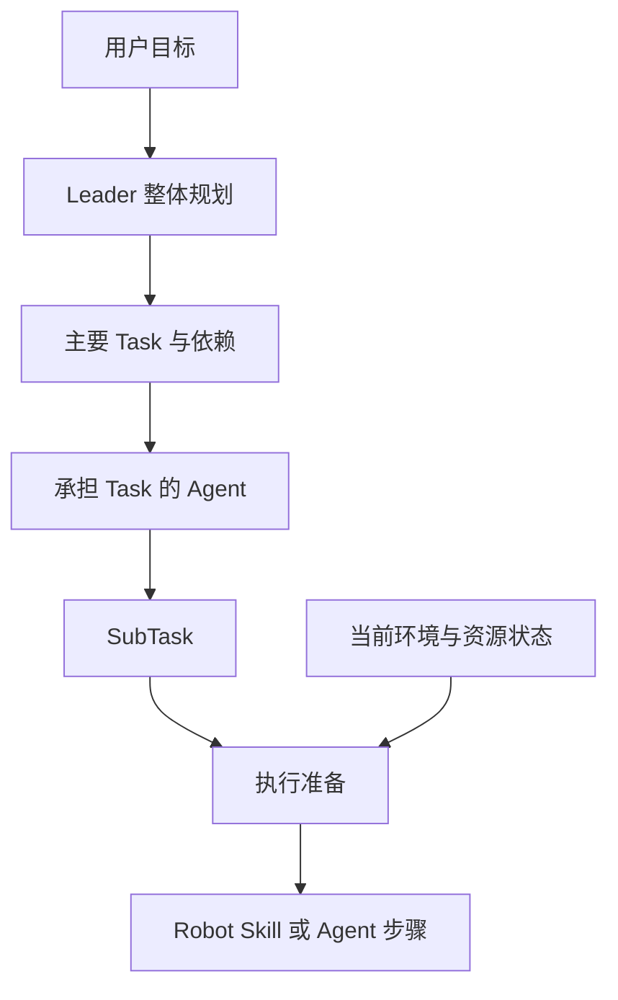
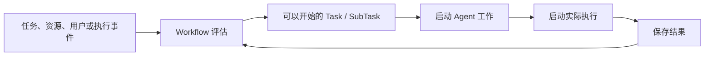

用户在具身应用中提出的通常是业务目标，例如：

> 将来源托盘顶层的一层周转箱搬到目标托盘。

这个目标需要结合当前环境形成主要工作，交给适合的 Agent 和 Robot，并在较长的物理执行过程中持续推进。Semantic 使用 Plan Proposal 表达可审阅的计划，使用 Workflow 组织已经确认的工作，使用 Task 和 SubTask 将目标逐步落实为可执行步骤。

```text
用户目标
→ Leader 理解与澄清
→ Plan Proposal
→ 用户审阅和批准
→ Workflow
→ Task 与依赖
→ Agent 和 Robot 承担工作
→ SubTask 执行
→ 结果与环境变化
→ Leader 汇总
```

本章介绍目标如何形成计划，Task 如何表达结果责任，以及 Workflow 如何根据依赖、资源、用户参与和运行事件持续推进。

## 从目标到可持续执行

“搬运一层周转箱”包含一组需要逐步确定的问题：

- 当前需要搬运哪些箱体；
- 箱体之间具有怎样的上下层关系；
- 每个箱体应该进入哪个目标位置；
- 哪些工作可以同时进行；
- 哪些工作需要等待前置结果；
- 每项工作需要什么 Agent、Robot 和能力；
- 环境变化后，后续工作如何继续。

Agent 负责理解这些问题并组织工作。Workflow 保存已经确认的目标、Task、关系和结果，让工作可以跨越多次 Agent Run、Robot 行动和用户 Interaction 持续发展。



## Plan Proposal 表达可审阅的计划

Plan Proposal 是 Leader 对用户目标和主要工作的结构化理解。它可以表达：

- 希望完成的目标；
- 计划涉及的范围；
- 主要 Task；
- Task 之间的关系；
- 业务约束；
- 完成条件；
- 可以使用的 Agent、Robot 和能力范围。

Plan Proposal 同时形成供 Framework 使用的语义结构和供用户阅读的计划视图。用户可以在 Conversation 中继续讨论，Leader 根据新的信息调整计划内容，再将更新后的计划交给用户审阅。

### 规划中的环境理解

Leader 根据当前目标取得相关信息，例如：

- 查询 Semantic Map 中的对象、区域和空间关系；
- 查看 Project 中的应用知识和资源；
- 了解可以参与工作的 Agent、Robot 和能力；
- 阅读与当前目标有关的 Artifact 和前序结果；
- 使用 Conversation 中已经确认的信息。

环境信息帮助 Leader 选择业务对象和组织任务。执行时，Robot Skill 通过 Ability 主动取得当前 Observation，将计划中的业务目标落实到现场状态。

### 用户参与计划形成

当计划涉及用户偏好、业务范围、授权或目标选择时，Leader 通过 Interaction 邀请用户参与。用户的回答回到原来的 Conversation 和规划工作，计划从已有理解继续形成。

用户批准表示当前计划描述的目标、范围、主要 Task 和关系可以进入正式执行。批准后，Semantic 创建 Workflow 和主要 Task，并开始评估可以推进的工作。

## Workflow 组织已经确认的工作

Workflow 是一个经过用户确认、可以持续推进的工作整体。它连接：

- 原始 Conversation；
- 已批准的目标与范围；
- 主要 Task；
- Task 之间的关系；
- 实际参与的 Agent 和 Robot；
- SubTask 与执行结果；
- 最终整体结果。

```text
Conversation
└── Plan Proposal
    └── Workflow
        ├── Task
        │   ├── SubTask
        │   └── SubTask
        └── Task
            └── SubTask
```

Workflow 让一项工作可以跨越多次 Agent Run、多个 Agent、多次 Robot Skill 执行、资源等待和环境变化。它保留目标、工作关系和进展，Agent 在需要理解、规划和决定的位置继续参与。

## Task 表达明确的结果责任

Task 是 Workflow 中由一个 Agent 负责完成的工作单元。一个 Task 需要让承担它的 Agent 理解：

```text
需要完成什么结果
已经提供了哪些业务信息
完成工作需要满足什么条件
依赖哪些前置结果
需要什么角色、能力和资源
最终产生了什么结果
```

### Task 目标

Task 目标描述需要完成的业务结果，例如：

> 将指定周转箱搬运到目标堆叠列。

它将工作保持在业务结果层面。承担 Task 的 Agent 再根据自己的角色、能力和当前环境组织具体步骤。

### Task Input

Task Input 是 Leader 或前置工作交给承担者的业务信息。它可以包含：

- 已选择的来源对象；
- 已选择的目标对象或区域；
- 用户确认的约束；
- 应用参数；
- 前置 Task 结果；
- 环境对象引用；
- 与当前工作有关的规划提示。

例如：

```text
Task：搬运一个周转箱

目标
  将来源托盘上的指定箱体放入目标堆叠列

输入
  来源箱体
  目标堆叠列
  保持箱体朝向

完成条件
  箱体稳定放置
  Robot 工具已经释放
  Robot 恢复可移动姿态
```

不同角色的 Task 根据业务需要形成相应输入。共同的目标、输入、完成条件、依赖和结果语义让它们能够进入同一套 Workflow。

### 完成条件与结果

完成条件说明 Task 取得预期结果时应当满足什么。它可以涉及业务输出、环境变化、Robot 状态或需要产生的 Artifact。

Task 结果面向后续协作表达当前工作取得了什么，包括：

- 业务结果摘要；
- 结构化结果；
- 相关 Artifact；
- 对环境产生的变化；
- 可供后续 Task 使用的信息。

Agent Run、Trace 和 Robot Execution 保存更详细的工作过程，Task 结果则连接后续 Task、Leader 和 Conversation。

## Task 通过依赖形成工作结构

Task 之间的依赖表达业务上的先后关系。拆码垛中的来源关系可以表示为：



这组关系表达：

- 下层箱体在其上层箱体搬走后具备操作条件；
- 左右两个来源列可以根据环境和资源条件推进；
- 最终检查汇集相关搬运结果。

Task 依赖描述业务条件，实际并行程度还会受到 Agent、Robot、工作空间和其他资源影响。

### 依赖与资源

业务依赖表示前置结果正在形成，资源等待表示当前需要的 Agent、Robot 或工作空间正在使用。当依赖满足并且资源可用时，Task 进入实际规划和执行。

多个相互独立的 Task 可以同时推进。共享同一 Robot 或工作空间的 Task 根据资源可用性依次取得执行条件。

## Agent 与 Robot 在 Task 开始时确定

Plan Proposal 描述 Task 所需要的角色、能力和资源，例如：

- Robot 角色；
- 抓取、导航和放置能力；
- 适合指定箱型的 Robot；
- Project 工作区写入能力；
- 环境分析能力。

Workflow 在 Task 具备执行条件时，根据实际可用的 Agent、Robot 和能力选择承担者。

```text
Task 具备执行条件
→ 查看当前可用 Agent、Robot 和能力
→ 选择适合的承担者
→ 建立本次 Task 的工作关系
→ Agent 开始规划和执行
```

计划表达业务需要，实际执行使用当时可用的参与者和资源。Robot Task 建立执行关系后，相关 Robot 在物理工作期间持续服务于这项 Task；工作完成并回到可用状态后，它可以继续承担新的任务。

## SubTask 表达 Task 内部步骤

Task 表达一个 Agent 需要负责的结果，SubTask 表达完成这个结果需要推进的局部步骤。

例如，一个单箱搬运 Task 可以形成：

```text
Task：将箱体搬到目标堆叠列
├── 来源导航
├── 抓取箱体
├── 携物导航
└── 放置箱体
```

Robot Agent 根据 Task 目标与输入、当前 Robot、当前环境和已安装 Robot Skill 组织这些 SubTask。

```text
Task
  表达一个 Agent 对业务结果的责任

SubTask
  表达这个 Agent 为完成结果而组织的执行步骤

Robot Execution
  表达一个 Robot Skill 内部的真实执行过程
```

Robot Skill 的 Stage、Action、Feedback 和 Observation 在 Robot Execution 中展开。Workflow 使用 Robot SubTask 表达一次具身步骤希望取得的结果。

专业 Agent 也可以使用 SubTask 组织局部工作，例如读取应用内容、修改资源、运行测试、分析结果和生成报告。

## 三个层次的规划

Semantic 将规划分为整体规划、Task 规划和执行准备三个层次。

### 整体规划

Leader 从用户目标出发，形成主要 Task、Task 关系、所需角色、能力和完成要求。整体规划关注业务目标与主要结果。

### Task 规划

承担 Task 的 Agent 结合 Task 目标、业务输入、实际能力和当前环境组织 SubTask。Task 规划关注当前 Agent 如何对这个结果负责。

### 执行准备

当前 SubTask 即将执行时，承担者结合当前环境、资源状态和 Skill 输入输出说明准备本次执行需要的信息。Robot Skill 随后通过 Ability 取得当前 Observation 并完成具身行动。



这种分层让主要计划保持业务语义，让承担 Task 的 Agent 根据实际参与者组织步骤，也让执行使用接近行动时的环境信息。

## Workflow 适应环境与执行变化

具身任务会在执行过程中持续获得新信息，例如：

- 环境对象的位置和关系发生变化；
- Robot 能力或状态发生变化；
- 一个 SubTask 返回新的结果；
- Robot Skill 请求 Agent 作出决定；
- 用户通过 Interaction 补充信息；
- 前置 Task 的实际结果带来新的工作条件。

承担 Task 的 Agent 可以根据当前目标和工作范围调整后续步骤：

```text
取得新的运行信息
→ Agent 理解变化
→ 保留已经形成的结果
→ 调整尚未开始的步骤
→ 继续执行、询问用户或结束当前 Task
```

涉及整体目标、业务范围或主要 Task 关系的变化，由 Leader 与用户继续协作并形成更新后的计划。Workflow 因此既保持已经确认的工作，也能够让未来步骤适应新的环境和执行结果。

## 等待、暂停与继续

Workflow 中的工作可以等待不同来源的信息：

- 前置 Task 结果；
- Agent 或 Robot 资源；
- 用户处理 Interaction；
- Agent 分析调整方式；
- Robot Execution 返回结果；
- 环境或设备状态明确。

每一种等待都具有明确的原因、当前处理者和继续条件。

```text
等待用户输入
→ 用户处理 Interaction
→ 原 Agent 继续工作

等待 Robot
→ Robot 重新可用
→ Workflow 重新评估 Task

等待 Agent 决定
→ Agent 返回调整结果
→ 当前 Task 继续

等待执行结果
→ Robot Execution 返回明确状态
→ Workflow 推进或请求处理
```

用户主动暂停的工作由用户继续。环境、设备或执行状态相关的等待由相应事件推动。停止 Workflow 时，运行系统停止启动新的工作；已经进入物理执行的步骤由 Robot 执行系统完成安全停止。

## 事件驱动 Workflow 持续推进

Workflow 根据任务、资源、用户和执行事件重新判断哪些工作可以继续。事件可以来自：

- Plan 获得批准；
- 前置 Task 完成；
- Agent 或 Robot 变为可用；
- Agent 完成 Task 规划；
- SubTask 完成；
- Robot Execution 返回结果；
- 用户处理 Interaction；
- 环境信息发生变化；
- 用户发起暂停或停止。



Workflow 评估依赖和资源，选择当前可以推进的工作，建立 Agent 与资源关系，并接收执行结果。需要语义理解的位置启动 Agent Run，已经明确的依赖与执行步骤由运行系统继续处理。

## Workflow 完成与 Leader 汇总

主要 Task 形成结果后，Workflow 汇集整体工作信息。Leader 结合用户目标、已批准计划、Task 结果、环境最终状态、Robot 执行结果以及相关 Observation 和 Artifact，形成面向用户的总结。

```text
主要 Task 形成结果
→ Workflow 汇集整体结果
→ Leader 启动总结 Run
→ Conversation 返回完成情况
```

总结可以说明完成了哪些工作、环境中的对象发生了什么变化、Robot 当前状态以及后续需要关注的事项。Workflow 完成后，Conversation 和 Project 继续保留，用户可以从新的环境状态开始下一项工作。

## 拆码垛 Workflow 示例

下面以搬运来源托盘顶层的一层周转箱为例，串联本章介绍的设计。

1. 用户在 Conversation 中提出一层搬运目标。
2. Leader 查询 Semantic Map，识别当前顶层箱体、来源层次关系、目标位置和可用 Robot。
3. Leader 生成 Plan Proposal，表达每个箱体对应的主要 Robot Task、来源依赖、目标分配和完成条件。
4. 用户批准后，Semantic 创建 Workflow 和主要 Robot Task。
5. 满足依赖且资源可用的 Task 进入执行，多台兼容 Robot 可以承担相互独立的 Task。
6. Robot Agent 为每个箱体搬运 Task 规划来源导航、抓取、携物导航和放置 SubTask。
7. Robot Skill 完成实际行动，结果持续返回 Workflow。
8. 箱体搬走后，来源层次关系和目标占用发生变化，相关事件推动后续 Task 继续。
9. 全部搬运 Task 形成结果后，Leader 在原 Conversation 中汇总已搬运箱体、目标位置、最终环境和 Robot 状态。

这个过程体现了任务规划的层次：Leader 组织主要业务结果，承担 Task 的 Agent 规划局部步骤，执行准备结合当前环境形成行动输入，Workflow 使用事件把它们持续连接起来。

## 与后续章节的关系

本章介绍了用户目标如何形成 Plan Proposal、Workflow、Task 和 SubTask，以及工作如何根据依赖、资源和运行结果持续推进。后续章节继续展开：

- **Robot 执行与具身闭环**：Robot SubTask 如何通过 Robot Skill、Ability 和 Robot SDK 完成环境行动；
- **Semantic 扩展模型**：开发者如何增加新的 Agent、Task 能力、Robot Skill 和环境支持；
- **仿真、真机与部署**：Workflow 使用的 Robot 和环境如何进入具体运行实例。

## 相关层次

- 设计契约与扩展指引：[核心模块 · Workflow 与任务编排](/developer/core-modules/orchestration/)
- 服务端/前端实现细节：[内部实现 · Server、Agent 与 Workflow](/developer/reference/internals/server-agent-and-workflow/)
