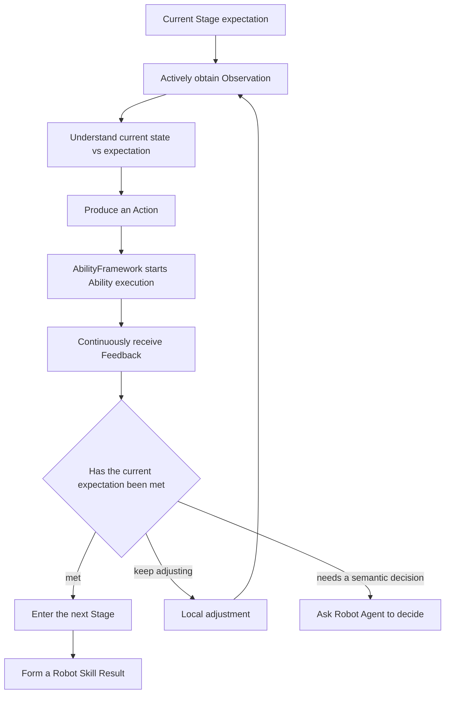
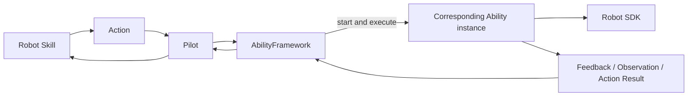
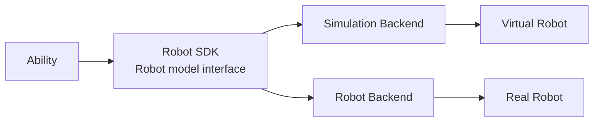
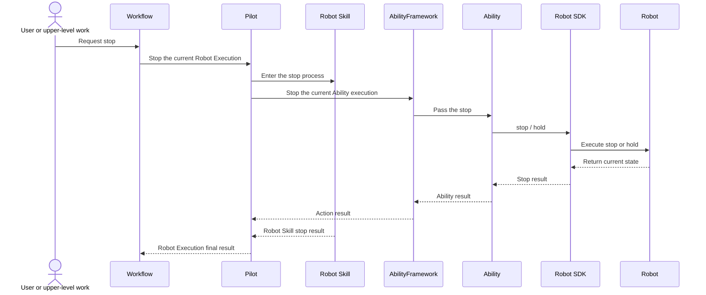

A Robot SubTask expresses the result one embodied operation wants to obtain, for example "grasp the specified tote" or "place the current tote into the target stacking column". For that result to happen in a real or simulated environment, the system still has to observe the current state, plan motions, drive the Robot, track the execution process, and judge environment change.

Semantic uses a layered Robot execution chain to turn task semantics into bodily action:

```text
Robot SubTask
→ Robot Agent chooses a Robot Skill
→ establish a Robot Execution
→ Pilot runs the Robot Skill
→ Robot Skill organizes Stages and Actions
→ AbilityFramework starts the corresponding Ability instance to execute the Action
→ Ability drives the Robot through Robot SDK
→ Feedback and Observation return to Robot Skill
→ Robot Skill forms a Result
→ Robot Execution drives Workflow
```

This chapter introduces how Robot, Pilot, Robot Execution, Robot Skill, AbilityFramework, Ability, and Robot SDK together form the embodied loop, and how the execution process stops, adjusts, and returns results to the task system.

## From task semantics to bodily action

Take grasp as an example:

> Grasp the specified tote and arrange it into a posture suitable for loaded travel.

What Robot Agent understands is an operation goal with business meaning. Robot execution still has to finish:

- observe the tote's current position, size, and surrounding space;
- plan a grasp that fits the current Robot and tools;
- control the base, manipulators, and tools;
- continuously read motion, contact, and sensor Feedback;
- actively obtain Observation at key points;
- judge whether the tote has been grasped stably;
- adjust local motions from on-site change;
- return the grasp result and the Robot's final state.

```mermaid
flowchart LR
    SubTask["Robot SubTask"]
    RobotAgent["Robot Agent"]
    Server["Semantic Server"]
    Pilot["Pilot"]
    Skill["Robot Skill"]
    Action["Action"]
    AF["AbilityFramework"]
    Ability["Ability instance"]
    SDK["Robot SDK"]
    Backend["Backend"]
    Robot["Robot"]
    Environment["Environment"]

    SubTask --> RobotAgent
    RobotAgent --> Server
    Server --> Pilot
    Pilot --> Skill
    Skill --> Action
    Action --> AF
    AF --> Ability
    Ability --> SDK
    SDK --> Backend
    Backend --> Robot
    Robot --> Environment
```



This chain keeps the link between business intent and physical action. The upper layer expresses what should be finished. Lower layers gradually add the current environment, Robot model, tools, motion, and sensor information.

## A Robot is a continuing embodied subject

A Robot has a continuing identity in Semantic and provides information related to the current run:

- Robot model and Backend;
- connection and availability state;
- tools, sensors, and motion capabilities;
- Abilities it can execute;
- installed Robot Skills;
- the current Robot Execution;
- the current environment and Robot state.

Robot Agent lets a Robot take part in a Project as an intelligent collaborator. Pilot lets the Robot connect to Semantic Server as an execution entity. The Robot body finishes the actual action in the environment.

```text
Robot Agent
  understands the Robot Task and chooses embodied operations

Pilot
  hosts Robot Skills and Robot Execution

Robot
  executes actions in a real or simulated environment
```

## Pilot hosts Robot execution

Pilot is an execution runtime for one Robot. It connects Semantic Server to Robot-side capabilities, and is responsible for:

- maintaining the Robot's runtime identity and capability catalog;
- managing Robot Skills this Robot can use;
- starting and tracking Robot Execution;
- starting the Robot Skill runtime;
- handing Actions produced by Robot Skill to AbilityFramework;
- receiving Feedback, Observation, and Action Result returned by AbilityFramework;
- passing Robot Agent requests and stop requests;
- returning the Robot's current state and execution process to Semantic Server.

Pilot focuses on one Robot's complete execution process. AbilityFramework is responsible for choosing and starting the corresponding Ability instance from each Action's capability definition, and finishing this execution.

Robot Skill, AbilityFramework, and Robot SDK each keep their own responsibility, so a Robot Skill's business logic can be reused on different Robots and in different runtime environments.

## Robot Execution expresses one complete embodied run

After Robot Agent starts a Robot Skill, Semantic establishes a Robot Execution. It is the complete record of one Robot Skill run, and also the connection between a Robot SubTask and bodily action.

```text
Robot SubTask
└── Robot Execution
    ├── Robot Skill
    ├── Stage
    │   ├── Action
    │   │   └── Ability execution
    │   ├── Feedback
    │   ├── Observation
    │   └── Artifact
    └── Result
```

Robot Execution expresses:

- which Robot is executing;
- which Robot Skill is currently in use;
- which Stage execution has reached;
- which Actions the Stage started;
- which Ability instances finished the Actions;
- what Feedback the Robot returned;
- which Observations the Skill obtained on demand;
- which Artifacts were produced;
- what Result was finally obtained.

The start of a Robot Execution means this embodied work has entered the runtime chain. The final result is formed together by the Robot Skill execution result and the current environment state.

### Robot Execution and Agent Run

After Robot Agent starts a Robot Execution, it can end the current Agent Run. Pilot and Robot Skill keep finishing the physical action.

```text
Robot Agent decides to execute a Robot Skill
→ Robot Execution starts
→ the current Agent Run ends
→ Robot Skill keeps executing
→ Robot Execution events return
→ the SubTask or a new Agent Run continues
```

Agent Run is responsible for semantic understanding and decision. Robot Execution is responsible for continuing physical action. They stay connected through Task, Robot Execution, and runtime events.

## Robot Skill organizes one embodied operation

A Robot Skill expresses a reusable embodied operation, for example:

- `semantic-navigation`;
- `grasp-object`;
- `place-object`.

A Robot Skill receives a business goal and organizes it into Stages with clear semantics. For example, grasp can be expressed as:

```text
observe_target
→ approach
→ grasp
→ lift_and_verify
→ prepare_transport
```

### Stage

A Stage is an execution phase inside a Robot Skill that has human-understandable semantics, such as observe the target, approach the target, establish contact, lift and verify, and arrange a loaded-travel posture.

Each Stage expresses:

- the result currently hoped for;
- Observations that need to be obtained;
- Actions that can be executed;
- how to judge progress from Feedback;
- how the current result enters the next Stage.

Stages let the internal process of a Robot Skill be understood by users, Agents, and Studio.

### Action

An Action is one capability execution with a clear boundary inside a Stage, for example:

- follow a navigation path;
- move one or more end effectors;
- control tool opening and closing;
- capture RGB-D;
- localize a target object;
- generate grasp candidates;
- check tool contact and load.

After Robot Skill produces an Action, Pilot submits it to AbilityFramework. AbilityFramework starts the corresponding Ability instance from the Action's capability definition. Ability then finishes this execution through Robot SDK.

## The embodied loop inside a Robot Skill

Robot Skill forms a local loop around "expectation — observation — action — feedback — judgment".



### Expectation

A Stage first describes the environment or Robot state it wants to reach, for example:

- the Robot has arrived at the target region;
- the tools have established the needed contact;
- the tote has left the support surface;
- the tote is at the target stacking position;
- the Robot has returned to a walking posture.

### Observation

Robot Skill actively observes the current object, region, tool, or Robot state through Ability. Observation can answer questions such as current tote pose, tool contact, whether the Robot is holding an object, target-position occupancy, and place stability.

### Action and Feedback

The Skill produces an Action from the current Observation. While Ability executes, motion, control, tool, and sensor state keep returning through Feedback.

Feedback helps the Skill understand how the Action is advancing. Observation helps the Skill re-understand the current environment at key points.

### Judgment and adjustment

From the current situation, Robot Skill enters the next Stage, adjusts local parameters, chooses a new candidate, re-observes the target, asks Robot Agent to decide, or forms the current Result.

Local adjustment always serves the same Robot SubTask and business goal.

## AbilityFramework and Ability

Ability organizes a Robot's perception, planning, motion, and tool capabilities into composable execution units. Semantic Robot capabilities include:

- **Navigation**: path planning and movement;
- **Manipulator Motion**: manipulator and multi-end-effector motion;
- **End Effector**: gripper, fixture, and other tool control;
- **Robot State**: Robot, joint, end-effector, and tool state;
- **Sensor Capture**: image, depth, and other sensor-data capture;
- **Object Perception**: object localization, size, and state observation;
- **Grasp Planning**: grasp candidates and manipulation-pose planning.

AbilityFramework hosts the Abilities the current Robot can use, and finishes one capability execution with Action as the entry:



This process expresses one execution relation: Action describes the capability that should be used, AbilityFramework starts an Ability instance that matches that capability definition, Ability executes through the current Robot's SDK, and returns process and result to Robot Skill.

Ability focuses on one class of composable capability. Robot Skill focuses on one complete embodied operation. Multiple Robot Skills can reuse the same class of Ability. The same Robot Skill can also compose multiple classes of Ability.

## Robot SDK connects a concrete Robot

Robot SDK provides a typed interface for one Robot model, for example:

- base motion;
- manipulator motion;
- tool control;
- Robot state;
- sensor reads;
- path and motion planning;
- stop and hold.

Ability uses Robot SDK to finish a concrete capability execution. Robot SDK then connects a real Robot or a simulation Runtime through a Backend.



Robot SDK lets upper-level Robot Skills and Abilities use consistent capability semantics. The corresponding Backend expresses control, state, and sensing implementations in different environments. Robot model, tools, coordinate frames, motion ranges, and safety parameters enter the SDK and Ability through Robot configuration.

## Feedback, Observation, Artifact, and Result

The environment chapter already introduced the overall meaning of this information. In Robot Execution, they together express the execution process and result.

### Feedback

Feedback expresses the continuous execution process of an Action, such as motion progress, Robot and end-effector state, control error, tool contact, force, and other sensor readings.

### Observation

Observation expresses the structured result Robot Skill obtains by actively observing the current environment or Robot state. It usually appears at Stage entry, before and after an Action, after a contact change, and before a Stage completion judgment.

### Artifact

Artifact stores data resources produced by Robot Execution, such as images, depth, point clouds, video, models, reports, and logs. An Observation can associate the corresponding Artifacts. Users and Agents can keep viewing or using this content from the current execution.

### Result

A Robot Skill Result expresses the final result of the current embodied operation, for example:

- the target reached by navigation;
- the object the Robot is carrying after grasp;
- the target region where the object is after place;
- the final state of the Robot and tools.

The Result drives Robot SubTask, Task, and Workflow to keep converging.

## Robot Skill collaborates with Robot Agent

Robot Skill is responsible for the local loop in the current embodied operation. Robot Agent is responsible for decisions that need task semantics and business understanding.

Robot Skill can ask Robot Agent at execution points that are suitable for a semantic decision, for example:

- several recovery strategies need a choice;
- the current target needs to be reconfirmed;
- environment change affects the original business intent;
- the current handling needs a new Task decision;
- a business or safety choice needs user participation.

```text
Robot Skill reaches a semantic decision point
→ Robot Execution stores the current Stage and Observation
→ Robot Agent judges from Task Context
→ it returns a strategy, adjustment, or end decision
→ Robot Skill continues from the current execution position
```

When Robot Agent needs user participation, it brings the question back to Conversation through an Interaction. The user's handling result continues into the same Robot Task and Robot Execution relation.

This collaboration keeps the physical loop inside Robot Skill, and hands business decisions to Robot Agent and the user.

## Stop, hold, and safe state

Stopping a Robot is a complete process from Workflow to the real body.



### Layered safety

Different layers share stop and safety:

- Robot local control and device protection handle immediate risk;
- Robot SDK provides stop and hold for the concrete Robot;
- Ability stops the current motion, tool, or navigation execution;
- AbilityFramework manages the stop process of the current Ability execution;
- Robot Skill organizes the stop of the current embodied operation;
- Pilot tracks Robot Execution and gathers results;
- Workflow stops starting related later work.

### Stopping and already stopped

A stop request starts a state-convergence process. After the Robot returns a confirmed state, the system forms an "already stopped" result.

While the Robot's current physical state is still being confirmed, Robot Execution keeps its relation to the original Task and Robot, so later handling stays oriented to the current site. E-stop, device protection, and on-site safety mechanisms are executed directly by the Robot local system. Their results continue to return to Semantic runtime records.

## Layered adjustment and recovery

Changes during embodied execution can be handled at different layers.

```text
Robot SDK / Ability
  handle the current capability execution and Robot state

Robot Skill
  handle the local loop of the current embodied operation

Robot Agent
  handle semantic decisions for the current Robot Task

Leader / Workflow
  handle the overall goal and cross-Task adjustment

User
  handle business scope, authorization, and important choices
```

Ability and Robot SDK can handle motion and control changes in the current capability execution. Robot Skill can re-observe the target, adjust local parameters, switch candidates, and replan the current Stage. Robot Agent can adjust later Robot SubTasks or answer a Skill request. Leader can handle main Task relations and overall-goal changes.

Recovery starts from the current environment and Robot state. Execution results that have already formed continue into later judgment.

## Robot Execution drives Workflow

Robot Execution returns actual runtime results to Workflow through events.

```text
Robot Execution starts
→ the Robot SubTask enters execution
→ Stages, Actions, Feedback, and Observation keep being produced
→ Robot Skill forms a Result
→ Robot Execution returns the final state
→ the SubTask updates its result
→ Workflow evaluates the next piece of work
```

The execution process can also produce Robot Agent requests, user Interactions, environment change, stop results, and new Artifacts. Workflow drives the current SubTask, Task, and later work from these events. Leader can bring Robot results back to Conversation when a Task or Workflow finishes.

## Simulation and real robots share execution semantics

Robot Execution, Robot Skill, Stage, Action, Ability, Feedback, Observation, and Result apply to both simulated Robots and real Robots.

```text
The same Robot SubTask
→ the same Robot Skill
→ the same Ability semantics
→ Robot SDK
   ├── Simulation Backend
   └── Robot Backend
```

A simulated environment provides Virtual Robots, sensors, and physical state. A real environment provides hardware state and on-site sensing information. Concrete control and data sources in the two environments are expressed by the corresponding Backend.

Scene start, Robot instance formation, Pilot attach, and real-robot deployment are covered in the simulation, real-robot, and deployment chapter.

## Depalletizing execution example

The following example uses one complete single-tote transfer to connect the Robot execution design in this chapter.

### Source navigation

Robot Agent starts `semantic-navigation`. Robot Skill observes the current Robot and target region, produces a navigation Action, and AbilityFramework starts a Navigation Ability to execute path planning and movement. Feedback returns motion progress. Observation confirms the final arrival state.

### Grasp

Robot Agent starts `grasp-object`:

```text
Observe the tote
→ approach
→ establish two-sided contact
→ lift and confirm
→ arrange a loaded-travel posture
```

Robot Skill composes Object Perception, Grasp Planning, Manipulator Motion, End Effector, and Robot State Abilities. During execution it tracks dual-arm and tool motion through Feedback, and reconfirms tote, contact, and holding state through Observation.

### Loaded travel

Robot Agent uses `semantic-navigation` again. The Skill confirms the current holding and tool state, plans a path to the target position, and keeps observing load state during navigation.

### Place

Robot Agent starts `place-object`:

```text
Observe the target stacking position
→ plan the place approach
→ set down and release the tote
→ observe tote stability
→ the Robot returns to a walking posture
```

### Results return

Four Robot Executions drive the corresponding SubTasks in turn. The tote's final position, Robot state, Observation, and Artifact enter the Task result. Workflow then drives the next tote transfer or a Leader summary.

## Relation to later chapters

This chapter introduced how a Robot SubTask becomes an environment action through Robot Agent, Pilot, Robot Skill, AbilityFramework, Ability, and Robot SDK, and how Robot Execution forms an embodied loop through Feedback, Observation, and Result. Later chapters continue:

- **Semantic extension model**: how developers add Robot Skills, Abilities, Robot SDKs, Backends, and other embodied capabilities;
- **Simulation, real robots, and deployment**: how Scene, Runtime, Pilot, and real Robots form a concrete runtime environment.

## Related layers

- Design contracts and extension guidance: [Core modules · Robot Skill](../developer/core-modules/robot/robot-skill.en.md)
- Server / frontend implementation details: [Internals · Pilot and Robot Execution](../developer/reference/internals/robot-execution-and-environment.en.md)
