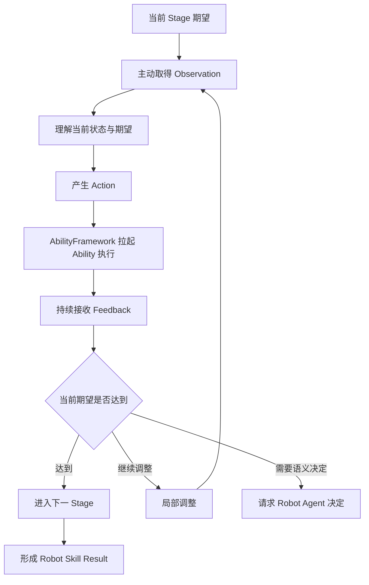
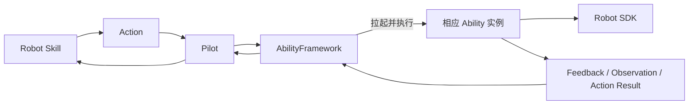
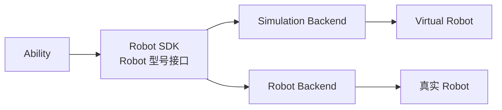
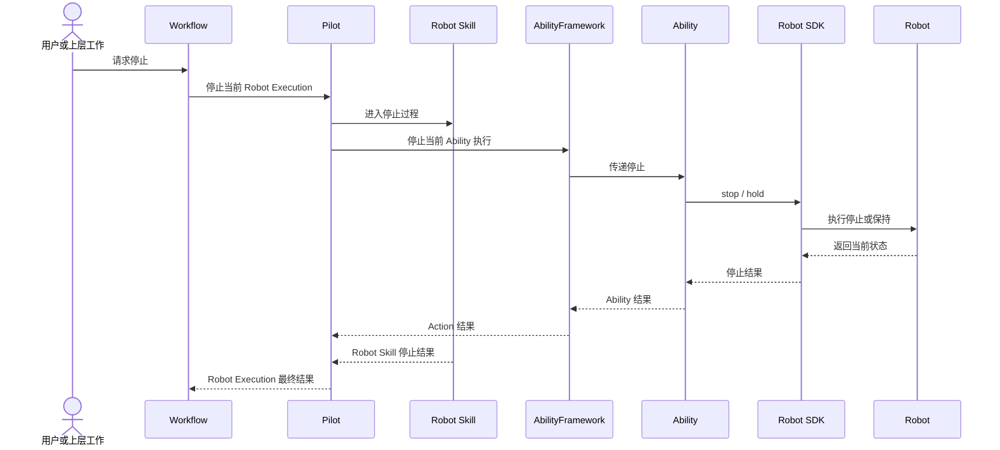

Robot SubTask 表达一次具身操作希望取得的结果，例如“抓取指定周转箱”或“将当前箱体放入目标堆叠列”。要让这个结果发生在真实或仿真环境中，还需要观察当前状态、规划动作、驱动 Robot、跟踪执行过程并判断环境变化。

Semantic 使用分层 Robot 执行链将任务语义落实为身体行动：

```text
Robot SubTask
→ Robot Agent 选择 Robot Skill
→ 建立 Robot Execution
→ Pilot 运行 Robot Skill
→ Robot Skill 组织 Stage 与 Action
→ AbilityFramework 拉起相应 Ability 实例执行 Action
→ Ability 使用 Robot SDK 驱动 Robot
→ Feedback 与 Observation 返回 Robot Skill
→ Robot Skill 形成 Result
→ Robot Execution 推动 Workflow
```

本章介绍 Robot、Pilot、Robot Execution、Robot Skill、AbilityFramework、Ability 和 Robot SDK 如何共同组成具身闭环，以及执行过程如何停止、调整并将结果返回任务系统。

## 从任务语义到身体行动

以抓取目标为例：

> 抓取指定周转箱，并整理为适合携物导航的姿态。

Robot Agent 理解的是带有业务含义的操作目标。Robot 执行需要进一步完成：

- 观察箱体当前的位置、尺寸和周边空间；
- 规划适合当前 Robot 和工具的抓取方式；
- 控制底盘、机械臂和工具；
- 持续读取运动、接触和传感器 Feedback；
- 在关键位置主动取得 Observation；
- 判断箱体是否已经稳定抓取；
- 根据现场变化调整局部动作；
- 返回抓取结果与 Robot 最终状态。

```mermaid
flowchart LR
    SubTask["Robot SubTask"]
    RobotAgent["Robot Agent"]
    Server["Semantic Server"]
    Pilot["Pilot"]
    Skill["Robot Skill"]
    Action["Action"]
    AF["AbilityFramework"]
    Ability["Ability 实例"]
    SDK["Robot SDK"]
    Backend["Backend"]
    Robot["Robot"]
    Environment["环境"]

    SubTask --> RobotAgent
    RobotAgent --> Server
    Server --> Pilot
    Pilot --> Skill
    Skill --> Action
    Action --> AF
    AF --> Ability
    Ability --> SDK
    SDK --> Backend
    Backend --> Robot
    Robot --> Environment
```



这条链路保持业务意图和物理行动之间的联系。上层表达希望完成什么，下层逐步加入当前环境、Robot 型号、工具、运动和传感器信息。

## Robot 是持续参与的具身主体

一台 Robot 在 Semantic 中具有持续身份，并提供与当前运行有关的信息：

- Robot 型号与 Backend；
- 连接和可用状态；
- 工具、传感器与运动能力；
- 可以执行的 Ability；
- 已安装的 Robot Skill；
- 当前 Robot Execution；
- 当前环境与 Robot 状态。

Robot Agent 让 Robot 以智能协作者身份参与 Project，Pilot 让 Robot 以执行实体连接 Semantic Server，Robot 本体则在环境中完成实际行动。

```text
Robot Agent
  理解 Robot Task 并选择具身操作

Pilot
  承载 Robot Skill 与 Robot Execution

Robot
  在真实或仿真环境中执行行动
```

## Pilot 承载 Robot 执行

Pilot 是面向一台 Robot 的执行运行时。它连接 Semantic Server 与 Robot 侧能力，并负责：

- 维护 Robot 的运行身份与能力目录；
- 管理这台 Robot 可以使用的 Robot Skill；
- 启动和跟踪 Robot Execution；
- 启动 Robot Skill 的运行环境；
- 将 Robot Skill 产生的 Action 交给 AbilityFramework；
- 接收 AbilityFramework 返回的 Feedback、Observation 和 Action Result；
- 传递 Robot Agent 请求与停止请求；
- 将 Robot 当前状态和执行过程返回 Semantic Server。

Pilot 关注一台 Robot 的完整执行过程。AbilityFramework 负责根据每个 Action 的能力定义，选择并拉起相应 Ability 实例完成本次执行。

Robot Skill、AbilityFramework 和 Robot SDK 分别保持自己的职责，使 Robot Skill 的业务逻辑可以在不同 Robot 和运行环境中复用。

## Robot Execution 表达一次完整具身执行

Robot Agent 启动一个 Robot Skill 后，Semantic 建立 Robot Execution。它是一次 Robot Skill 运行的完整记录，也是 Robot SubTask 与身体行动之间的连接。

```text
Robot SubTask
└── Robot Execution
    ├── Robot Skill
    ├── Stage
    │   ├── Action
    │   │   └── Ability 执行
    │   ├── Feedback
    │   ├── Observation
    │   └── Artifact
    └── Result
```

Robot Execution 表达：

- 哪台 Robot 正在执行；
- 当前使用哪个 Robot Skill；
- 执行进行到哪个 Stage；
- Stage 发起了哪些 Action；
- 哪些 Ability 实例完成了 Action；
- Robot 返回了什么 Feedback；
- Skill 主动取得了哪些 Observation；
- 产生了哪些 Artifact；
- 最终取得了什么 Result。

Robot Execution 开始表示这项具身工作已经进入运行链。最终结果由 Robot Skill 的执行结果和当前环境状态共同形成。

### Robot Execution 与 Agent Run

Robot Agent 启动 Robot Execution 后可以结束当前 Agent Run，Pilot 和 Robot Skill 继续完成物理行动。

```text
Robot Agent 决定执行 Robot Skill
→ Robot Execution 开始
→ 当前 Agent Run 结束
→ Robot Skill 持续执行
→ Robot Execution 事件返回
→ SubTask 或新的 Agent Run 继续
```

Agent Run 负责语义理解和决定，Robot Execution 负责持续的物理行动。二者通过 Task、Robot Execution 和运行事件保持联系。

## Robot Skill 组织一次具身操作

Robot Skill 表达一个可复用的具身操作，例如：

- `semantic-navigation`；
- `grasp-object`；
- `place-object`。

Robot Skill 接收业务目标，并将其组织为具有明确语义的 Stage。例如，抓取可以表达为：

```text
observe_target
→ approach
→ grasp
→ lift_and_verify
→ prepare_transport
```

### Stage

Stage 是 Robot Skill 中一个具有人类可理解语义的执行阶段，例如观察目标、接近目标、建立接触、抬升确认和整理携物姿态。

每个 Stage 表达：

- 当前希望达到的结果；
- 需要取得的 Observation；
- 可以执行的 Action；
- 如何根据 Feedback 判断进展；
- 当前结果如何进入下一 Stage。

Stage 让 Robot Skill 的内部过程可以被用户、Agent 和 Studio 理解。

### Action

Action 是 Stage 中一次边界明确的能力执行，例如：

- 跟随一条导航路线；
- 移动一个或多个末端；
- 控制工具开合；
- 采集 RGB-D；
- 定位目标对象；
- 生成抓取候选；
- 检查工具接触与承载。

Robot Skill 产生 Action 后，Pilot 将其提交给 AbilityFramework。AbilityFramework 根据 Action 的能力定义拉起相应 Ability 实例，Ability 再使用 Robot SDK 完成本次执行。

## Robot Skill 内部的具身闭环

Robot Skill 围绕“期望—观察—行动—反馈—判断”形成局部闭环。



### 期望

Stage 首先描述希望达到的环境或 Robot 状态，例如：

- Robot 到达目标区域；
- 工具已经建立需要的接触；
- 箱体已经离开支撑面；
- 箱体位于目标堆叠位置；
- Robot 已经恢复行走姿态。

### Observation

Robot Skill 通过 Ability 主动观察当前对象、区域、工具或 Robot 状态。Observation 可以回答箱体当前位姿、工具接触、Robot 持物、目标位置占用和放置稳定性等问题。

### Action 与 Feedback

Skill 根据当前 Observation 产生 Action。Ability 执行期间，运动、控制、工具和传感器状态通过 Feedback 持续返回。

Feedback 帮助 Skill 理解 Action 如何推进，Observation 帮助 Skill 在关键位置重新理解当前环境。

### 判断与调整

Robot Skill 根据当前情况进入下一 Stage、调整局部参数、选择新的候选、重新观察目标、请求 Robot Agent 决定或形成当前 Result。

局部调整始终服务于同一个 Robot SubTask 和业务目标。

## AbilityFramework 与 Ability

Ability 将 Robot 的感知、规划、运动和工具能力组织为可组合执行单元。Semantic 的 Robot 能力包括：

- **Navigation**：路线规划与移动；
- **Manipulator Motion**：机械臂和多末端运动；
- **End Effector**：夹爪、夹具和其他工具控制；
- **Robot State**：Robot、关节、末端和工具状态；
- **Sensor Capture**：图像、深度和其他传感数据采集；
- **Object Perception**：物体定位、尺寸和状态观察；
- **Grasp Planning**：抓取候选与操作姿态规划。

AbilityFramework 承载当前 Robot 可以使用的 Ability，并以 Action 为入口完成一次能力执行：



这个过程表达的是一次执行关系：Action 描述希望使用的能力，AbilityFramework 拉起符合该能力定义的 Ability 实例，Ability 使用当前 Robot 的 SDK 执行，并将过程与结果返回 Robot Skill。

Ability 关注一类可组合能力，Robot Skill 关注一个完整具身操作。多个 Robot Skill 可以复用同一类 Ability，同一个 Robot Skill 也可以组合多类 Ability。

## Robot SDK 连接具体 Robot

Robot SDK 为一个 Robot 型号提供类型化接口，例如：

- 底盘运动；
- 机械臂运动；
- 工具控制；
- Robot 状态；
- 传感器读取；
- 路线和运动规划；
- 停止与保持。

Ability 使用 Robot SDK 完成具体能力执行。Robot SDK 再通过 Backend 连接真实 Robot 或仿真 Runtime。



Robot SDK 让上层 Robot Skill 和 Ability 使用一致的能力语义，相应 Backend 表达不同环境中的控制、状态和传感实现。Robot 型号、工具、坐标系、运动范围和安全参数通过 Robot 配置进入 SDK 与 Ability。

## Feedback、Observation、Artifact 与 Result

环境章节已经介绍了这些信息的总体含义。在 Robot Execution 中，它们共同表达执行过程和结果。

### Feedback

Feedback 表达 Action 的连续执行过程，例如运动进度、Robot 和末端状态、控制偏差、工具接触、力以及其他传感器读数。

### Observation

Observation 表达 Robot Skill 主动观察当前环境或 Robot 状态得到的结构化结果。它通常出现在 Stage 入口、Action 前后、接触变化后和 Stage 完成判断前。

### Artifact

Artifact 保存 Robot Execution 产生的图像、深度、点云、视频、模型、报告和日志等数据资源。Observation 可以关联相应 Artifact，用户和 Agent 可以从当前执行继续查看或使用这些内容。

### Result

Robot Skill Result 表达当前具身操作取得的最终结果，例如：

- 导航到达的目标；
- 抓取后 Robot 正在承载的对象；
- 放置后对象所在的目标区域；
- Robot 与工具的最终状态。

Result 推动 Robot SubTask、Task 和 Workflow 继续收敛。

## Robot Skill 与 Robot Agent 协作

Robot Skill 负责当前具身操作中的局部闭环，Robot Agent 负责需要任务语义和业务理解的决定。

Robot Skill 可以在适合进行语义决定的执行位置请求 Robot Agent，例如：

- 多个恢复策略需要选择；
- 当前目标需要重新确认；
- 环境变化影响原有业务意图；
- 当前处理需要新的 Task 决定；
- 业务或安全选择需要用户参与。

```text
Robot Skill 到达语义决策点
→ Robot Execution 保存当前 Stage 与 Observation
→ Robot Agent 结合 Task Context 进行判断
→ 返回策略、调整或结束决定
→ Robot Skill 从当前执行位置继续
```

Robot Agent 需要用户参与时，通过 Interaction 将问题带回 Conversation。用户的处理结果继续进入同一个 Robot Task 和 Robot Execution 关系。

这种协作将物理闭环保持在 Robot Skill 中，将业务决定交给 Robot Agent 和用户。

## 停止、保持与安全状态

Robot 停止是一条从 Workflow 到真实身体的完整过程。



### 分层安全

不同层次共同承担停止与安全：

- Robot 本地控制与设备保护处理即时风险；
- Robot SDK 提供具体 Robot 的 stop 和 hold；
- Ability 停止当前运动、工具或导航执行；
- AbilityFramework 管理当前 Ability 执行的停止过程；
- Robot Skill 组织当前具身操作的停止；
- Pilot 跟踪 Robot Execution 并汇集结果；
- Workflow 停止启动相关后续工作。

### 正在停止与已经停止

停止请求启动一个状态收敛过程。Robot 返回确认状态后，系统形成“已经停止”的结果。

当 Robot 当前物理状态仍在确认中，Robot Execution 保持与原 Task 和 Robot 的关系，使后续处理继续面向当前现场。急停、设备保护和现场安全机制由 Robot 本地系统直接执行，其结果继续返回 Semantic 的运行记录。

## 分层调整与恢复

具身执行中的变化可以在不同层次处理。

```text
Robot SDK / Ability
  处理当前能力执行与 Robot 状态

Robot Skill
  处理当前具身操作的局部闭环

Robot Agent
  处理当前 Robot Task 的语义决定

Leader / Workflow
  处理整体目标与跨 Task 调整

用户
  处理业务范围、授权和重要选择
```

Ability 和 Robot SDK 可以处理当前能力执行中的运动与控制变化。Robot Skill 可以重新观察目标、调整局部参数、更换候选和重规划当前 Stage。Robot Agent 可以调整后续 Robot SubTask 或回答 Skill 请求。Leader 可以处理主要 Task 关系和整体目标变化。

恢复从当前环境与 Robot 状态出发，已经形成的执行结果继续进入后续判断。

## Robot Execution 推动 Workflow

Robot Execution 通过事件将实际运行结果返回 Workflow。

```text
Robot Execution 开始
→ Robot SubTask 进入执行
→ Stage、Action、Feedback 与 Observation 持续产生
→ Robot Skill 形成 Result
→ Robot Execution 返回最终状态
→ SubTask 更新结果
→ Workflow 评估下一项工作
```

执行过程还可以产生 Robot Agent 请求、用户 Interaction、环境变化、停止结果和新的 Artifact。Workflow 根据这些事件推动当前 SubTask、Task 和后续工作。Leader 可以在 Task 或 Workflow 完成时，将 Robot 结果带回 Conversation。

## 仿真与真机共享执行语义

Robot Execution、Robot Skill、Stage、Action、Ability、Feedback、Observation 和 Result 同时适用于仿真 Robot 与真实 Robot。

```text
相同 Robot SubTask
→ 相同 Robot Skill
→ 相同 Ability 语义
→ Robot SDK
   ├── Simulation Backend
   └── Robot Backend
```

仿真环境提供 Virtual Robot、传感器和物理状态，真实环境提供硬件状态和现场传感信息。两种环境中的具体控制与数据来源由相应 Backend 表达。

Scene 启动、Robot 实例形成、Pilot 接入和真机部署将在仿真、真机与部署章节展开。

## 拆码垛执行示例

下面以单箱完整搬运为例，串联本章介绍的 Robot 执行设计。

### 来源导航

Robot Agent 启动 `semantic-navigation`。Robot Skill 观察当前 Robot 与目标区域，产生导航 Action，AbilityFramework 拉起 Navigation Ability 执行路线规划与移动。Feedback 返回运动进度，Observation 确认最终到达状态。

### 抓取

Robot Agent 启动 `grasp-object`：

```text
观察箱体
→ 接近
→ 建立双侧接触
→ 抬升并确认
→ 整理携物姿态
```

Robot Skill 组合 Object Perception、Grasp Planning、Manipulator Motion、End Effector 和 Robot State Ability。执行中通过 Feedback 跟踪双臂与工具运动，通过 Observation 重新确认箱体、接触和持物状态。

### 携物导航

Robot Agent 再次使用 `semantic-navigation`。Skill 确认当前持物和工具状态，规划到目标位置的路线，并在导航期间持续观察承载状态。

### 放置

Robot Agent 启动 `place-object`：

```text
观察目标堆叠位置
→ 规划放置接近
→ 放下并释放箱体
→ 观察箱体稳定性
→ Robot 恢复行走姿态
```

### 结果返回

四个 Robot Execution 依次推动对应 SubTask。箱体最终位置、Robot 状态、Observation 和 Artifact 进入 Task 结果，Workflow 随后推动下一个箱体搬运或 Leader 总结。

## 与后续章节的关系

本章介绍了 Robot SubTask 如何经过 Robot Agent、Pilot、Robot Skill、AbilityFramework、Ability 和 Robot SDK 形成环境行动，以及 Robot Execution 如何通过 Feedback、Observation 和 Result 形成具身闭环。后续章节继续展开：

- **Semantic 扩展模型**：开发者如何增加 Robot Skill、Ability、Robot SDK、Backend 和其他具身能力；
- **仿真、真机与部署**：Scene、Runtime、Pilot 和真实 Robot 如何组成具体运行环境。

## 相关层次

- 设计契约与扩展指引：[核心模块 · Robot Skill](/developer/core-modules/robot/robot-skill/)
- 服务端/前端实现细节：[内部实现 · Pilot 与 Robot Execution](/developer/reference/internals/robot-execution-and-environment/)
