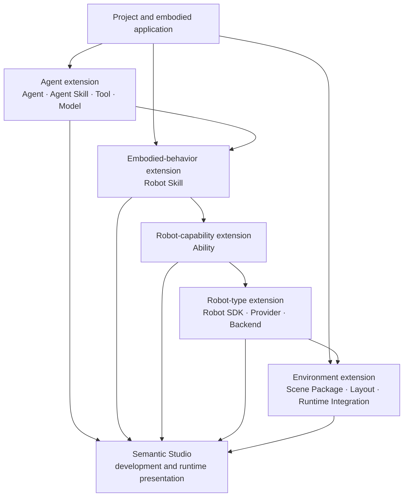
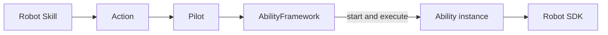
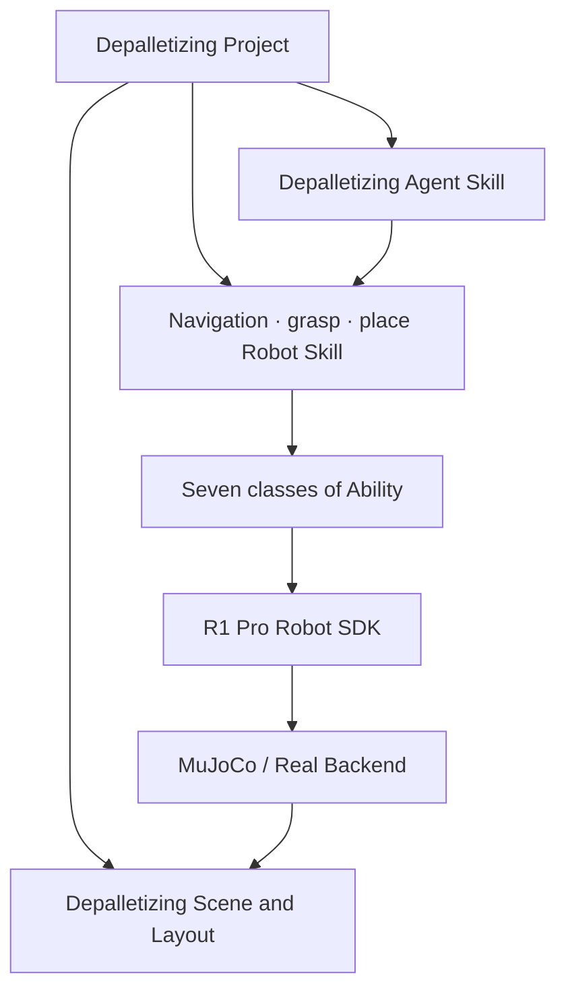

An embodied application keeps introducing new domain knowledge, Agent working methods, Robot behaviors, perception and control capabilities, Robot models, and runtime environments. Semantic places these changes in different extension layers, so each layer evolves around one clear problem and connects to adjacent layers through stable interface definitions.

```text
A new application need
→ judge which layer the change belongs to
→ develop the corresponding extension
→ define inputs, outputs, and capability descriptions
→ verify independently and integrate with adjacent layers
→ publish as a reusable resource
→ the Project selects and composes
→ enter Agent, Workflow, or Robot execution
```

This chapter introduces Semantic's layered extension model, the responsibility of each layer, how a Project composes them, and how developers choose the extension point that fits the current need.

## Extending an embodied application by layer

One embodied application can produce needs of different kinds:

- an Agent needs to understand new industry knowledge;
- an Agent needs to access a new business system;
- a Robot needs to finish a new business operation;
- a Robot needs new perception, planning, or control capabilities;
- the system needs to support a new Robot model;
- a Robot needs to connect a new hardware, algorithm, or simulation Backend;
- a Project needs a new Scene, Layout, or simulation platform;
- an Agent or perception capability needs to use a new Model.

These needs unfold layer by layer along "understand — collaborate — embodied operation — Robot capability — concrete device — runtime environment".



Each layer answers one kind of question:

```text
Agent and Agent Skill
  how the system understands a domain and organizes work

Tool
  how an Agent obtains information or calls a system capability

Robot Skill
  how a Robot finishes one embodied operation

Ability
  what perception, planning, and control capabilities a Robot can provide

Robot SDK
  how one Robot model provides a stable interface

Provider and Backend
  how Robot capabilities connect to algorithms, hardware, or a simulation Runtime

Scene and Runtime Integration
  what environment an embodied application happens in
```

## Choose the suitable extension layer

A developer can first judge what the current need changes.

### Add domain knowledge or a working method

Use **Agent Skill**, for example a depalletizing planning method, warehouse inspection rules, assembly-process knowledge, or a project code-review method.

### Add a system capability an Agent can call

Use **Tool**, for example querying production orders, reading a warehouse system, querying Semantic Map, submitting a Plan Proposal, or starting a Robot Skill.

### Add a reusable embodied operation

Use **Robot Skill**, for example grasping an object, semantic navigation, placing an object, opening a door, or scanning a shelf.

### Add perception, planning, motion, or tool capability

Use **Ability**, for example object localization, grasp planning, multi-end-effector synchronized motion, tool-load checking, or RGB-D capture.

### Add a Robot model

Use **Robot SDK** to describe that model's base, manipulators, tools, sensors, state, and stop capabilities.

### Connect a new hardware, algorithm, or simulation execution style

Use **Provider or Backend**, for example a vendor motion planner, local kinematics, ROS, MuJoCo, or Isaac Sim.

### Add a runnable environment

Use **Scene Package and Layout**, for example a depalletizing scene, a warehouse inspection scene, an assembly workstation, and different object layouts.

### Attach a new simulation platform

Use **Runtime Integration** to load Scenes, create Scene Instances, provide Virtual Robots, sensors, and environment state.

## Agent extension

The Agent layer can extend participants, domain knowledge, tools, and Models.

### Agent

An Agent defines an intelligent role that can take part in Project collaboration, including:

- identity and name;
- role and responsibilities;
- Agent Skills it can use;
- Tools it can call;
- the Model it uses;
- how it takes part in Conversation or Task.

For example, a Project can configure a warehouse-planning Leader, an environment-analysis Agent, a quality-inspection Agent, and a Robot Agent for each Robot.

An Agent definition expresses "who takes part in the work".

### Agent Skill

An Agent Skill expresses domain knowledge and working methods, for example:

- how to understand one class of user goal;
- how to query related environment information;
- how to organize a goal into Tasks;
- how to choose and use Tools;
- how to form a result;
- which situations are suitable for inviting the user.

An Agent Skill can serve Leader, an Agent that owns a specialist Task, Robot Agent, and short consultation. A Project can compose general knowledge with application-specific knowledge.

### Tool

A Tool lets an Agent interact with Semantic or an external system. It describes its purpose, required inputs, returned results, and its relation to the current Project or work context.

A Tool can provide environment query, Project resource reading, Interaction, plan submission, Robot runtime, and access to external business systems.

### Model

A Model gives an Agent language understanding, reasoning, multimodal understanding, or code-generation capability. A Project can choose a Model that fits the role and work, for example:

- Leader uses a model that is good at long-goal understanding and planning;
- Robot Agent uses a model that is good at tool calling and structured decision;
- Artifact analysis uses a multimodal model;
- Developer Agent uses a code model.

A Model Provider attaches a concrete model service to Semantic. The Agent's identity, role, Skill, Tool, and Context continue to express the same working style.

## Robot Skill extension

A Robot Skill expresses a reusable embodied operation. It needs to describe:

- applicable business goals;
- inputs and Robot Skill Result;
- Stages that users can understand;
- the expectation of each Stage;
- Actions that need to be produced;
- how Feedback and Observation are used;
- local adjustment methods;
- Robot Agent requests;
- the stop process.

```text
Business goal
→ Robot Skill
→ Stage
→ Action
→ Ability execution
→ Robot Skill Result
```

For example, `grasp-object` can compose Object Perception, Grasp Planning, Manipulator Motion, End Effector, and Robot State Abilities, and finish a complete operation from target observation to a stable grasp.

A Robot Skill works with the semantics of business objects, target regions, tools, and Robot capabilities. A concrete Robot's joints, communication interfaces, simulation objects, and vendor implementations are expressed by Robot SDK, Provider, and Backend.

### Agent Skill and Robot Skill

```text
Agent Skill
  helps Robot Agent understand which business steps to organize

Robot Skill
  finishes one of those real embodied operations
```

For example, a depalletizing Agent Skill helps Robot Agent organize source navigation, grasp, loaded travel, and place. Each step is then executed by the corresponding Robot Skill.

## Ability extension

An Ability expresses one Robot capability that Robot Skills can compose. It can belong to:

- Navigation;
- Manipulator Motion;
- End Effector;
- Robot State;
- Sensor Capture;
- Object Perception;
- Grasp Planning.

An Ability extension needs to describe:

- the capability role;
- supported Actions;
- Action inputs;
- Feedback;
- Observation;
- Action Result;
- Robot SDK capabilities it uses;
- how it stops.

### Action connects Robot Skill and Ability



Robot Skill produces an Action. Pilot submits it to AbilityFramework. AbilityFramework starts an Ability instance that fits the current Robot from the Action's capability definition, and finishes this capability execution.

Multiple Robot Skills can reuse the same class of Ability. For example, grasp and place both use Manipulator Motion, navigation and loaded travel both use Navigation, and many Robot Skills can use Sensor Capture to produce Artifacts.

Ability lets perception, planning, and control capabilities evolve independently and enter different embodied operations.

## Robot SDK extension

A Robot SDK expresses a stable capability interface for one Robot model. It can provide:

- Robot resources and components;
- base control;
- manipulator control;
- multi-end-effector motion;
- tool control;
- Robot state;
- sensor data;
- stop and hold;
- motion, navigation, and kinematics capabilities.

Ability uses Robot SDK to execute around a capability goal. Robot SDK turns those goals into concrete Robot resources.

### Robot model and tool configuration

The same Robot model can compose different tools, sensors, or Backends. A Robot instance uses configuration to describe its identity, model, components, tools, coordinate frames, motion ranges, safety parameters, and runtime-environment connection.

Robot SDK forms the concrete capabilities of the current Robot from this information.

### Provider

A Provider supplies an algorithm implementation that can be composed or replaced, for example:

- kinematics;
- trajectory planning;
- navigation planning;
- vendor-built planning capability;
- local algorithms.

A Provider lets the same Robot SDK choose a suitable algorithm source from the concrete Robot and deployment environment.

### Backend

A Backend connects Robot SDK to a concrete execution environment, for example:

- a vendor Robot interface;
- ROS;
- MuJoCo Runtime;
- Isaac Sim Runtime;
- a test environment.

The same Robot SDK can serve real robots, simulation, and tests through different Backends.

## Environment extension

An embodied application also needs to extend the environment in which a Robot acts.

### Scene Package

A Scene Package describes a runnable environment, including:

- the environment model;
- Robots and devices;
- objects and regions;
- sensors;
- spatial semantics;
- available Layouts;
- Runtimes that can be used.

For example, a depalletizing Scene Package can include pallets, totes, an R1 Pro Robot, two-sided fixtures, cameras, and a work region.

### Layout

A Layout expresses one concrete spatial arrangement in the same Scene, for example:

- single-tote debugging;
- one layer of totes;
- a complete three-layer pallet;
- different target-pallet positions;
- different Robot initial positions.

A Layout lets the same environment model serve development, verification, and different tasks.

### Runtime Integration

Runtime Integration connects a Scene Package to a concrete simulation platform. It is responsible for:

- discovering runnable Scenes;
- creating a Scene Instance;
- loading a Layout;
- enumerating Virtual Robots;
- providing sensors and environment state;
- receiving Scene lifecycle operations;
- providing environment change to Semantic Map and Studio.

Scene expresses the environment content that should run. Runtime Integration expresses how that environment runs on a concrete simulation platform.

## A Project composes different extensions

A Project is where different extensions enter an embodied application. A depalletizing Project can choose:

```text
Agent
  Leader
  Robot Agent

Agent Skill
  depalletizing Workflow planning
  Robot transfer Task planning

Robot Skill
  semantic-navigation
  grasp-object
  place-object

Ability
  Navigation
  Manipulator Motion
  End Effector
  Robot State
  Sensor Capture
  Object Perception
  Grasp Planning

Robot and Robot SDK
  R1 Pro

Backend
  MuJoCo or a real Robot Backend

Scene and Layout
  depalletizing environment
  single tote, one layer, or a complete pallet
```



The Project chooses the knowledge, behaviors, and environment resources the application needs. The concrete runtime environment provides currently available Robots, Abilities, Backends, and Runtimes.

## Capability discovery and composition

Semantic lets Agents and Robots understand currently usable capabilities at runtime.

An Agent can understand Agent Skills bound to the current role, available Tools, Project resources, and work it is suitable to own.

A Robot Agent can understand:

- the current Robot model and tools;
- Robot Skills that are installed and enabled;
- a Robot Skill's purpose, inputs, and results;
- currently available Abilities;
- the Robot's current runtime state.

A Robot Skill describes the Actions it needs. AbilityFramework starts the corresponding Ability instance from an Action's capability definition.

```text
Robot Task
→ Robot Agent chooses a Robot Skill
→ Robot Skill produces an Action
→ AbilityFramework starts the corresponding Ability instance
→ Ability uses Robot SDK
→ the Robot finishes the action
```

This capability relation lets the upper layer choose operations from semantics, and lets the lower layer provide a concrete implementation from the current Robot and runtime environment.

## Inputs, outputs, and compatibility

Different extensions connect through their own inputs, outputs, and capability descriptions:

```text
Agent Skill
  domain knowledge, Tool usage, and result expression

Tool
  inputs and results

Robot Skill
  business inputs, Stages, Action requirements, and Robot Skill Result

Ability
  Action inputs, Feedback, Observation, and Action Result

Robot SDK
  Robot resources, commands, state, and sensing interfaces

Backend
  concrete control and state implementation

Scene Package
  environment objects, Robots, sensors, and Runtime support information
```

Each layer can publish versions at its own pace. Release and deployment information records the versions a product combination actually uses.

Adjacent layers form a runnable combination through these relations:

- an Agent can use the Tools the work needs;
- the Robot has installed the Robot Skills the current Task needs;
- Actions a Robot Skill needs can be executed by an Ability;
- Robot SDK capabilities an Ability uses fit the current Robot;
- Robot SDK matches the current Backend and Robot instance;
- a Scene Package can be loaded by the current Runtime.

Versions, inputs and outputs, and compatibility let each layer evolve independently, and also let a Project clearly express the actual combination one run uses.

## Development, verification, and release

Semantic extensions share one development process:

```mermaid
flowchart LR
    Develop["Develop in a Project"]
    LayerTest["Verify at the corresponding layer"]
    Integration["Integrate with adjacent layers"]
    Package["Package and publish"]
    Install["Install into the runtime environment"]
    Select["The Project selects and uses"]
    Observe["Studio observes runtime results"]

    Develop --> LayerTest
    LayerTest --> Integration
    Integration --> Package
    Package --> Install
    Install --> Select
    Select --> Observe
```



Verification focus at different layers includes:

- Agent Skill: domain goals, Tool usage, and output quality;
- Tool: inputs, results, and external-system interaction;
- Robot Skill: Stages, the local loop, stop, and Robot Agent requests;
- Ability: Action, Feedback, Observation, Action Result, and stop;
- Robot SDK: Robot resources, control, state, sensors, and Backend;
- Scene: objects, regions, Virtual Robots, sensors, and environment change;
- complete combination: Conversation, Workflow, Robot Execution, and environment results.

Studio presents these extensions as Project resources, Agent capabilities, Robot capabilities, Scenes, and runtime records, helping developers move from single-layer verification into a complete application run.

## Depalletizing extension example

The following example uses adding two-sided tote-grasp capability to connect different extension layers.

### Agent Skill

A depalletizing Agent Skill describes currently transferable totes, grasp-strategy choice, source layer relations, and how to organize a single-tote Robot Task.

### Robot Skill

`grasp-object` organizes direct two-sided grasp, one-sided pull-out, re-observation, two-sided engagement, lift confirmation, and loaded-posture arrangement.

### Ability

Robot Skill composes Object Perception, Grasp Planning, Manipulator Motion, End Effector, and Robot State. Two-sided grasp candidates are produced by Grasp Planning. Multi-end-effector motion is executed by Manipulator Motion.

### Robot SDK

The R1 Pro Robot SDK provides dual-tool description and state, multi-end-effector motion, dual-tool control, loaded motion, and stop and hold capabilities.

### Scene and Runtime

A Scene Package provides totes, two-sided fixtures, source pallet, target pallet, Robot, sensors, and several Layouts. Runtime Integration loads them into MuJoCo or another simulation platform.

### Project composition

A depalletizing Project chooses these Agent Skills, Robot Skills, Abilities, Robot SDK, Scene, and Layouts, then finishes single-tote, one-layer, and complete-pallet transfers through Workflow and Robot Execution.

This example shows how one embodied capability is formed step by step along multiple extension layers: each layer works around its own problem, and adjacent layers compose a complete application through inputs, outputs, and capability descriptions.

## Relation to later chapters

This chapter introduced how developers add Agents, Agent Skills, Tools, Robot Skills, Abilities, Robot SDKs, Backends, Scenes, and Runtime support. The next chapter continues with:

- how these extensions are packaged and installed;
- how a Project chooses a concrete runtime environment;
- how a simulation Scene and Virtual Robot start;
- how a real-robot Pilot and Robot attach;
- how the same embodied application runs in simulation and on a real robot.
