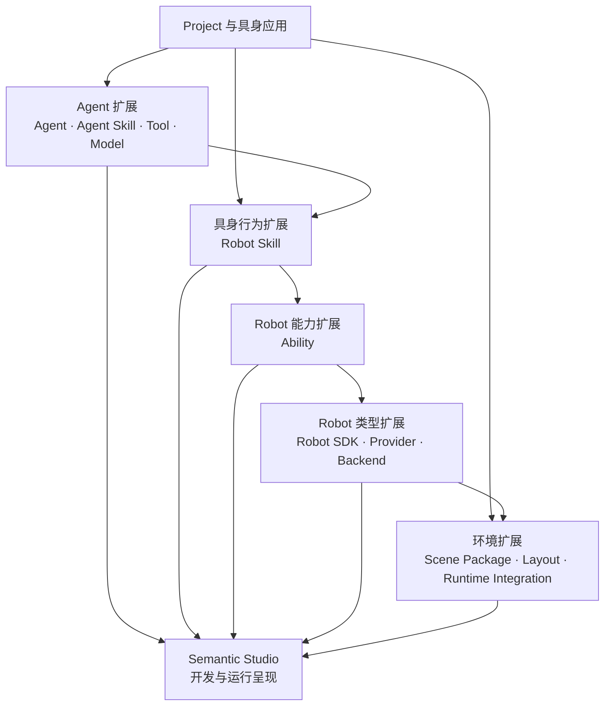
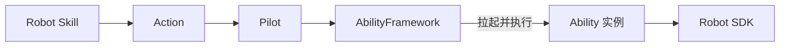
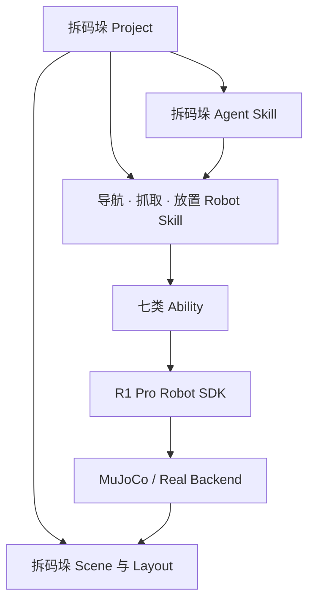
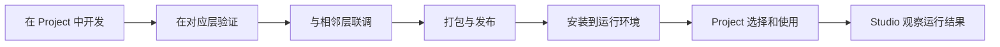

具身应用会不断引入新的领域知识、Agent 工作方法、Robot 行为、感知与控制能力、Robot 型号和运行环境。Semantic 将这些变化放在不同扩展层中，使每一层围绕一个清晰问题演进，并通过稳定的接口定义连接上下层。

```text
新的应用需求
→ 判断变化属于哪个层次
→ 开发相应扩展
→ 定义输入、输出和能力说明
→ 独立验证并与相邻层联调
→ 发布为可复用资源
→ Project 选择和组合
→ 进入 Agent、Workflow 或 Robot 执行
```

本章介绍 Semantic 的分层扩展模型、各层职责、Project 组合方式，以及开发者如何选择适合当前需求的扩展位置。

## 分层扩展具身应用

一项具身应用可能产生不同性质的需求：

- Agent 需要理解新的行业知识；
- Agent 需要访问新的业务系统；
- Robot 需要完成一种新的业务操作；
- Robot 需要新的感知、规划或控制能力；
- 系统需要支持新的 Robot 型号；
- Robot 需要连接新的硬件、算法或仿真 Backend；
- Project 需要新的 Scene、Layout 或仿真平台；
- Agent 或感知能力需要使用新的 Model。

这些需求沿着“理解—协作—具身操作—Robot 能力—具体设备—运行环境”逐层展开。



每一层回答一种问题：

```text
Agent 与 Agent Skill
  系统怎样理解领域并组织工作

Tool
  Agent 怎样取得信息或调用系统能力

Robot Skill
  Robot 怎样完成一个具身操作

Ability
  Robot 可以提供什么感知、规划和控制能力

Robot SDK
  一个 Robot 型号怎样提供稳定接口

Provider 与 Backend
  Robot 能力怎样连接算法、硬件或仿真 Runtime

Scene 与 Runtime Integration
  具身应用发生在怎样的环境中
```

## 选择适合的扩展层

开发者可以先判断当前需求改变了什么。

### 增加领域知识或工作方法

使用 **Agent Skill**，例如拆码垛规划方法、仓库巡检规则、装配工艺知识和项目代码审查方法。

### 增加 Agent 可以调用的系统能力

使用 **Tool**，例如查询生产订单、读取仓库系统、查询 Semantic Map、提交 Plan Proposal 或启动 Robot Skill。

### 增加可复用具身操作

使用 **Robot Skill**，例如抓取物体、语义导航、放置物体、开门或扫描货架。

### 增加感知、规划、运动或工具能力

使用 **Ability**，例如物体定位、抓取规划、多末端同步运动、工具承载检查或 RGB-D 采集。

### 增加 Robot 型号

使用 **Robot SDK**，描述该型号的底盘、机械臂、工具、传感器、状态和停止能力。

### 连接新的硬件、算法或仿真执行方式

使用 **Provider 或 Backend**，例如厂商运动规划器、本地运动学、ROS、MuJoCo 或 Isaac Sim。

### 增加可运行环境

使用 **Scene Package 和 Layout**，例如拆码垛场景、仓库巡检场景、装配工作站和不同对象布局。

### 接入新的仿真平台

使用 **Runtime Integration**，负责加载 Scene、创建 Scene Instance、提供 Virtual Robot、传感器和环境状态。

## Agent 扩展

Agent 层可以扩展参与者、领域知识、工具和 Model。

### Agent

Agent 定义一个可以参与 Project 协作的智能角色，包括：

- 身份和名称；
- 角色与职责；
- 可以使用的 Agent Skill；
- 可以调用的 Tool；
- 使用的 Model；
- 参与 Conversation 或 Task 的方式。

例如，Project 可以配置仓库规划 Leader、环境分析 Agent、质量检测 Agent，以及每台 Robot 对应的 Robot Agent。

Agent 定义表达“谁来参与工作”。

### Agent Skill

Agent Skill 表达领域知识和工作方法，例如：

- 如何理解一类用户目标；
- 如何查询相关环境信息；
- 如何将目标组织为 Task；
- 如何选择和使用 Tool；
- 如何形成结果；
- 哪些情况适合邀请用户参与。

Agent Skill 可以服务于 Leader、承担专业 Task 的 Agent、Robot Agent 和短时咨询。Project 可以将通用知识与应用专用知识组合起来。

### Tool

Tool 让 Agent 与 Semantic 或外部系统发生交互。它说明自身用途、需要的输入、返回的结果，以及它与当前 Project 或工作上下文的关系。

Tool 可以提供环境查询、Project 资源读取、Interaction、计划提交、Robot 运行和外部业务系统访问等能力。

### Model

Model 为 Agent 提供语言理解、推理、多模态理解或代码生成能力。Project 可以根据角色和工作选择适合的 Model，例如：

- Leader 使用擅长长目标理解和规划的模型；
- Robot Agent 使用擅长工具调用和结构化决策的模型；
- Artifact 分析使用多模态模型；
- Developer Agent 使用代码模型。

Model Provider 将具体模型服务接入 Semantic。Agent 的身份、角色、Skill、Tool 和 Context 继续表达同一套工作方式。

## Robot Skill 扩展

Robot Skill 表达一个可复用的具身操作。它需要说明：

- 适用的业务目标；
- 输入和 Robot Skill Result；
- 可被用户理解的 Stage；
- 每个 Stage 的期望；
- 需要产生的 Action；
- 使用 Feedback 与 Observation 的方式；
- 局部调整方法；
- Robot Agent 请求；
- 停止过程。

```text
业务目标
→ Robot Skill
→ Stage
→ Action
→ Ability 执行
→ Robot Skill Result
```

例如，`grasp-object` 可以组合 Object Perception、Grasp Planning、Manipulator Motion、End Effector 和 Robot State Ability，完成从目标观察到稳定抓取的完整操作。

Robot Skill 使用业务对象、目标区域、工具和 Robot 能力语义工作。具体 Robot 的关节、通信接口、仿真对象和厂商实现由 Robot SDK、Provider 与 Backend 表达。

### Agent Skill 与 Robot Skill

```text
Agent Skill
  帮助 Robot Agent 理解应该组织哪些业务步骤

Robot Skill
  完成其中一个真实具身操作
```

例如，拆码垛 Agent Skill 帮助 Robot Agent 组织来源导航、抓取、携物导航和放置；每一步再由相应 Robot Skill 执行。

## Ability 扩展

Ability 表达一种可以被 Robot Skill 组合使用的 Robot 能力。它可以属于：

- Navigation；
- Manipulator Motion；
- End Effector；
- Robot State；
- Sensor Capture；
- Object Perception；
- Grasp Planning。

一个 Ability 扩展需要说明：

- 能力角色；
- 支持的 Action；
- Action 输入；
- Feedback；
- Observation；
- Action Result；
- 使用的 Robot SDK 能力；
- 停止方式。

### Action 连接 Robot Skill 与 Ability



Robot Skill 产生 Action，Pilot 将其提交给 AbilityFramework。AbilityFramework 根据 Action 的能力定义拉起适合当前 Robot 的 Ability 实例，并完成本次能力执行。

多个 Robot Skill 可以复用同一类 Ability。例如，抓取与放置共同使用 Manipulator Motion，导航与携物导航共同使用 Navigation，多种 Robot Skill 可以使用 Sensor Capture 生成 Artifact。

Ability 让感知、规划和控制能力可以独立演进，并进入不同具身操作。

## Robot SDK 扩展

Robot SDK 表达一个 Robot 型号的稳定能力接口。它可以提供：

- Robot 资源与组件；
- 底盘控制；
- 机械臂控制；
- 多末端运动；
- 工具控制；
- Robot 状态；
- 传感器数据；
- 停止与保持；
- 运动、导航和运动学能力。

Ability 使用 Robot SDK 围绕能力目标执行，Robot SDK 将这些目标落实到具体 Robot 资源。

### Robot 型号与工具配置

同一个 Robot 型号可以组合不同工具、传感器或 Backend。Robot 实例使用配置说明自己的身份、型号、组件、工具、坐标系、运动范围、安全参数和运行环境连接。

Robot SDK 根据这些信息形成当前 Robot 的具体能力。

### Provider

Provider 提供可以组合或替换的算法实现，例如：

- 运动学；
- 轨迹规划；
- 导航规划；
- 厂商自带规划能力；
- 本地算法。

Provider 让同一 Robot SDK 根据具体 Robot 和部署环境选择合适的算法来源。

### Backend

Backend 将 Robot SDK 连接到具体执行环境，例如：

- 厂商 Robot 接口；
- ROS；
- MuJoCo Runtime；
- Isaac Sim Runtime；
- 测试环境。

同一 Robot SDK 可以通过不同 Backend 服务于真机、仿真和测试。

## 环境扩展

具身应用还需要扩展 Robot 行动所处的环境。

### Scene Package

Scene Package 描述一个可运行环境，包括：

- 环境模型；
- Robot 和设备；
- 对象与区域；
- 传感器；
- 空间语义；
- 可用 Layout；
- 可以使用的 Runtime。

例如，拆码垛 Scene Package 可以包含托盘、周转箱、R1 Pro Robot、双侧夹具、相机和工作区域。

### Layout

Layout 表达同一 Scene 中一种具体空间布置，例如：

- 单箱调试；
- 一层周转箱；
- 三层完整托盘；
- 不同目标托盘位置；
- 不同 Robot 初始位置。

Layout 让同一个环境模型可以服务于开发、验证和不同任务。

### Runtime Integration

Runtime Integration 将 Scene Package 连接到具体仿真平台。它负责：

- 发现可运行 Scene；
- 创建 Scene Instance；
- 加载 Layout；
- 枚举 Virtual Robot；
- 提供传感器和环境状态；
- 接收 Scene 生命周期操作；
- 将环境变化提供给 Semantic Map 和 Studio。

Scene 表达要运行的环境内容，Runtime Integration 表达该环境如何在具体仿真平台中运行。

## Project 组合不同扩展

Project 是不同扩展进入具身应用的组合位置。一个拆码垛 Project 可以选择：

```text
Agent
  Leader
  Robot Agent

Agent Skill
  拆码垛 Workflow 规划
  Robot 搬运 Task 规划

Robot Skill
  semantic-navigation
  grasp-object
  place-object

Ability
  Navigation
  Manipulator Motion
  End Effector
  Robot State
  Sensor Capture
  Object Perception
  Grasp Planning

Robot 与 Robot SDK
  R1 Pro

Backend
  MuJoCo 或真实 Robot Backend

Scene 与 Layout
  拆码垛环境
  单箱、一层或完整托盘
```



Project 选择应用需要的知识、行为和环境资源，具体运行环境提供当前可用的 Robot、Ability、Backend 和 Runtime。

## 能力发现与组合

Semantic 让 Agent 和 Robot 在运行时了解当前可以使用的能力。

Agent 可以了解当前角色绑定的 Agent Skill、可用 Tool、Project 资源和适合承担的工作。

Robot Agent 可以了解：

- 当前 Robot 型号与工具；
- 已安装并启用的 Robot Skill；
- Robot Skill 的用途、输入和结果；
- 当前可用 Ability；
- Robot 当前运行状态。

Robot Skill 说明自己需要的 Action，AbilityFramework 根据 Action 的能力定义拉起相应 Ability 实例。

```text
Robot Task
→ Robot Agent 选择 Robot Skill
→ Robot Skill 产生 Action
→ AbilityFramework 拉起相应 Ability 实例
→ Ability 使用 Robot SDK
→ Robot 完成行动
```

这种能力关系让上层根据语义选择操作，下层根据当前 Robot 和运行环境提供具体实现。

## 输入输出与兼容关系

不同扩展通过各自的输入、输出和能力说明连接：

```text
Agent Skill
  领域知识、Tool 使用方法和结果表达

Tool
  输入与结果

Robot Skill
  业务输入、Stage、Action 需求和 Robot Skill Result

Ability
  Action 输入、Feedback、Observation 和 Action Result

Robot SDK
  Robot 资源、命令、状态和传感接口

Backend
  具体控制与状态实现

Scene Package
  环境对象、Robot、传感器和 Runtime 支持信息
```

每一层可以按照自己的演进速度发布版本，发布与部署信息记录一次产品组合实际使用的版本。

相邻层通过以下关系形成可以运行的组合：

- Agent 可以使用工作所需的 Tool；
- Robot 已安装当前 Task 所需的 Robot Skill；
- Robot Skill 需要的 Action 可以由 Ability 执行；
- Ability 使用的 Robot SDK 能力适合当前 Robot；
- Robot SDK 与当前 Backend 和 Robot 实例匹配；
- Scene Package 可以由当前 Runtime 加载。

版本、输入输出和兼容关系让各层能够独立演进，也让 Project 可以清楚表达一次运行使用的实际组合。

## 开发、验证与发布

Semantic 扩展使用一条共同的开发过程：



不同层的验证重点包括：

- Agent Skill：领域目标、Tool 使用和输出质量；
- Tool：输入、结果和外部系统交互；
- Robot Skill：Stage、局部闭环、停止和 Robot Agent 请求；
- Ability：Action、Feedback、Observation、Action Result 和停止；
- Robot SDK：Robot 资源、控制、状态、传感器和 Backend；
- Scene：对象、区域、Virtual Robot、传感器和环境变化；
- 完整组合：Conversation、Workflow、Robot Execution 和环境结果。

Studio 将这些扩展呈现为 Project 资源、Agent 能力、Robot 能力、Scene 和运行记录，帮助开发者从单层验证进入完整应用运行。

## 拆码垛扩展示例

下面以增加双侧周转箱抓取能力为例，串联不同扩展层。

### Agent Skill

拆码垛 Agent Skill 说明当前可搬运箱体、抓取策略选择、来源层次关系和单箱 Robot Task 的组织方式。

### Robot Skill

`grasp-object` 组织直接双侧抓取、单侧外拉、重新观察、双侧接合、抬升确认和携物姿态整理。

### Ability

Robot Skill 组合 Object Perception、Grasp Planning、Manipulator Motion、End Effector 和 Robot State。双侧抓取候选由 Grasp Planning 产生，多末端运动由 Manipulator Motion 执行。

### Robot SDK

R1 Pro Robot SDK 提供双工具描述与状态、多末端运动、双工具控制、携物运动和 stop、hold 能力。

### Scene 与 Runtime

Scene Package 提供周转箱、双侧夹具、来源托盘、目标托盘、Robot、传感器和多种 Layout。Runtime Integration 将它们加载到 MuJoCo 或其他仿真平台。

### Project 组合

拆码垛 Project 选择这些 Agent Skill、Robot Skill、Ability、Robot SDK、Scene 和 Layout，再通过 Workflow 与 Robot Execution 完成单箱、一层和完整托盘搬运。

这个示例展示了一个具身能力如何沿多个扩展层逐步形成：每一层围绕自己的问题工作，上下层通过输入、输出和能力说明组成完整应用。

## 与后续章节的关系

本章介绍了开发者如何增加 Agent、Agent Skill、Tool、Robot Skill、Ability、Robot SDK、Backend、Scene 和 Runtime 支持。下一章将继续展开：

- 这些扩展如何打包和安装；
- Project 如何选择具体运行环境；
- 仿真 Scene 与 Virtual Robot 如何启动；
- 真机 Pilot 与 Robot 如何接入；
- 同一套具身应用如何运行在仿真和真机环境中。
