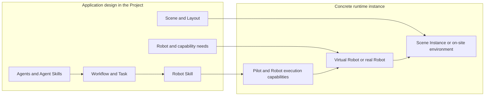
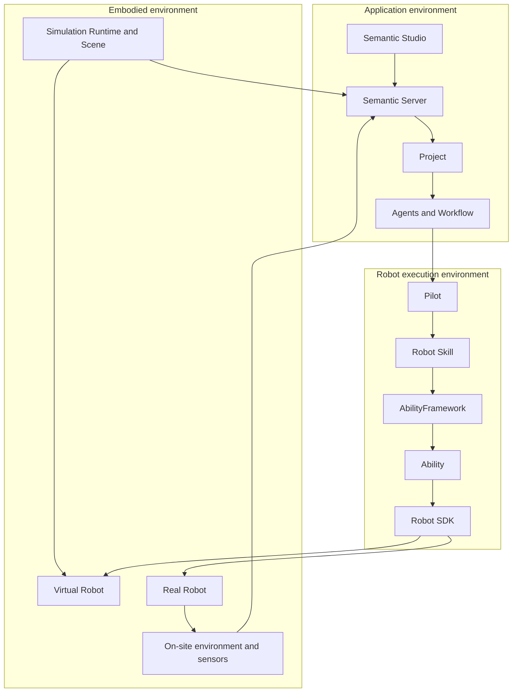
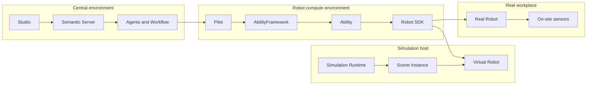
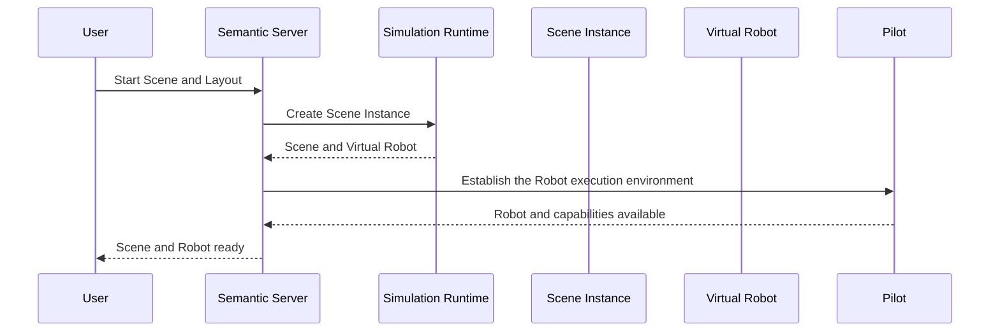
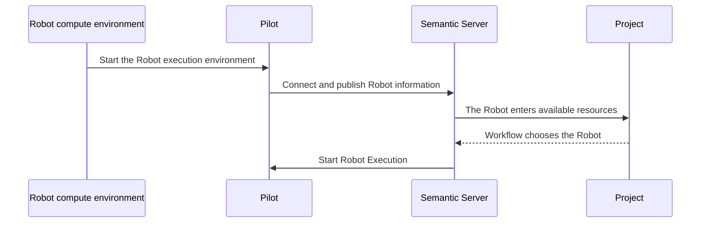
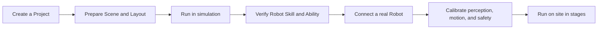

Agents, Workflow, Robot Skills, and environment resources in a Project finally have to enter a concrete runtime environment. That environment can be made of a simulation Scene and Virtual Robots, or of real Robots, on-site sensors, and a work region.

Semantic lets the two environments share application goals, collaboration style, and embodied-operation semantics. Scene, Runtime, Provider, Backend, and the concrete Robot then provide the actual runtime capability.

```text
An embodied application in a Project
→ choose a runtime environment
→ establish Scene and Robot instances
→ prepare Robot execution capabilities
→ Agents and Workflow start working
→ the Robot acts in a simulated or real environment
→ environment information returns to the Project
```

This chapter introduces how a Project enters a concrete runtime environment, how simulated Robots and real Robots attach to Semantic, and how an embodied application moves from a development environment into actual deployment.

## From application design to a runtime instance

A Project gathers content that one embodied application keeps using:

- Agents, Agent Skills, and Models;
- how Workflow organizes tasks;
- Robot Skills;
- Scenes, Layouts, and other environment resources;
- Robot types and capability needs;
- application code, tests, and documents.

This content describes the problems the application needs to solve, what kind of environment it needs, and which capabilities it can use. When a run starts, Semantic composes them with concrete resources in the current deployment environment:



What a Project stores is the continuing relation of an embodied application. A runtime instance expresses the environment, Robot, and execution capabilities this run actually uses. The same Project can run in a simulation environment on a development machine, or connect to a real Robot deployed on site.

## Three parts of a runtime environment

A complete run is composed of the application environment, the Robot execution environment, and the embodied environment.



### Application environment

Semantic Server organizes Project, Conversation, Agent, Workflow, Semantic Map, and runtime information. Semantic Studio gives users development, collaboration, environment observation, and runtime operations.

### Robot execution environment

Pilot represents one Robot connecting to Semantic Server, and hosts that Robot's Robot Skill execution. Robot Skill produces Actions. AbilityFramework starts the corresponding Ability instance from an Action's capability definition. Ability then uses the current Robot through Robot SDK.

A Robot execution environment can live on the Robot's onboard computer, an edge host, a simulation host, or a development machine. It always works around one Robot with a clear identity and resource scope.

### Embodied environment

The embodied environment is the space where Robot action actually happens. A simulated environment is provided by Simulation Runtime, Scene, physical models, and virtual sensors. A real environment is formed together by the Robot, work region, on-site objects, Robot sensors, and external perception systems.

Robot actions change the embodied environment. Feedback, Observation, Artifact, and Semantic Map bring the action process and environment change back to the Project.

## A Project chooses a runtime environment

A Project describes the environment and Robot capabilities the application needs. The deployment environment provides concrete resources that can be used now. When a run starts, the two form one explicit choice.

### Runtime Profile

A Runtime Profile expresses a Project's needs and preferences for a simulation runtime environment, for example:

- Runtime type;
- Scene capabilities;
- Robot type;
- Backend type;
- sensor and rendering capabilities;
- run scale.

A Project can store a default Runtime Profile, so the same application keeps a consistent runtime intent across different development environments.

### Runtime Installation

A Runtime Installation expresses a concrete Runtime that is already installed and can be started in a deployment environment, for example local MuJoCo, a remote simulation host, or a team-shared simulation environment.

It contains the software, resource locations, and connection capability needed to run a Scene. Semantic looks up a compatible Runtime Installation from the Project's Runtime Profile:

```text
The Project chooses a Scene and Layout
→ read the default Runtime Profile
→ look up a compatible Runtime Installation
→ determine the Runtime this run uses
→ create a Scene Instance
```

When there is only one compatible environment, it can be used directly. When several environments exist, the user can choose when starting a Scene, and save a common choice as a Project preference.

A Runtime Profile lets a Project express "what kind of environment is needed". A Runtime Installation provides "where it runs now". Concrete hosts, process locations, and connection information are managed by the deployment environment.

### Choosing a real Robot

A real Robot enters Semantic with a long-lived identity. A Project chooses a concrete instance from currently available Robots according to the Robot type, tools, and capabilities a task needs.

The Robot's actual model, tools, sensors, Backend, and runtime state together decide the work it can take. Workflow uses this live information to finish Robot assignment when a task is ready to execute.

## Simulated environment

A simulated environment uses a Scene Package, Layout, and Simulation Runtime to form a runnable embodied world.

```text
Scene Package
→ choose a Layout
→ Simulation Runtime loads
→ create a Scene Instance
→ discover Virtual Robots
→ establish the Robot execution environment
→ Virtual Robots take part in Workflow
```

### Scene Package and Layout

A Scene Package describes the environment model, Robots, objects, regions, sensors, spatial semantics, and available Layouts. A Layout expresses one concrete spatial arrangement in the same Scene.

For example, a depalletizing Scene Package can include:

- a source pallet and a target pallet;
- totes of different models;
- an R1 Pro Robot and two-sided fixtures;
- cameras and depth sensors;
- single-tote, one-layer, and complete-pallet Layouts.

### Scene Instance

After Simulation Runtime loads a Scene Package and Layout, it forms a Scene Instance. A Scene Instance is the simulation environment that is running this time. It contains the current Robots, object state, sensor output, and physical process.

Objects and regions in a Scene Instance can enter Semantic Map. Sensor data can form Observation and Artifact. Robot actions directly change physical state in the current scene.

### Virtual Robot

The Runtime provides Virtual Robots from the Scene. Each Virtual Robot has a clear Robot identity, model, components, tools, sensors, and Backend.

A Virtual Robot takes part in Workflow as an ordinary Robot:

```text
Robot Task
→ Robot Agent
→ Pilot
→ Robot Skill
→ Ability
→ Robot SDK
→ Simulation Backend
→ Virtual Robot
```

Agents, Workflow, and Robot Skills use unified Robot capability semantics. Simulation Backend turns Robot SDK operations into joints, base, tools, and sensors in the Runtime.

### Simulated Robot execution environment

After a Scene Instance creates Virtual Robots, Semantic prepares the corresponding Pilot, Robot Skill, AbilityFramework, Ability, and Robot SDK environment for each Robot.

After Ability packages enter the Robot execution environment, AbilityFramework starts the corresponding Ability instance when an Action arrives. Robot Skills are installed and enabled according to the current Project and Robot needs. After a Robot reaches an executable state, Workflow can assign a suitable Task to it.

One Scene Instance can contain multiple Virtual Robots. They share space and objects in the scene, while each has its own Robot identity, execution process, and resource-use relation.

## Real Robot environment

A real Robot connects to Semantic Server through a Robot compute environment.

```text
Robot-type resources and instance configuration
→ the Robot compute environment starts
→ Pilot connects to Semantic Server
→ Robot and capability information enter the system
→ the Robot becomes an available resource
→ Workflow assigns a Task
```

### Robot type and Robot instance

A Robot type describes the resources and capabilities one model can provide, such as base, manipulators, tools, sensors, coordinate frames, and motion style.

A Robot instance represents one concrete device on site, including:

- Robot identity;
- current tools and sensors;
- Robot SDK and Backend;
- motion and safety configuration;
- the work environment it is in;
- current connection and runtime state.

The same Robot type can form multiple Robot instances, and can also serve different applications according to different tools and Backends.

### Pilot and Robot identity

Pilot represents one concrete Robot connecting to Semantic Server. After a Robot first enters the system, it forms a long-lived identity. Later connections keep using information bound to that Robot.

Pilot provides the current Robot, Robot Skills, and execution state to Server. Robot Agent and Workflow can therefore keep recognizing the same device, and connect Tasks, Robot Execution, and runtime results to it.

### On-site environment information

Information about a real environment can come from:

- the Robot's own sensors;
- external cameras and perception systems;
- localization and navigation systems;
- an on-site map;
- equipment and production systems;
- Observations that Agents start on demand.

This information together forms Semantic Map and the current runtime context. At execution time, Robot Skill obtains the current Observation through Ability, and advances motions from the Robot's live Feedback.

## Simulation and real robots share application design

Simulation and real robots use the same Project, Agent, Workflow, and Robot execution structure:

| Application layer | Simulated environment | Real environment |
|---|---|---|
| Project | Simulation development and verification application | On-site application |
| Agents and Workflow | Organize goals, Tasks, and collaboration | Organize goals, Tasks, and collaboration |
| Robot Skill | Express embodied operations such as navigation, grasp, and place | Express embodied operations such as navigation, grasp, and place |
| Ability | Use simulation perception, planning, and control Providers | Use on-site perception, planning, and control Providers |
| Robot SDK | Connect Simulation Backend | Connect a real Robot Backend |
| Robot | Virtual Robot | Real Robot |
| Environment information | Scene and virtual sensors | On-site perception and Robot sensors |

This layering lets application goals and embodied-operation semantics continue into different environments. Environment-related parts are provided by the corresponding implementations:

- Scene and physical models;
- Robot Backend;
- perception and planning Providers;
- sensor sources;
- motion parameters;
- contact and safety requirements.

Simulation is used to develop applications, understand task flows, verify Robot Skills, and observe environment change. A real-robot run then combines real sensors, dynamics, contact conditions, and on-site safety requirements for staged verification.

## Deployment units

Different parts of Semantic can be deployed on the same development machine, or distributed across a central server, Robot hosts, and simulation hosts.

### Central environment

The central environment hosts:

- Semantic Server;
- Project and runtime information;
- Agent Runtime;
- Workflow;
- Semantic Map;
- Skill, Model, and Scene Registry;
- Semantic Studio services.

### Robot compute environment

The Robot compute environment hosts:

- Pilot;
- Robot Skill Worker;
- AbilityFramework;
- Ability packages;
- Robot SDK;
- Providers and Backends.

A real robot usually uses the Robot's onboard computer or an edge host. A Virtual Robot's execution environment can be established automatically by the Framework after a Scene starts.

### Simulation host

A simulation host hosts:

- Simulation Runtime;
- Scene Package;
- Scene Instance;
- Virtual Robots;
- virtual sensors and rendering.

A simulation host can be on the same development machine as Semantic Server, or provide a remote Runtime Installation.



Deployment location can be chosen from development scale, Robot compute capability, network environment, and simulation resources. The parts still compose one embodied application through the same identity, capability, and runtime relations.

## Reusable resources and instance configuration

Deployment has to handle reusable resources and concrete instances at the same time.

### Reusable resources

Reusable resources include:

- Agent Skills;
- Robot Skills;
- Ability packages;
- Robot SDK and Providers;
- Robot type packages;
- Scene Packages;
- Model Providers.

These resources can be used by multiple Projects, Robots, or runtime environments.

### Robot type package

A Robot type package organizes what one Robot model needs to run, such as Pilot support, AbilityFramework, Abilities, Robot SDK, Providers, Backends, and configuration templates.

A type package is reused at the Robot-model level. Robot Skills are installed from a Registry into a concrete Robot execution environment according to application and Robot needs.

### Instance configuration

Instance configuration turns reusable resources into one concrete Robot or one Scene run, including:

- Robot and Pilot identity;
- Robot model, tools, and sensors;
- Backend connection;
- Scene Instance association;
- motion and safety parameters;
- Robot Skills the current Project needs.

A simulated environment can form instance configuration from a Virtual Robot description. Real-robot configuration is used with a concrete device over a long time.

## Start and end

Simulation and real robots use different start entries, and enter a unified task-execution style after the Robot is ready.

### Start a simulation Scene



After Scene preparation finishes, Semantic synchronizes environment objects and initial spatial relations. After a Virtual Robot's execution capabilities are prepared, Workflow can start using that Robot.

### Connect a real Robot



A real Robot can stay online independently of a Project. A Project chooses a currently available Robot when needed. After a task finishes, the Robot can keep serving later work.

### End a run

When a run ends, Semantic first coordinates the current Robot action, then handles the environment lifecycle:

```text
Stop advancing new tasks
→ end or stop the current Robot Execution
→ the Robot enters a clear safe state
→ end the Robot execution environment
→ stop the Scene Instance
```

A Scene reset establishes a new environment state. The current Robot action first enters a safe state. Then the Robot execution environment keeps connecting to the reset Scene, or is established again from a new Virtual Robot description.

The device lifecycle of a real Robot is managed by the on-site operating process. Semantic stores task and execution results, and keeps using the Robot as the same device after it connects again.

## From simulation development to a real-robot run

Semantic supports an embodied application as it enters a real environment along one continuous path:



In this process, Project, Agents, Workflow, and Robot Skills keep application continuity. When entering a real environment, developers choose the corresponding Backend, Provider, sensors, and safety configuration for the current Robot and site, and verify in stages:

- Robot resources and coordinate frames;
- perception results;
- motion and navigation;
- tool and contact behavior;
- stop and hold;
- a complete Workflow.

Simulation provides a repeatable environment and debugging capability. Real-robot verification lets the application adapt to real sensing, dynamics, and on-site conditions. Studio presents both run processes with consistent Project, Task, Robot Execution, and environment views.

## Depalletizing deployment example

A depalletizing Project contains depalletizing Agent Skills, navigation and pick-and-place Robot Skills, R1 Pro Robot support, and a depalletizing Scene.

### Run in MuJoCo

```text
The Project chooses a depalletizing Scene and Layout
→ MuJoCo Runtime creates a Scene Instance
→ the Scene provides an R1 Pro Virtual Robot
→ the Framework establishes the corresponding Robot execution environment
→ Workflow executes navigation, grasp, transfer, and place
→ Scene and Semantic Map reflect tote changes
```

Object Perception can localize totes from information the simulation environment provides. Manipulator Motion and End Effector drive the Robot through the MuJoCo Backend. Virtual cameras and depth sensors form Observation and Artifact.

### Run at a real workstation

```text
An R1 Pro Robot connects to Semantic Server
→ on-site perception provides pallets, totes, and the work region
→ the Project chooses the current Robot
→ Workflow executes the same kind of transfer Task
→ Ability executes motions through the real Robot Backend
→ on-site information updates Semantic Map
```

The two environments share the depalletizing goal, Task organization, and navigation, grasp, and place Robot Skills. MuJoCo and the real workstation each provide the physical environment, sensors, Providers, Backends, and safety configuration.

## Semantic architecture main line

This architecture set starts from how an embodied application is organized, and finally lands in a concrete runtime environment:

```text
A Project organizes an embodied application
→ the environment provides objects, spatial relations, and current information
→ Agents understand the goal and collaborate
→ Workflow organizes work that keeps progressing
→ the Robot finishes embodied actions
→ the extension model adds new knowledge and capabilities
→ the deployment environment lets the application run in simulation or on a real robot
```

Developers can keep entering concrete work through the following documents:

- **User and developer guides**: create a Project, use Studio, run Workflow, and observe a Robot;
- **Extension development guides**: develop Agent Skills, Robot Skills, Abilities, Robot SDKs, and Scenes;
- **Deployment guides**: install Semantic Server, a simulation Runtime, and a Robot execution environment;
- **API and configuration reference**: inspect Manifest, interface, event, and configuration definitions;
- **Implementation design**: understand Agent Runtime, Workflow, Pilot, Simulation Runtime, and state-synchronization mechanisms.
