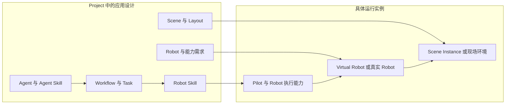
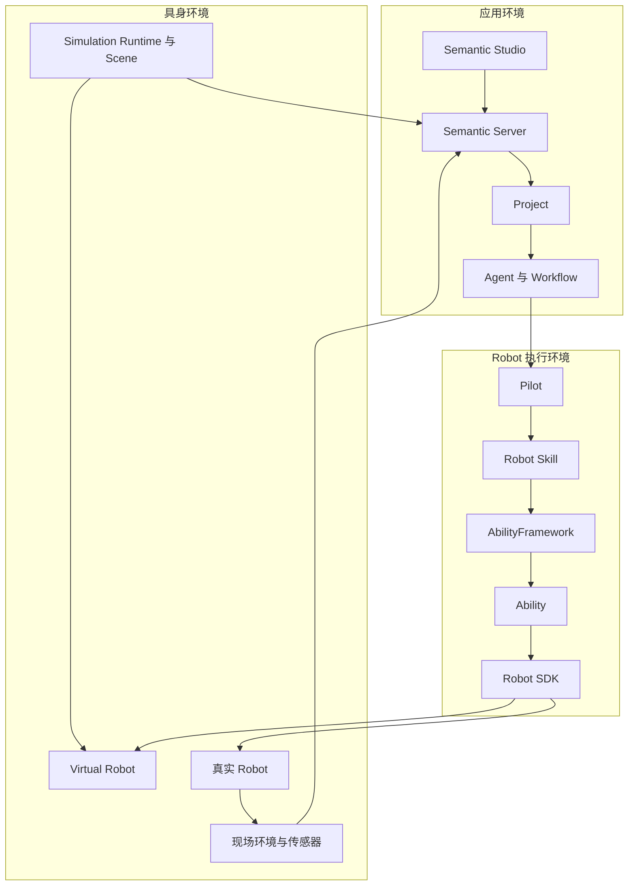
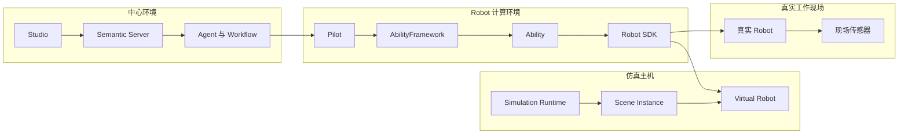
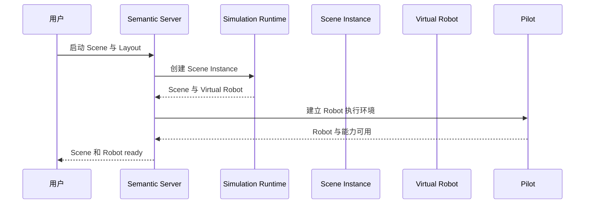
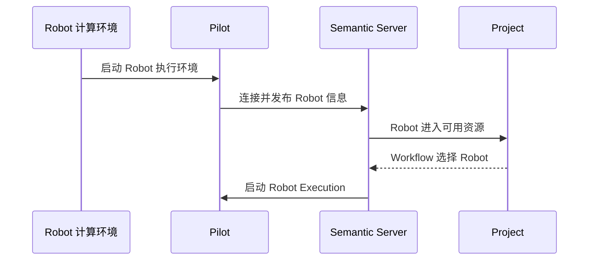

Project 中的 Agent、Workflow、Robot Skill 和环境资源，最终需要进入一个具体运行环境。这个环境可以由仿真 Scene 和 Virtual Robot 构成，也可以由真实 Robot、现场传感器和工作区域构成。

Semantic 让两种环境共享应用目标、协作方式和具身操作语义，再由 Scene、Runtime、Provider、Backend 和具体 Robot 提供实际运行能力。

```text
Project 中的具身应用
→ 选择运行环境
→ 建立 Scene 和 Robot 实例
→ 准备 Robot 执行能力
→ Agent 与 Workflow 开始工作
→ Robot 在仿真或真实环境中行动
→ 环境信息返回 Project
```

本章介绍 Project 如何进入具体运行环境，仿真 Robot 与真实 Robot 如何接入 Semantic，以及一项具身应用如何从开发环境走向实际部署。

## 从应用设计到运行实例

Project 汇集一项具身应用持续使用的内容：

- Agent、Agent Skill 和 Model；
- Workflow 的任务组织方式；
- Robot Skill；
- Scene、Layout 和其他环境资源；
- Robot 类型与能力需求；
- 应用代码、测试和文档。

这些内容描述应用要解决的问题、需要怎样的环境以及可以使用哪些能力。开始运行时，Semantic 将它们与当前部署环境中的具体资源组合起来：



Project 保存的是具身应用的持续关系。运行实例表达这一次应用实际使用的环境、Robot 和执行能力。同一个 Project 可以在开发机上的仿真环境中运行，也可以连接到部署在现场的真实 Robot。

## 运行环境的三个部分

一次完整运行由应用环境、Robot 执行环境和具身环境共同组成。



### 应用环境

Semantic Server 组织 Project、Conversation、Agent、Workflow、Semantic Map 和运行信息。Semantic Studio 为用户提供开发、协作、环境观察和运行操作。

### Robot 执行环境

Pilot 代表一台 Robot 连接 Semantic Server，并承载该 Robot 的 Robot Skill 执行。Robot Skill 产生 Action，AbilityFramework 根据 Action 的能力定义启动相应 Ability 实例，Ability 再通过 Robot SDK 使用当前 Robot。

Robot 执行环境可以位于 Robot 自带计算机、边缘主机、仿真主机或开发机上。它始终围绕一台具有明确身份和资源范围的 Robot 工作。

### 具身环境

具身环境是 Robot 行动实际发生的空间。仿真环境由 Simulation Runtime、Scene、物理模型和虚拟传感器提供；真实环境由 Robot、工作区域、现场物体、Robot 传感器和外部感知系统共同构成。

Robot 的行动改变具身环境，Feedback、Observation、Artifact 和 Semantic Map 将行动过程与环境变化带回 Project。

## Project 选择运行环境

Project 描述应用需要的环境和 Robot 能力，部署环境提供当前可以使用的具体资源。运行开始时，两者形成一次明确的选择。

### Runtime Profile

Runtime Profile 表达 Project 对仿真运行环境的需求和偏好，例如：

- Runtime 类型；
- Scene 能力；
- Robot 类型；
- Backend 类型；
- 传感器与渲染能力；
- 运行规模。

Project 可以保存默认 Runtime Profile，使同一项应用在不同开发环境中保持一致的运行意图。

### Runtime Installation

Runtime Installation 表达一个部署环境中已经安装并可以启动的具体 Runtime，例如本机 MuJoCo、远程仿真主机或团队共享的仿真环境。

它包含运行 Scene 所需的软件、资源位置和连接能力。Semantic 根据 Project 的 Runtime Profile 查找兼容的 Runtime Installation：

```text
Project 选择 Scene 与 Layout
→ 读取默认 Runtime Profile
→ 查找兼容的 Runtime Installation
→ 确定本次使用的 Runtime
→ 创建 Scene Instance
```

只有一个兼容环境时可以直接使用；存在多个环境时，用户可以在启动 Scene 时选择，并将常用选择保存为 Project 偏好。

Runtime Profile 让 Project 表达“需要怎样的环境”，Runtime Installation 提供“当前在哪里运行”。具体主机、进程位置和连接信息由部署环境管理。

### 真实 Robot 选择

真实 Robot 以长期身份进入 Semantic。Project 根据任务需要的 Robot 类型、工具和能力，从当前可用 Robot 中选择具体实例。

Robot 的实际型号、工具、传感器、Backend 和运行状态共同决定它能够承担的工作。Workflow 在任务准备执行时使用这些实时信息完成 Robot 分配。

## 仿真环境

仿真环境使用 Scene Package、Layout 和 Simulation Runtime 构成可运行的具身世界。

```text
Scene Package
→ 选择 Layout
→ Simulation Runtime 加载
→ 创建 Scene Instance
→ 发现 Virtual Robot
→ 建立 Robot 执行环境
→ Virtual Robot 参与 Workflow
```

### Scene Package 与 Layout

Scene Package 描述环境模型、Robot、物体、区域、传感器、空间语义和可用 Layout。Layout 表达同一 Scene 中一种具体空间布置。

例如，拆码垛 Scene Package 可以包含：

- 来源托盘与目标托盘；
- 不同型号的周转箱；
- R1 Pro Robot 与双侧夹具；
- 相机和深度传感器；
- 单箱、一层和完整托盘 Layout。

### Scene Instance

Simulation Runtime 加载 Scene Package 和 Layout 后形成 Scene Instance。Scene Instance 是这一次正在运行的仿真环境，包含当前 Robot、物体状态、传感器输出和物理过程。

Scene Instance 中的对象和区域可以进入 Semantic Map，传感器数据可以形成 Observation 与 Artifact，Robot 行动则直接改变当前场景中的物理状态。

### Virtual Robot

Runtime 从 Scene 中提供 Virtual Robot。每台 Virtual Robot 具有明确的 Robot 身份、型号、组件、工具、传感器和 Backend。

Virtual Robot 以普通 Robot 身份参与 Workflow：

```text
Robot Task
→ Robot Agent
→ Pilot
→ Robot Skill
→ Ability
→ Robot SDK
→ Simulation Backend
→ Virtual Robot
```

Agent、Workflow 和 Robot Skill 使用统一的 Robot 能力语义。Simulation Backend 将 Robot SDK 的操作落实到 Runtime 中的关节、底盘、工具和传感器。

### 仿真 Robot 执行环境

Scene Instance 创建 Virtual Robot 后，Semantic 为每台 Robot 准备对应的 Pilot、Robot Skill、AbilityFramework、Ability 和 Robot SDK 环境。

Ability 包进入 Robot 执行环境后，由 AbilityFramework 在 Action 到达时启动相应 Ability 实例。Robot Skill 按当前 Project 和 Robot 的需要安装和启用。Robot 达到可执行状态后，Workflow 可以将适合的 Task 分配给它。

一个 Scene Instance 可以包含多台 Virtual Robot。它们共享场景中的空间和物体，同时拥有各自的 Robot 身份、执行过程和资源使用关系。

## 真实 Robot 环境

真实 Robot 通过 Robot 计算环境连接 Semantic Server。

```text
Robot 类型资源与实例配置
→ Robot 计算环境启动
→ Pilot 连接 Semantic Server
→ Robot 与能力信息进入系统
→ Robot 成为可用资源
→ Workflow 分配 Task
```

### Robot 类型与 Robot 实例

Robot 类型描述一个型号可以提供的资源和能力，例如底盘、机械臂、工具、传感器、坐标系和运动方式。

Robot 实例表示现场的一台具体设备，包括：

- Robot 身份；
- 当前工具和传感器；
- Robot SDK 与 Backend；
- 运动和安全配置；
- 所在工作环境；
- 当前连接与运行状态。

同一 Robot 类型可以形成多台 Robot 实例，也可以根据不同工具和 Backend 服务于不同应用。

### Pilot 与 Robot 身份

Pilot 代表一台具体 Robot 连接 Semantic Server。Robot 首次进入系统后形成长期身份，后续连接继续使用与该 Robot 绑定的信息。

Pilot 向 Server 提供当前 Robot、Robot Skill 和执行状态。Robot Agent 和 Workflow 因此能够持续识别同一台设备，并将 Task、Robot Execution 和运行结果与它联系起来。

### 现场环境信息

真实环境的信息可以来自：

- Robot 自身传感器；
- 外部相机和感知系统；
- 定位与导航系统；
- 现场地图；
- 设备和生产系统；
- Agent 主动发起的 Observation。

这些信息共同形成 Semantic Map 和当前运行上下文。Robot Skill 在执行时通过 Ability 取得当前 Observation，并根据 Robot 的实时 Feedback 推进动作。

## 仿真与真机共享应用设计

仿真和真机使用相同的 Project、Agent、Workflow 和 Robot 执行结构：

| 应用层次 | 仿真环境 | 真实环境 |
|---|---|---|
| Project | 仿真开发与验证应用 | 现场应用 |
| Agent 与 Workflow | 组织目标、Task 和协作 | 组织目标、Task 和协作 |
| Robot Skill | 表达导航、抓取和放置等具身操作 | 表达导航、抓取和放置等具身操作 |
| Ability | 使用仿真感知、规划与控制 Provider | 使用现场感知、规划与控制 Provider |
| Robot SDK | 连接 Simulation Backend | 连接真实 Robot Backend |
| Robot | Virtual Robot | 真实 Robot |
| 环境信息 | Scene 和虚拟传感器 | 现场感知和 Robot 传感器 |

这种分层让应用目标和具身操作语义可以延续到不同环境。环境相关的部分由相应实现提供：

- Scene 与物理模型；
- Robot Backend；
- 感知和规划 Provider；
- 传感器来源；
- 运动参数；
- 接触与安全要求。

仿真用于开发应用、理解任务流程、验证 Robot Skill 和观察环境变化。真机运行进一步结合真实传感器、动力学、接触条件和现场安全要求完成逐级验证。

## 部署单元

Semantic 的不同部分可以部署在同一台开发机，也可以分布在中心服务器、Robot 主机和仿真主机上。

### 中心环境

中心环境承载：

- Semantic Server；
- Project 与运行信息；
- Agent Runtime；
- Workflow；
- Semantic Map；
- Skill、Model 和 Scene Registry；
- Semantic Studio 服务。

### Robot 计算环境

Robot 计算环境承载：

- Pilot；
- Robot Skill Worker；
- AbilityFramework；
- Ability 包；
- Robot SDK；
- Provider 与 Backend。

真机通常使用 Robot 自带计算机或边缘主机。Virtual Robot 的执行环境可以由 Framework 在 Scene 启动后自动建立。

### 仿真主机

仿真主机承载：

- Simulation Runtime；
- Scene Package；
- Scene Instance；
- Virtual Robot；
- 虚拟传感器与渲染。

仿真主机可以与 Semantic Server 位于同一台开发机，也可以提供远程 Runtime Installation。



部署位置可以根据开发规模、Robot 计算能力、网络环境和仿真资源进行选择。各部分继续通过相同的身份、能力和运行关系组成一项具身应用。

## 可复用资源与实例配置

部署过程需要同时处理可复用资源和具体实例。

### 可复用资源

可复用资源包括：

- Agent Skill；
- Robot Skill；
- Ability 包；
- Robot SDK 与 Provider；
- Robot 类型包；
- Scene Package；
- Model Provider。

这些资源可以被多个 Project、Robot 或运行环境使用。

### Robot 类型包

Robot 类型包将同一型号 Robot 运行所需的内容组织在一起，例如 Pilot 支持、AbilityFramework、Ability、Robot SDK、Provider、Backend 和配置模板。

类型包面向 Robot 型号复用。Robot Skill 按应用和 Robot 的实际需要从 Registry 安装到具体 Robot 执行环境。

### 实例配置

实例配置把可复用资源落实到一台具体 Robot 或一次 Scene 运行，包括：

- Robot 与 Pilot 身份；
- Robot 型号、工具和传感器；
- Backend 连接；
- Scene Instance 关联；
- 运动与安全参数；
- 当前 Project 需要的 Robot Skill。

仿真环境可以根据 Virtual Robot 描述形成实例配置。真机配置随具体设备长期使用。

## 启动与结束

仿真和真机使用不同的启动入口，并在 Robot ready 后进入统一的任务执行方式。

### 启动仿真 Scene



Scene 准备完成后，Semantic 同步环境对象和初始空间关系。Virtual Robot 的执行能力准备完成后，Workflow 可以开始使用该 Robot。

### 连接真实 Robot



真实 Robot 可以独立于 Project 保持在线。Project 在需要时选择当前可用 Robot，任务结束后 Robot 可以继续服务后续工作。

### 结束运行

结束运行时，Semantic 先协调当前 Robot 行动，再处理环境生命周期：

```text
停止新的任务推进
→ 结束或停止当前 Robot Execution
→ Robot 进入明确的安全状态
→ 结束 Robot 执行环境
→ 停止 Scene Instance
```

Scene reset 会建立新的环境状态。当前 Robot 行动先进入安全状态，随后 Robot 执行环境继续连接重置后的 Scene，或者根据新的 Virtual Robot 描述重新建立。

真实 Robot 的设备生命周期由现场运行流程管理。Semantic 保存任务与执行结果，并在 Robot 再次连接后继续将其作为同一台设备使用。

## 从仿真开发到真机运行

Semantic 支持具身应用沿一条连续路径逐步进入真实环境：


在这个过程中，Project、Agent、Workflow 和 Robot Skill 保持应用连续性。进入真实环境时，开发者为当前 Robot 与现场选择相应 Backend、Provider、传感器和安全配置，并逐级验证：

- Robot 资源与坐标系；
- 感知结果；
- 运动和导航；
- 工具与接触行为；
- 停止和保持；
- 完整 Workflow。

仿真提供可重复的环境与调试能力，真机验证让应用适应真实传感、动力学和现场条件。Studio 使用一致的 Project、Task、Robot Execution 和环境视角呈现两种运行过程。

## 拆码垛部署示例

拆码垛 Project 包含拆码垛 Agent Skill、导航与抓放 Robot Skill、R1 Pro Robot 支持和拆码垛 Scene。

### 在 MuJoCo 中运行

```text
Project 选择拆码垛 Scene 和 Layout
→ MuJoCo Runtime 创建 Scene Instance
→ Scene 提供 R1 Pro Virtual Robot
→ Framework 建立对应 Robot 执行环境
→ Workflow 执行导航、抓取、搬运和放置
→ Scene 与 Semantic Map 反映周转箱变化
```

Object Perception 可以使用仿真环境提供的信息定位周转箱，Manipulator Motion 与 End Effector 通过 MuJoCo Backend 驱动 Robot，虚拟相机和深度传感器形成 Observation 与 Artifact。

### 在真实工作站中运行

```text
R1 Pro Robot 连接 Semantic Server
→ 现场感知提供托盘、周转箱和工作区域
→ Project 选择当前 Robot
→ Workflow 执行同类搬运 Task
→ Ability 通过真实 Robot Backend 执行动作
→ 现场信息更新 Semantic Map
```

两种环境共同使用拆码垛目标、Task 组织方式和导航、抓取、放置 Robot Skill。MuJoCo 与真实工作站分别提供物理环境、传感器、Provider、Backend 和安全配置。

## Semantic 架构主线

本组架构文档从具身应用的组织方式出发，最终落到具体运行环境：

```text
Project 组织具身应用
→ 环境提供对象、空间关系与当前信息
→ Agent 理解目标并协作
→ Workflow 组织持续推进的工作
→ Robot 完成具身行动
→ 扩展模型增加新的知识与能力
→ 部署环境让应用运行在仿真或真机中
```

开发者可以继续通过以下文档进入具体工作：

- **用户与开发者指南**：创建 Project、使用 Studio、运行 Workflow 和观察 Robot；
- **扩展开发指南**：开发 Agent Skill、Robot Skill、Ability、Robot SDK 和 Scene；
- **部署指南**：安装 Semantic Server、仿真 Runtime 和 Robot 执行环境；
- **API 与配置参考**：查看 Manifest、接口、事件和配置定义；
- **实现设计**：了解 Agent Runtime、Workflow、Pilot、Simulation Runtime 和状态同步机制。
