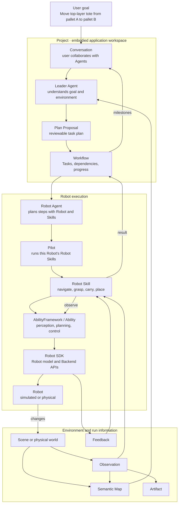

Semantic is a framework for building and operating embodied AI applications. It connects users, Agents, environments, and Robots through semantic state: Agents understand goals and the environment, organize work that can continue over time, and Robot Skills, Abilities, and Robot SDKs turn that work into physical actions.

An embodied task always happens in a real or simulated environment. Agents need to know which objects, regions, and Robots exist, choose the next goal, and receive new information after actions change the environment. Semantic therefore follows a continuous loop:

```text
Understand the goal and environment
→ Plan the task
→ Execute embodied actions
→ Receive Feedback and perform active Observation
→ Update environment and task state
→ Continue or adjust the task
```

## A depalletizing task

Suppose the user says:

> Use the R1 Pro Robot in the current Scene to move the top-layer tote on pallet A to an empty stacking column on pallet B.

That sentence names a business goal. Execution still needs the totes, pallets, free space, Robot state, and installed capabilities in the current environment. Semantic organizes the work like this:



The four parts are:

1. **Project and collaboration** organize goals, Agent conversations, tasks, environment resources, and run history.
2. **Agents and the task system** turn business goals and environment semantics into Workflow, Task, and SubTask.
3. **Robot execution** hands Robot SubTasks to a Robot through Robot Skill, Ability, and Robot SDK.
4. **Environment information** brings action results, Feedback, and Observation back to Skill, Agent, Semantic Map, and Studio.

## Architecture pages

| Chapter | Question it answers |
|---|---|
| [01 How an embodied system runs](01-system-overview.en.md) | How a task closes the loop among user, Agent, environment, and Robot |
| [02 Project and Studio](02-project.en.md) | How an embodied application organizes resources, collaboration, development, and runs |
| [03 Environment, perception, and Semantic Map](03-environment.en.md) | How Semantic represents the environment and obtains current information |
| [04 Agents and collaboration](04-agent-and-collaboration.en.md) | How Agents understand goals, use Skills and Tools, and collaborate |
| [05 Planning and Workflow](05-planning-and-workflow.en.md) | How a user goal becomes a Plan, Tasks, and SubTasks |
| [06 Robot execution](06-robot-execution.en.md) | How Robot Skill, Ability, Robot SDK, and the Robot complete one action |
| [07 Extension model](07-extension-model.en.md) | How developers add Agent, Skill, Ability, Robot, Backend, and Scene capabilities |
| [08 Simulation, real robots, and deployment](08-simulation-real-robot-and-deployment.en.md) | How the same design runs in simulation and on physical Robots |

## Reading path

First read [01](01-system-overview.en.md) → [02](02-project.en.md) → [03](03-environment.en.md) → [04](04-agent-and-collaboration.en.md) → [05](05-planning-and-workflow.en.md) → [06](06-robot-execution.en.md).

Related sections: [User Guide](../user/_index.en.md) · [Developer Guide](../developer/_index.en.md) · [API and configuration](../developer/reference/api/_index.en.md) · [Releases](../releases/_index.en.md)
