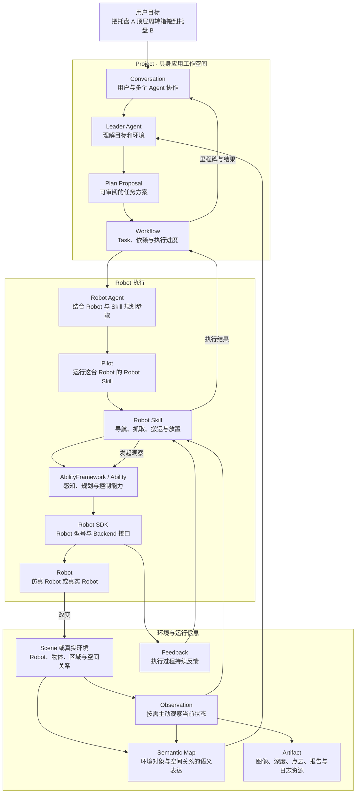

Semantic 是面向具身智能应用开发与运行的框架。它以语义为纽带连接用户、Agent、环境和 Robot：Agent 理解用户目标与环境信息，组织可以持续推进的任务；Robot Skill、Ability 和 Robot SDK 将任务落实为具体的机器人行动；Semantic Studio 将项目开发、环境构建、任务协作和运行观察组织在同一个工作空间中。

具身任务始终发生在一个真实或仿真的环境里。Agent 需要理解环境中有哪些对象、区域和 Robot，选择要完成的目标，并在行动改变环境后继续获得新的信息。Semantic 因此围绕一条持续循环的主线展开：

```text
理解目标与环境
→ 规划任务
→ 执行具身行动
→ 接收 Feedback 并主动 Observation
→ 更新对环境和任务的理解
→ 继续执行或调整任务
```

本组文档从这条具身闭环出发，介绍 Semantic 如何组织 Project、Agent、Workflow、Robot 执行、Semantic Map、仿真和真机，以及开发者如何扩展新的具身能力。

## 从一个拆码垛任务看 Semantic

假设用户提出目标：

> 使用当前场景中的 R1 Pro Robot，把托盘 A 顶层的周转箱搬到托盘 B 的空闲堆叠列。

这句话包含业务目标，但真正执行还需要结合当前环境中的箱体、托盘、可通行区域、Robot 状态和已安装能力。Semantic 将这项工作组织成下面的过程：



这张图展示了 Semantic 的四个主要部分：

1. **Project 与协作空间**组织用户目标、Agent 对话、任务、环境资源和运行记录。
2. **Agent 与任务系统**理解业务目标和环境语义，将目标逐步展开为 Workflow、Task 和 SubTask。
3. **Robot 执行系统**把 Robot SubTask 交给具体 Robot，通过 Robot Skill、Ability 和 Robot SDK 完成行动。
4. **环境与运行信息**把行动产生的变化、持续 Feedback 和主动 Observation 带回 Skill、Agent、Semantic Map 和 Studio。

在这个例子中，Semantic Map 帮助 Agent 理解“托盘 A 顶层周转箱”和“托盘 B 空闲堆叠列”分别指向什么。Robot Skill 在真正抓取和放置时，通过 Ability 主动观察当前物体、工具和目标位置。执行过程中的控制状态通过 Feedback 持续返回，图像、深度、点云或报告可以作为 Artifact 保存在 Project 中。行动改变环境后，同一个对象及其新的空间关系继续进入后续任务。

## Project 组织一项具身应用

Project 是用户开发和运行一项具身应用的工作空间。它把需要共同演进的内容放在一起：

- Agent Skill、Robot Skill 和应用代码；
- Scene、Layout 和其他环境资源；
- Model、Agent、Team 和工具配置；
- Conversation、Plan Proposal、Workflow 和 Task；
- Semantic Map、Artifact、Agent Run 和 Robot Execution；
- Project 选择的 Runtime、Robot 和已安装能力。

Semantic Studio 围绕 Project 提供统一入口。用户可以在 Conversation 中说明目标，在 Project Explorer 中维护资源，在 Scene 和 Semantic Map 中理解环境，在 Workflow 面板中查看任务，在 Robot Execution 中观察机器人行动。开发、调试和正式运行使用同一套 Project 语义，产生的结果可以继续用于下一轮开发和任务协作。

## Agent 将语义目标组织成任务

Semantic 中的 Agent 以明确角色参与工作。Leader 与用户协作并理解总体目标；不同专业 Agent 承担适合自身能力的 Task；Robot Agent 面向实际 Robot 规划和推进 Robot SubTask；其他 Agent 可以处理地图、开发、监测或短时分析。

Agent 身份可以长期存在，模型执行按 Agent Run 启动。每个 Run 根据当前目的组装 Conversation、Task、Semantic Map 查询结果、Project Memory、Skill、工具和实时资源信息。用户回答 Interaction、任务进入下一步骤或执行发生异常时，系统创建新的 Run 延续同一项工作。

Agent Skill 为 Agent 提供领域知识、工作方法和工具说明。工具让 Agent 查询环境、读取 Project 资源、创建 Interaction、提交 Plan Proposal 或启动 Robot Skill。Agent 的规划摘要、问题和结果回到 Conversation；具体工具调用和运行过程记录在 Run 与 Trace 中。

## Workflow 让任务持续推进

用户目标首先在 Conversation 中形成可审阅的 Plan Proposal。用户批准后，Proposal 成为 Workflow，并创建具有明确结果和依赖关系的 Task。负责具体 Task 的 Agent 再根据当前环境、可用资源和 Skill 规划较短的 SubTask。

```text
Conversation
└── Plan Proposal
    └── Workflow
        ├── Task
        │   ├── SubTask
        │   └── SubTask
        └── Task
```

Task 表达一个 Agent 需要负责的业务结果，例如“将指定周转箱搬到目标堆叠列”。Robot SubTask 表达一次可以由 Robot Skill 承担的具身步骤，例如来源导航、抓取、携物导航和放置。Robot Skill 内部的 Stage 与 Action 继续留在 Robot Execution 中，用于组织执行闭环。

Workflow Service 根据 Task 依赖和实际资源推进工作。Robot 在 Task 可以开始时后绑定，Robot Agent 再结合这台 Robot 当前安装的 Skill 和实时状态准备执行。执行产生的新信息可以调整尚未开始的步骤，已经完成的结果则继续成为后续 Task 的输入。

## Robot 执行连接语义与身体

Robot 执行把 Agent 处理的业务意图逐层转化为 Robot 可以完成的行动：

```text
Robot Agent
→ Robot Skill
→ AbilityFramework / Ability
→ Robot SDK
→ Robot 或 Simulation Runtime
```

Robot Agent 选择 Skill 并准备业务输入。Robot Skill 组织一个具身步骤中的 Stage、Action、主动观察和有限恢复。Ability 提供导航、运动、工具控制、Robot 状态、传感器采集、物体感知和抓取规划等可组合能力。Robot SDK 面向具体 Robot 型号提供稳定接口，并通过不同 Backend 连接真机或仿真 Runtime。

Pilot 代表一台 Robot 接入 Semantic Server，管理这台 Robot 的 Skill 安装与执行。一次 Skill 运行形成一条 Robot Execution，其中包含 Stage、Action、Feedback、Observation、Artifact 和最终 Result。Studio 使用这条运行记录展示 Robot 正在做什么，以及环境和任务发生了什么变化。

## 环境信息形成持续的具身闭环

Semantic 使用不同信息表达环境和执行过程：

- **Scene**描述仿真环境及其具体布局；真实环境由 Robot、感知和外部地图系统共同提供信息。
- **Semantic Map**表达环境中的对象、区域及其空间关系，供 Agent 理解目标、查询环境并在 Studio 中展示。
- **Feedback**由执行层在 Action 运行期间持续向上反馈，例如运动进度、控制误差、工具状态和传感器读数。
- **Observation**由 Agent 或 Robot Skill 为判断当前情况而主动发起，例如重新定位箱体、检查工具承载或确认放置状态。
- **Artifact**是在 Project 中保存、查看、引用和复用的数据资源或运行产物，例如图像、深度、点云、视频、模型、报告和日志文件。

Agent 使用 Semantic Map 建立环境语义和任务目标；Robot Skill 使用 Ability 取得执行时的 Observation，并根据 Feedback 推进局部闭环。任务结果、场景变化和新的观察继续更新 Project 对环境的表达，使下一项任务能够从新的环境状态出发。

## Semantic 的扩展层次

Semantic 为具身应用提供多层扩展入口。每一层对应不同的问题：

| 扩展 | 主要内容 |
|---|---|
| Agent Skill | 领域知识、工作方法、工具使用方式和输出约定 |
| Robot Skill | 导航、抓取、搬运、放置等可复用具身任务 |
| Ability | 感知、规划、运动、工具控制等可组合 Robot 能力 |
| Robot SDK | 具体 Robot 型号的控制、状态和传感接口 |
| Backend | 真机、MuJoCo 或其他 Runtime 的连接实现 |
| Scene Package / Layout | 可运行环境、对象、Robot 和空间布置 |
| Studio | Project 资源、环境、任务和运行过程的交互与展示 |

开发者可以在 Project 中创建和调试这些内容，再将可复用部分发布到相应 Registry 或安装环境中。运行时，Project 选择的 Scene、Robot、Skill 和 Runtime 组合成一次具体的具身应用实例。

## 架构文档结构

后续章节沿着一项具身应用从组织、理解到执行和部署的顺序展开：

| 章节 | 回答的问题 |
|---|---|
| `01 具身系统如何运行` | 一项具身任务如何在用户、Agent、环境和 Robot 之间形成完整闭环 |
| `02 Project 与 Studio` | 一项具身应用如何组织资源、协作、开发和运行 |
| `03 环境、感知与 Semantic Map` | Semantic 如何表达环境，并通过 Feedback 与 Observation 取得当前信息 |
| `04 Agent 与协作` | Agent 如何理解目标、使用 Skill 和工具，并与用户及其他 Agent 协作 |
| `05 任务规划与 Workflow` | 用户目标如何形成 Plan、Task、SubTask，并在执行中持续推进 |
| `06 Robot 执行与具身闭环` | Robot Skill、Ability、Robot SDK 和 Robot 如何完成一次具身行动 |
| `07 Semantic 扩展模型` | 开发者如何增加 Agent、Skill、Ability、Robot、Backend 和 Scene 能力 |
| `08 仿真、真机与部署` | 同一套 Semantic 设计如何运行在仿真环境和真实 Robot 上 |

## 阅读路径

### 第一次了解 Semantic

按顺序阅读 `01 → 02 → 03 → 04 → 05 → 06`。这条路径先建立具身系统全景，再进入环境、Agent、任务和 Robot 执行。

### 开发 Agent 与任务应用

阅读 `02 Project 与 Studio`、`03 环境、感知与 Semantic Map`、`04 Agent 与协作`、`05 任务规划与 Workflow` 和 `07 Semantic 扩展模型`。

### 开发 Robot 能力

阅读 `03 环境、感知与 Semantic Map`、`06 Robot 执行与具身闭环`、`07 Semantic 扩展模型` 和 `08 仿真、真机与部署`。

### 部署和运行 Semantic

阅读 `01 具身系统如何运行`、`02 Project 与 Studio`、`06 Robot 执行与具身闭环` 和 `08 仿真、真机与部署`。

## 其他文档

- **实现设计**进一步展开 Agent Runtime、Workflow、Pilot、Robot Skill、Ability、Robot SDK、Simulation Runtime 和 Studio 使用的机制与接口。
- **用户与开发者指南**说明如何创建 Project、配置 Agent、开发 Skill、启动场景、接入 Robot、运行 Workflow 和调试执行。
- **API 与配置参考**提供接口、事件、模型、Manifest 和配置文件的精确定义。
- **版本与发布说明**记录各版本的交付范围、兼容关系和运行要求。
