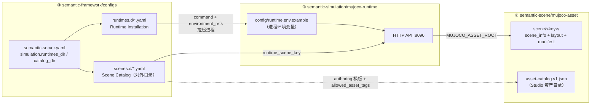

A Scene Package describes a runnable embodied environment. A Layout describes one environment arrangement. A Runtime loads the scene, advances state, and provides virtual Robot and sensing interfaces.

Simulation configuration is split across three repositories, each answering one question:

| Config owner | Repository | Question it answers | Who consumes it |
|---|---|---|---|
| ① Runtime process config | `semantic-simulation/mujoco-runtime` | How the Runtime process itself starts, where it listens, and where it finds assets | The Runtime process itself |
| ② Scene assets | `semantic-scene/mujoco-asset` | What the physical world looks like: Robot, objects, sensors, layout | Runtime load, Studio edit |
| ③ Framework registration | `semantic-framework/configs` | Which Runtime instances the Server knows about, and which scenes it exposes | Loaded at Server startup; queried by Web/Agent |

The three form a one-way chain: **the Server finds and starts ① from ③, and ① then loads ② from the asset root registered in ①**.



## How the configs relate (keys and mappings)

| Relation | Configs on both sides | What must match |
|---|---|---|
| Scene key | `runtime_scene_key` of a `scenes.d` entry ↔ `mujoco-asset/scene/<key>/` directory | The key pointed to by the Framework catalog entry must be a scene the Runtime can load (query `/api/v1/scenes`) |
| Profile match | `compatible_runtime_profile` of a `scenes.d` entry ↔ `profile.runtime_profile_id` in `runtimes.d` | A scene can start only on a Runtime it declares compatible |
| Capability report | `capabilities` in `runtimes.d` (expected) ↔ Runtime `GET /api/v1/runtime-profiles` (actual) | After connect, the Runtime's actual return overwrites; it cannot be faked |
| Asset location | `environment_refs: MUJOCO_ASSET_ROOT: SEMANTIC_MUJOCO_ASSET_ROOT` in `runtimes.d` ↔ the environment variable exported before starting the Server | The Runtime process finds the root of ② this way |
| Studio edit | `asset_catalog_version` / `allowed_asset_tags` in `scenes.d` authoring ↔ `catalog_version` / entry `tags` in `mujoco-asset/asset-catalog.v1.json` | The editor filters available assets by tag |

---

The layers below follow **startup order**.

## Layer 1: Runtime process config (mujoco-runtime)

The Runtime is an independent FastAPI process. It reads only environment variables and none of the Framework config (`src/plugin_mujoco/settings.py`):

```bash
# config/runtime.env.example
MUJOCO_ASSET_ROOT=/opt/semantic/mujoco_asset   # ② 资产仓根目录（唯一关联点）
MUJOCO_GL=egl                                  # 无头渲染后端；无 GPU 可改 osmesa
PLUGIN_MUJOCO_HOST=127.0.0.1
PLUGIN_MUJOCO_PORT=8090
PLUGIN_MUJOCO_BACKEND=mujoco
PLUGIN_MUJOCO_REALTIME=1                       # 实时推进；0 = 按步进
```

The start command is decided by the `pyproject.toml` entry: `uv run plugin-mujoco`. robosuite/libero are independent profiles (`profiles/`, each with its own Python environment and lock file) and do not affect native config.

## Layer 2: Scene assets (mujoco-asset)

```text
mujoco-asset/
├── asset-catalog.v1.json           # Studio 编辑器的资产目录（预览/默认属性/标签）
├── assets/objects/                 # 对象 XML 与 mesh（box、tote、pallet…）
├── robot/
│   ├── r1_pro_chassis/             # native Runtime 实际装配的模型
│   └── r1_pro_tote_gripper/        # tote_v1 场景使用的模型（semantic_robot_profile.yaml）
└── scene/
    └── palletizing_depalletizing_tote_v1/     # 目录名 = runtime_scene_key
        ├── asset-manifest.yaml     # 打包清单：scene_key、catalog 元数据、robots profile
        ├── scene_info.yaml         # 物理事实：Robot 位姿、传感器、timestep、gravity、viewer
        └── layout*.yaml            # 每次布置：对象实例、初始位姿、支撑关系
```

Division of the three YAML files:

- **scene_info.yaml** — scene invariants (Robot initial pose, camera intrinsics, physics parameters). Excerpt:

  ```yaml
  basic_info:
    scene_id: palletizing_depalletizing_tote_v1
  robots:
  - robot_name: r1_pro_tote_gripper
    robot_id: 1
    position: [0, 0, 0.01]
    sensor_name: camera
  sensors:
  - {sensor_name: camera, sensor_type: camera, width: 640, height: 480, fps: 15}
  simulation_params:
    timestep: 0.001
    gravity: [0, 0, -9.81]
  ```

- **layout*.yaml** — variables of one arrangement (object instances and initial poses). Objects that matter to an Agent use a stable source identity, which the Framework maps to Semantic Map entities;
- **asset-manifest.yaml** — packs the two above into a publishable scene: `scene_key`, catalog metadata (`scene_id/version/capabilities/authoring.mode`), layout list, and Robot model profile references.

`asset-catalog.v1.json` does not participate in Runtime load. It only serves Studio editing (each entry has `catalog_id`, `asset.asset_key`, `preview`, `default_properties`). Current assets are marked `distribution_status: internal-only` and `license: pending`; licensing must be handled before public release.

## Layer 3: Framework registers Runtimes (runtimes.d)

The `simulation` section of `semantic-server.yaml` names two registration directories:

```yaml
simulation:
  runtimes_dir: configs/runtimes.d   # Runtime Installation 登记处
  catalog_dir: configs/scenes.d      # Scene Catalog（对外场景目录）
```

`runtimes.d/native-mujoco.yaml` (real content) registers a **startable Runtime instance**:

```yaml
schema_version: 1
installation_id: local-native-mujoco
development: true
profile:
  runtime_profile_id: native-mujoco          # ← scenes.d 用它做兼容匹配
  engine: mujoco
  loader: native
  api_version: v1
  scene_kinds: [scene_document, asset_scene]
  capabilities:                              # 期望值，连接后以 Runtime 实际上报覆盖
    editable_scene: true
    native_evaluator: false
    viewer: true
    robot_models: [r1_pro_chassis]
    sensor_kinds: [rgb, depth, contact, holding, robot_state]
launch_mode: uv                              # 开发模式：uv | process | remote | container
endpoint: http://127.0.0.1:8090
workdir: ${SEMANTIC_MUJOCO_WORKDIR}
command: [uv, run, --frozen, plugin-mujoco]  # ← 第 1 层进程就这样被拉起
environment_refs:                            # 值必须是 SEMANTIC_ 前缀环境变量
  MUJOCO_ASSET_ROOT: SEMANTIC_MUJOCO_ASSET_ROOT
  MUJOCO_GL: SEMANTIC_MUJOCO_GL
asset_data_mounts:
  - {kind: assets, source: ${SEMANTIC_MUJOCO_ASSET_ROOT}, target: /assets, read_only: true}
enabled: true
```

Notes:

- This file describes "how the Server starts and probes a Runtime process" (`RuntimeSupervisor`: auto-start on probe failure, poll health checks in a 20s window);
- A Runtime instance belongs to one Project at a time;
- Formal install (schema v2) uses a Runtime Pack: `pack_id/runner/environment_path` are all absolute paths, every file has sha256, and the runner can only come from the Framework built-in map (`native-mujoco → bin/plugin-mujoco`). The command field is no longer used.

## Layer 4: Framework public scene catalog (scenes.d)

`scenes.d/mujoco-platforms.yaml` is the scene catalog Web/Agent sees. Each entry maps a **public scene_id** to a **Runtime-side scene key** (real content excerpt):

```yaml
schema_version: 1
catalog_version: 0.4.0-dev.0
entries:
  - scene_id: depalletizing-r1pro                  # 对外名称（Web 展示）
    name: R1 Pro 拆码垛
    engine: mujoco
    compatible_runtime_profile: native-mujoco      # ← 必须匹配 runtimes.d 的 profile id
    versions:
      - version: 1.0.0
        runtime_scene_key: palletizing_depalletizing_tote_v1   # ← Runtime 的 scene/<目录名>
        published: true
        robot_models: [r1_pro_chassis]
        variants:                                  # variant = 一次可启动的布局/配置
          - {variant_id: layout001, kind: layout, authoring_ref: authoring/depalletizing-r1pro/layout001.json}
          - {variant_id: layout_smoke, kind: layout, authoring_ref: authoring/depalletizing-r1pro/layout_smoke.json}
        authoring:
          mode: layout_only                        # none（外部环境不可编辑）| layout_only
          template_ref: authoring/depalletizing-r1pro/scene-template.json
          allowed_asset_tags: [native-mujoco]      # ← 过滤 asset-catalog 条目
          locked_nodes: [robot-r1-pro, camera-overview, light-key]
```

- `authoring/*.json` referenced by `variants` are SceneDocument edit templates (nodes are robot/camera/light; physics matches scene_info);
- Multiple Layouts under the same SceneID each build a RuntimeBundle. Switching = stop + reload;
- robosuite/libero entries use `authoring.mode: none` plus an `evaluation` section (native evaluation metrics) and cannot be edited.

## Startup chain (connecting these configs)

```text
用户在 Web 选择 scene_id=depalletizing-r1pro + variant=layout_smoke
→ Framework 校验：条目 published、compatible_runtime_profile 与 Project 匹配、variant 存在
→ RuntimeSupervisor 按 runtimes.d 的 command 拉起进程，
   注入 environment_refs 指向的环境变量（含 MUJOCO_ASSET_ROOT）
→ 健康检查通过后，Layout SceneDocument 编译为 RuntimeBundle 并注册
→ POST /api/v1/scenes/{runtime_scene_key}/instances（layout=layout_smoke）
→ Runtime 从 MUJOCO_ASSET_ROOT 加载 scene_info + layout，推进物理
→ 返回 running：首个 Snapshot 同步到 Semantic Map
→ 虚拟 Robot 描述生成受管 RobotDeployment，拉起 AbilityFramework / Ability / Pilot
```

## Getting started: run a Scene locally

Both methods below have been verified locally.

### Method A: standalone Runtime (fastest verification; only layers 1 and 2)

```bash
cd semantic-simulation/mujoco-runtime
make install                                   # uv sync --frozen --extra dev
export MUJOCO_ASSET_ROOT=/path/to/semantic-scene/mujoco-asset
export MUJOCO_GL=egl                           # 无显示器的服务器用 EGL 渲染
uv run plugin-mujoco                           # 监听 127.0.0.1:8090

curl http://127.0.0.1:8090/healthz
# {"status":"ok","version":"0.4.0.dev0"}

curl http://127.0.0.1:8090/api/v1/scenes       # 列出可加载的场景与布局

# 启动场景（scene key 即 mujoco-asset/scene/ 下的目录名）
curl -X POST http://127.0.0.1:8090/api/v1/scenes/palletizing_depalletizing_tote_v1/instances \
  -H 'Content-Type: application/json' \
  -d '{"request_id":"dev-1","layout":"layout_smoke","seed":7,"headless":true}'
# → {"instance_id":"...","state":"starting",...}

# 轮询至 running，然后获取快照与虚拟 Robot
curl http://127.0.0.1:8090/api/v1/scene-instances/<instance_id>
curl http://127.0.0.1:8090/api/v1/scene-instances/<instance_id>/snapshot
curl http://127.0.0.1:8090/api/v1/scene-instances/<instance_id>/robots

# 停止
curl -X POST http://127.0.0.1:8090/api/v1/scene-instances/<instance_id>/stop
```

### Method B: full Framework chain (all three config layers)

```bash
cd semantic-framework
# 这两个变量就是 runtimes.d environment_refs 引用的 SEMANTIC_ 前缀变量
export SEMANTIC_MUJOCO_WORKDIR=/path/to/semantic-simulation/mujoco-runtime
export SEMANTIC_MUJOCO_ASSET_ROOT=/path/to/semantic-scene/mujoco-asset
make run          # build + semantic init + 启动 Server（HTTP :8080 / WS :8081）

# 以开发方式登记 Runtime（等价于启用 runtimes.d 登记的另一途径）
.output/bin/semantic runtime install \
  --dev-source /path/to/semantic-simulation/mujoco-runtime \
  --profile native-mujoco \
  --asset-root $SEMANTIC_MUJOCO_ASSET_ROOT \
  --scene-catalog /path/to/semantic-simulation/mujoco-runtime/runtime-packs/native-mujoco/catalog

.output/bin/semantic runtime doctor --all        # 静态检查（--smoke 可真实启动最小场景）
```

Then in the Web UI open a Project → choose `depalletizing-r1pro` in the scene catalog → choose a Layout → start.

## Runtime HTTP API quick reference

| Endpoint | Description |
|---|---|
| `GET /healthz` | `{status, version}` |
| `GET /api/v1/runtime`, `/runtime-profiles`, `/scenes` | Runtime info, Profile capabilities, scene and layout list |
| `POST /api/v1/runtime-bundles` | Compile a RuntimeBundle already validated by the Framework |
| `POST /api/v1/scenes/{scene_key}/instances` | Start an instance (same `request_id` is idempotent and returns the same instance) |
| `GET /api/v1/scene-instances/{id}` | Instance state (state/progress/failure_reason) |
| `POST .../pause\|resume\|reset\|stop` | Instance operations |
| `GET .../snapshot` | Scene snapshot (objects/regions/robots/sensors/generation) |
| `GET .../robots` | Virtual Robot descriptors |
| `GET .../viewer-scene(.content)` | Viewer scene (GLB) |
| `WS .../pose-stream` | Binary pose stream |
| `GET/POST /api/v1/robots/{rid}/...` | Robot SDK short path: profile, state, commands, hold, sensors, frame streams |

Errors are unified as `{"error": {"code", "message", "details"}}`.

## Lifecycle

- **Reset**: hold the Robot, reset the Scene, and sync the new environment state;
- **Scene stop**: first HoldRobot each robot on the Runtime and confirm success (physical safety boundary), then converge Pilot/Ability, then stop the Scene Instance;
- **Layout switch / variant switch**: write a layout_switch checkpoint first, fully end the current instance, then start the new Layout (do not hot-patch MjModel);
- **Robot start failure**: the Scene stays viewable, the Robot is marked degraded, and the scene is not destroyed.

## Tests

```bash
cd semantic-simulation/mujoco-runtime
make install
make test                                        # Fake Backend，无 MuJoCo 依赖
MUJOCO_ASSET_ROOT=... MUJOCO_GL=egl make test-native   # 真实资产 + 真实 MuJoCo
make test-contracts                              # 合同样例一致性
```

Development and verification order:

1. Compile/validate Scene asset references (start a Layout on a standalone Runtime);
2. Verify Snapshot, object identity, Robot, and sensors;
3. Control the virtual Robot through the Robot SDK short path;
4. Complete real physical actions with Ability and Robot Skill;
5. Start the Scene from Framework and Web, and verify managed Robots and Semantic Map sync.

Physical tests check actual contact, collision, motion, and stop, and confirm that object motion comes from simulation physics.
