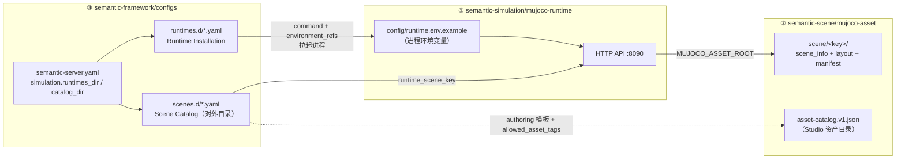

Scene Package 描述可运行的具身环境，Layout 描述一次环境布置，Runtime 负责加载场景、推进状态并提供虚拟 Robot 和传感接口。

仿真相关的配置分散在三个仓库，各自回答一个问题：

| 配置归属 | 仓库 | 回答的问题 | 谁来消费 |
|---|---|---|---|
| ① Runtime 进程配置 | `semantic-simulation/mujoco-runtime` | Runtime 进程自己怎么启动、监听哪、去哪找资产 | Runtime 进程自身 |
| ② Scene 资源 | `semantic-scene/mujoco-asset` | 物理世界长什么样：Robot、对象、传感器、布局 | Runtime 加载、Studio 编辑 |
| ③ Framework 登记 | `semantic-framework/configs` | Server 知道有哪些 Runtime 实例、对外暴露哪些场景 | Server 启动时加载，Web/Agent 查询 |

三者是一条单向链路：**Server 按 ③ 找到并拉起 ①，① 再按 ① 里登记的资产根加载 ②**。



## 配置之间的关联（键与映射）

| 关联点 | 两侧配置 | 必须一致的内容 |
|---|---|---|
| 场景键 | `scenes.d` 条目的 `runtime_scene_key` ↔ `mujoco-asset/scene/<key>/` 目录 | Framework 目录条目指向的键，必须是 Runtime 能加载的场景（`/api/v1/scenes` 可查） |
| Profile 匹配 | `scenes.d` 条目的 `compatible_runtime_profile` ↔ `runtimes.d` 的 `profile.runtime_profile_id` | 场景只能启动在声明兼容的 Runtime 上 |
| 能力上报 | `runtimes.d` 的 `capabilities`（期望值） ↔ Runtime `GET /api/v1/runtime-profiles`（实际值） | 连接后以 Runtime 实际返回覆盖，不可伪装 |
| 资产定位 | `runtimes.d` 的 `environment_refs: MUJOCO_ASSET_ROOT: SEMANTIC_MUJOCO_ASSET_ROOT` ↔ 启动 Server 前导出的环境变量 | Runtime 进程由此找到 ② 的根目录 |
| Studio 编辑 | `scenes.d` authoring 的 `asset_catalog_version` / `allowed_asset_tags` ↔ `mujoco-asset/asset-catalog.v1.json` 的 `catalog_version` / 条目 `tags` | 编辑器按标签过滤可用资产 |

---

下面按**启动顺序**逐层展开。

## 第 1 层：Runtime 进程配置（mujoco-runtime）

Runtime 是独立 FastAPI 进程，只读环境变量，不读 Framework 的任何配置（`src/plugin_mujoco/settings.py`）：

```bash
# config/runtime.env.example
MUJOCO_ASSET_ROOT=/opt/semantic/mujoco_asset   # ② 资产仓根目录（唯一关联点）
MUJOCO_GL=egl                                  # 无头渲染后端；无 GPU 可改 osmesa
PLUGIN_MUJOCO_HOST=127.0.0.1
PLUGIN_MUJOCO_PORT=8090
PLUGIN_MUJOCO_BACKEND=mujoco
PLUGIN_MUJOCO_REALTIME=1                       # 实时推进；0 = 按步进
```

启动命令由 `pyproject.toml` 入口决定：`uv run plugin-mujoco`。robosuite/libero 是独立 profile（`profiles/`，各自的 Python 环境和锁文件），不影响 native 配置。

## 第 2 层：Scene 资源（mujoco-asset）

```text
mujoco-asset/
├── asset-catalog.v1.json           # Studio 编辑器的资产目录（预览/默认属性/标签）
├── assets/objects/                 # 对象 XML 与 mesh（box、tote、pallet…）
├── robot/
│   ├── r1_pro_chassis/             # native Runtime 实际装配的模型
│   └── r1_pro_tote_gripper/        # tote_v1 场景使用的模型（semantic_robot_profile.yaml）
└── scene/
    └── palletizing_depalletizing_tote_v1/     # 目录名 = runtime_scene_key
        ├── asset-manifest.yaml     # 打包清单：scene_key、catalog 元数据、robots profile
        ├── scene_info.yaml         # 物理事实：Robot 位姿、传感器、timestep、gravity、viewer
        └── layout*.yaml            # 每次布置：对象实例、初始位姿、支撑关系
```

三个 YAML 的分工：

- **scene_info.yaml**——场景不变量（Robot 初始位姿、相机内参、物理参数），节选：

  ```yaml
  basic_info:
    scene_id: palletizing_depalletizing_tote_v1
  robots:
  - robot_name: r1_pro_tote_gripper
    robot_id: 1
    position: [0, 0, 0.01]
    sensor_name: camera
  sensors:
  - {sensor_name: camera, sensor_type: camera, width: 640, height: 480, fps: 15}
  simulation_params:
    timestep: 0.001
    gravity: [0, 0, -9.81]
  ```

- **layout*.yaml**——一次布置的变量（对象实例与初始位姿）。对 Agent 有意义的对象使用稳定来源身份，由 Framework 映射到 Semantic Map 实体；
- **asset-manifest.yaml**——把上面两者打包成可发布的场景：`scene_key`、catalog 元数据（`scene_id/version/capabilities/authoring.mode`）、layouts 清单、Robot 模型 profile 引用。

`asset-catalog.v1.json` 不参与 Runtime 加载，只服务 Studio 编辑（每个条目含 `catalog_id`、`asset.asset_key`、`preview`、`default_properties`）。注意当前资产标记 `distribution_status: internal-only`、`license: pending`，对外发布前需要处理授权。

## 第 3 层：Framework 登记 Runtime（runtimes.d）

`semantic-server.yaml` 的 `simulation` 段指定两个登记目录：

```yaml
simulation:
  runtimes_dir: configs/runtimes.d   # Runtime Installation 登记处
  catalog_dir: configs/scenes.d      # Scene Catalog（对外场景目录）
```

`runtimes.d/native-mujoco.yaml`（真实内容）登记一个**可启动的 Runtime 实例**：

```yaml
schema_version: 1
installation_id: local-native-mujoco
development: true
profile:
  runtime_profile_id: native-mujoco          # ← scenes.d 用它做兼容匹配
  engine: mujoco
  loader: native
  api_version: v1
  scene_kinds: [scene_document, asset_scene]
  capabilities:                              # 期望值，连接后以 Runtime 实际上报覆盖
    editable_scene: true
    native_evaluator: false
    viewer: true
    robot_models: [r1_pro_chassis]
    sensor_kinds: [rgb, depth, contact, holding, robot_state]
launch_mode: uv                              # 开发模式：uv | process | remote | container
endpoint: http://127.0.0.1:8090
workdir: ${SEMANTIC_MUJOCO_WORKDIR}
command: [uv, run, --frozen, plugin-mujoco]  # ← 第 1 层进程就这样被拉起
environment_refs:                            # 值必须是 SEMANTIC_ 前缀环境变量
  MUJOCO_ASSET_ROOT: SEMANTIC_MUJOCO_ASSET_ROOT
  MUJOCO_GL: SEMANTIC_MUJOCO_GL
asset_data_mounts:
  - {kind: assets, source: ${SEMANTIC_MUJOCO_ASSET_ROOT}, target: /assets, read_only: true}
enabled: true
```

要点：

- 这份文件描述"Server 如何拉起并探活一个 Runtime 进程"（`RuntimeSupervisor`：探测失败自动启动，20s 窗口轮询健康检查）；
- 一个 Runtime 实例同一时间只归属一个 Project；
- 正式安装（schema v2）改用 Runtime Pack：`pack_id/runner/environment_path` 全部绝对路径、每个文件带 sha256、runner 只能来自 Framework 内建映射（`native-mujoco → bin/plugin-mujoco`），不再使用 command 字段。

## 第 4 层：Framework 对外场景目录（scenes.d）

`scenes.d/mujoco-platforms.yaml` 是 Web/Agent 看到的场景目录，每个条目把一个**对外 scene_id** 映射到 **Runtime 侧的场景键**（真实内容节选）：

```yaml
schema_version: 1
catalog_version: 0.4.0-dev.0
entries:
  - scene_id: depalletizing-r1pro                  # 对外名称（Web 展示）
    name: R1 Pro 拆码垛
    engine: mujoco
    compatible_runtime_profile: native-mujoco      # ← 必须匹配 runtimes.d 的 profile id
    versions:
      - version: 1.0.0
        runtime_scene_key: palletizing_depalletizing_tote_v1   # ← Runtime 的 scene/<目录名>
        published: true
        robot_models: [r1_pro_chassis]
        variants:                                  # variant = 一次可启动的布局/配置
          - {variant_id: layout001, kind: layout, authoring_ref: authoring/depalletizing-r1pro/layout001.json}
          - {variant_id: layout_smoke, kind: layout, authoring_ref: authoring/depalletizing-r1pro/layout_smoke.json}
        authoring:
          mode: layout_only                        # none（外部环境不可编辑）| layout_only
          template_ref: authoring/depalletizing-r1pro/scene-template.json
          allowed_asset_tags: [native-mujoco]      # ← 过滤 asset-catalog 条目
          locked_nodes: [robot-r1-pro, camera-overview, light-key]
```

- `variants` 引用的 `authoring/*.json` 是 SceneDocument 编辑模板（nodes 为 robot/camera/light，physics 与 scene_info 一致）；
- 同一 SceneID 下多个 Layout 分别构建 RuntimeBundle，切换 = stop + reload；
- robosuite/libero 条目使用 `authoring.mode: none` + `evaluation` 段（原生评测指标），不可编辑。

## 启动链路（把这些配置串起来）

```text
用户在 Web 选择 scene_id=depalletizing-r1pro + variant=layout_smoke
→ Framework 校验：条目 published、compatible_runtime_profile 与 Project 匹配、variant 存在
→ RuntimeSupervisor 按 runtimes.d 的 command 拉起进程，
   注入 environment_refs 指向的环境变量（含 MUJOCO_ASSET_ROOT）
→ 健康检查通过后，Layout SceneDocument 编译为 RuntimeBundle 并注册
→ POST /api/v1/scenes/{runtime_scene_key}/instances（layout=layout_smoke）
→ Runtime 从 MUJOCO_ASSET_ROOT 加载 scene_info + layout，推进物理
→ 返回 running：首个 Snapshot 同步到 Semantic Map
→ 虚拟 Robot 描述生成受管 RobotDeployment，拉起 AbilityFramework / Ability / Pilot
```

## 入门：本地跑通一个 Scene

以下两种方式均已在本地验证。

### 方式 A：独立 Runtime（最快验证，只涉及第 1、2 层配置）

```bash
cd semantic-simulation/mujoco-runtime
make install                                   # uv sync --frozen --extra dev
export MUJOCO_ASSET_ROOT=/path/to/semantic-scene/mujoco-asset
export MUJOCO_GL=egl                           # 无显示器的服务器用 EGL 渲染
uv run plugin-mujoco                           # 监听 127.0.0.1:8090

curl http://127.0.0.1:8090/healthz
# {"status":"ok","version":"0.4.0.dev0"}

curl http://127.0.0.1:8090/api/v1/scenes       # 列出可加载的场景与布局

# 启动场景（scene key 即 mujoco-asset/scene/ 下的目录名）
curl -X POST http://127.0.0.1:8090/api/v1/scenes/palletizing_depalletizing_tote_v1/instances \
  -H 'Content-Type: application/json' \
  -d '{"request_id":"dev-1","layout":"layout_smoke","seed":7,"headless":true}'
# → {"instance_id":"...","state":"starting",...}

# 轮询至 running，然后获取快照与虚拟 Robot
curl http://127.0.0.1:8090/api/v1/scene-instances/<instance_id>
curl http://127.0.0.1:8090/api/v1/scene-instances/<instance_id>/snapshot
curl http://127.0.0.1:8090/api/v1/scene-instances/<instance_id>/robots

# 停止
curl -X POST http://127.0.0.1:8090/api/v1/scene-instances/<instance_id>/stop
```

### 方式 B：Framework 全链路（三层配置全部参与）

```bash
cd semantic-framework
# 这两个变量就是 runtimes.d environment_refs 引用的 SEMANTIC_ 前缀变量
export SEMANTIC_MUJOCO_WORKDIR=/path/to/semantic-simulation/mujoco-runtime
export SEMANTIC_MUJOCO_ASSET_ROOT=/path/to/semantic-scene/mujoco-asset
make run          # build + semantic init + 启动 Server（HTTP :8080 / WS :8081）

# 以开发方式登记 Runtime（等价于启用 runtimes.d 登记的另一途径）
.output/bin/semantic runtime install \
  --dev-source /path/to/semantic-simulation/mujoco-runtime \
  --profile native-mujoco \
  --asset-root $SEMANTIC_MUJOCO_ASSET_ROOT \
  --scene-catalog /path/to/semantic-simulation/mujoco-runtime/runtime-packs/native-mujoco/catalog

.output/bin/semantic runtime doctor --all        # 静态检查（--smoke 可真实启动最小场景）
```

之后在 Web 中打开 Project → 场景目录选择 `depalletizing-r1pro` → 选择 Layout → 启动。

## Runtime HTTP API 速查

| 端点 | 说明 |
|---|---|
| `GET /healthz` | `{status, version}` |
| `GET /api/v1/runtime`、`/runtime-profiles`、`/scenes` | Runtime 信息、Profile 能力、场景与布局列表 |
| `POST /api/v1/runtime-bundles` | 编译 Framework 已校验的 RuntimeBundle |
| `POST /api/v1/scenes/{scene_key}/instances` | 启动实例（相同 `request_id` 幂等返回相同 instance） |
| `GET /api/v1/scene-instances/{id}` | 实例状态（state/progress/failure_reason） |
| `POST .../pause\|resume\|reset\|stop` | 实例操作 |
| `GET .../snapshot` | 场景快照（objects/regions/robots/sensors/generation） |
| `GET .../robots` | 虚拟 Robot 描述 |
| `GET .../viewer-scene(.content)` | Viewer 场景（GLB） |
| `WS .../pose-stream` | 二进制位姿流 |
| `GET/POST /api/v1/robots/{rid}/...` | Robot SDK 短路径：profile、state、commands、hold、sensors、帧流 |

错误统一为 `{"error": {"code", "message", "details"}}`。

## 生命周期

- **Reset**：Robot hold 后重置 Scene，并同步新的环境状态；
- **Scene stop**：先向 Runtime 逐台 HoldRobot 并确认成功（物理安全边界），再收敛 Pilot/Ability，最后停止 Scene Instance；
- **Layout switch / variant 切换**：先落 layout_switch 检查点，完整结束当前实例后启动新 Layout（不热改 MjModel）；
- **Robot 启动失败**：Scene 保持可查看，Robot 标记 degraded，不销毁场景。

## 测试

```bash
cd semantic-simulation/mujoco-runtime
make install
make test                                        # Fake Backend，无 MuJoCo 依赖
MUJOCO_ASSET_ROOT=... MUJOCO_GL=egl make test-native   # 真实资产 + 真实 MuJoCo
make test-contracts                              # 合同样例一致性
```

开发与验证顺序：

1. 编译/校验 Scene 资源引用（独立 Runtime 启动 Layout）；
2. 验证 Snapshot、对象身份、Robot 和传感器；
3. 使用 Robot SDK 短路径控制虚拟 Robot；
4. 使用 Ability 和 Robot Skill 完成真实物理动作；
5. 从 Framework 和 Web 启动 Scene，验证受管 Robot 与 Semantic Map 同步。

物理测试检查实际接触、碰撞、运动和停止，并确认对象运动来自仿真物理。
