## Runtime boundaries

```mermaid
flowchart LR
    Studio[Semantic Studio]
    Server[Semantic Server]
    Workflow[Workflow]
    Pilot[semantic-pilot]
    Worker[Robot Skill Worker]
    Ability[AbilityFramework + Ability]
    SDK[Robot SDK]
    Runtime[Runtime / physical device]

    Studio -->|REST / WebSocket| Server
    Server --> Workflow
    Workflow -->|WebSocket| Pilot
    Pilot -->|JSON-RPC| Worker
    Worker -->|Action type@schema| Ability
    Ability -->|Python API| SDK
    SDK --> Runtime
```

## Protocol boundaries

| Boundary | Protocol | Responsibility |
|---|---|---|
| Studio ↔ Server | REST + WebSocket | Resource control, state queries, incremental events |
| Server ↔ Pilot | WebSocket | Robot state, Skill dispatch, and execution events |
| Pilot ↔ Worker | stdin/stdout JSON-RPC | Isolated Robot Skill execution |
| Worker ↔ Ability | Action `type@schema_version` | Invoke atomic actions |
| Ability ↔ SDK | Typed Python API | Device control and state reads |
| SDK ↔ Runtime/device | HTTP, WebSocket, or vendor APIs | Physical execution |

## How one task runs

1. The user describes a goal in a Studio Conversation;
2. The Agent reads Skills, calls Tools, and creates a Plan Proposal;
3. After approval, Server creates the Workflow, Tasks, and dependencies;
4. Workflow starts Agent Steps or Robot SubTasks according to resources and dependencies;
5. Pilot starts a Skill Worker; the Worker calls declared Actions;
6. Ability connects to simulation or a physical device through Robot SDK;
7. Feedback, Observation, Artifact, and terminal state return to Studio through the event chain;
8. Workflow continues, pauses, resumes, or completes based on the result.

## Design boundaries

Each layer depends only on the public protocol of the adjacent layer. Agents do not access devices directly, Robot Skills do not import the SDK directly, Runtime does not own Agent or business orchestration, and Studio does not connect to device processes directly.
