## 运行边界

```mermaid
flowchart LR
    Studio[Semantic Studio]
    Server[Semantic Server]
    Workflow[Workflow]
    Pilot[semantic-pilot]
    Worker[Robot Skill Worker]
    Ability[AbilityFramework + Ability]
    SDK[Robot SDK]
    Runtime[Runtime / 真实设备]

    Studio -->|REST / WebSocket| Server
    Server --> Workflow
    Workflow -->|WebSocket| Pilot
    Pilot -->|JSON-RPC| Worker
    Worker -->|Action type@schema| Ability
    Ability -->|Python API| SDK
    SDK --> Runtime
```

## 协议边界

| 边界 | 协议 | 责任 |
|---|---|---|
| Studio ↔ Server | REST + WebSocket | 资源控制、状态查询、增量事件 |
| Server ↔ Pilot | WebSocket | Robot 状态、Skill 下发和执行事件 |
| Pilot ↔ Worker | stdin/stdout JSON-RPC | 隔离运行 Robot Skill |
| Worker ↔ Ability | Action `type@schema_version` | 调用原子动作 |
| Ability ↔ SDK | Python 类型化 API | 设备控制和状态读取 |
| SDK ↔ Runtime/设备 | HTTP、WebSocket 或厂商接口 | 物理执行 |

## 一次任务如何运行

1. 用户在 Studio 的 Conversation 中描述目标；
2. Agent 读取 Skill、调用 Tool，生成 Plan Proposal；
3. 用户批准后，Server 创建 Workflow、Task 和依赖；
4. Workflow 按资源和依赖启动 Agent Step 或 Robot SubTask；
5. Pilot 启动 Skill Worker，Worker 调用声明过的 Action；
6. Ability 通过 Robot SDK 连接仿真或真实设备；
7. Feedback、Observation、Artifact 和终态通过事件链返回 Studio；
8. Workflow 根据结果继续、暂停、恢复或完成。

## 设计边界

每一层只依赖相邻层的公开协议。Agent 不直接访问设备，Robot Skill 不直接 import SDK，Runtime 不负责 Agent 或业务编排，Studio 不直接连接设备进程。
