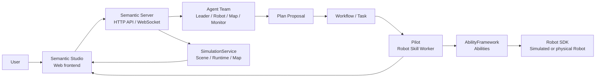

The Semantic User Guide is for people who use Semantic Studio to build, run, and observe embodied applications. It follows a Project through installation, model and simulation setup, Agent planning, and execution monitoring.

## The product chain

From a user perspective, Semantic Studio is the frontend and Semantic Server is the backend. Studio does not directly control models, simulation, or robots; it calls Server APIs and receives live updates over WebSocket.

The boundaries are:

- **Studio**: pages, Project layout, Conversation, scene viewing, and execution monitoring.
- **Server**: Project, Conversation, Workflow, model settings, Runtime, and Robot state.
- **Execution layer**: Pilot, AbilityFramework, Robot SDK, and Simulation Runtime.

## Recommended reading order

1. [Install and Start](getting-started/install-and-start.en.md): deploy a prebuilt package or build from source.
2. [Best Practice: From Project to Plan](getting-started/best-practice.en.md): follow a screenshot-based default workflow.
3. [Project and Semantic Studio](workspace/project-and-studio.en.md): understand the frontend pages and panels.
4. [Conversation, Agents, and Interactions](collaboration/conversation-agents-and-interactions.en.md): learn how to describe goals and answer Agent questions.
5. [Plans and Workflow](workflow/planning-and-execution.en.md): review, approve, pause, resume, and stop execution.
6. [Simulation](environments/simulation.en.md) or [Real Robots](environments/real-robot.en.md): continue with your target environment.

## Guide structure

| Section | What you will learn |
|---|---|
| [Getting Started](getting-started/_index.en.md) | Installation, startup, login, and the screenshot-based best practice |
| [Workspace](workspace/_index.en.md) | Project and Semantic Studio page structure |
| [Collaboration](collaboration/_index.en.md) | Conversation, Leader, Robot Agent, and structured Interactions |
| [Plans & Execution](workflow/_index.en.md) | Plan Proposal, Workflow, Task, recovery, and stop |
| [Environments](environments/_index.en.md) | MuJoCo simulation, Runtime, and real robot onboarding |
| [Robot Execution](robot/_index.en.md) | Robot Skill, Stage, Action, Observation, and Artifact |
| [Operations](operations/_index.en.md) | Health checks, logs, reconnection, Runtime, and maintenance |
| [Troubleshooting](troubleshooting/_index.en.md) | Login, ports, Runtime, models, and device issues |

## Core objects

- **Project**: the workspace for goals, resources, Conversation, runs, and layout.
- **Semantic Studio**: the web frontend used every day.
- **Conversation**: the main collaboration surface between users and Agents.
- **Plan Proposal**: an Agent-generated plan reviewed and approved by the user.
- **Workflow**: the approved plan in execution, made of Tasks and SubTasks.
- **Scene / Layout**: a simulated environment and a startable initial layout.
- **Robot Execution**: one Robot Skill run with stages and evidence.
- **Artifact**: images, files, sensor data, and other execution outputs.

## Reading on GitHub

Documentation links use relative `.md` paths so they work on GitHub source pages. The Hugo build converts them into deployed page URLs. If a link still returns 404 on GitHub, check whether the target file exists on the branch you are viewing; untranslated or unmerged files are not available on `main`.
