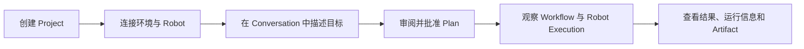

Semantic 用户手册面向使用 Semantic 构建和运行具身应用的用户。它从 Project 开始，依次介绍 Studio、Agent 协作、任务规划、环境、Robot 执行和运行维护。

一条典型使用路径如下：

## 从哪里开始

- 初次使用 Semantic：阅读[安装与启动](/user/getting-started/install-and-start/)和[第一个 Project](/user/getting-started/first-project/)。
- 了解日常工作界面：阅读[Project 与 Semantic Studio](/user/workspace/project-and-studio/)。
- 通过 Agent 完成任务：阅读[Conversation、Agent 与 Interaction](/user/collaboration/conversation-agents-and-interactions/)和[计划与 Workflow](/user/workflow/planning-and-execution/)。
- 使用仿真或真机：阅读[仿真环境](/user/environments/simulation/)和[连接真实 Robot](/user/environments/real-robot/)。
- 查看机器人执行：阅读[Robot 执行与观察](/user/robot/execute-and-observe/)。
- 诊断运行问题：阅读[运行维护](/user/operations/runtime-operations/)和[问题排查](/user/troubleshooting/)。

## 手册结构

| 部分 | 内容 |
|---|---|
| 快速开始 | 安装、启动、创建 Project 和完成第一个 Robot 任务 |
| 工作空间 | Project 中的资源、Conversation、运行视图和 Studio 工具 |
| 协作 | 用户与多个 Agent 的沟通、结构化 Interaction 和结果汇总 |
| 计划与执行 | Plan Proposal、Workflow、Task、暂停、恢复和停止 |
| 环境与 Robot | 仿真 Scene、Runtime、Pilot、真机接入和设备状态 |
| Robot 执行 | Robot Skill、Stage、Action、Observation 和 Artifact |
| 运维与排查 | 服务状态、日志、重连、执行异常和安全停止 |

## 使用中的核心对象

- **Project**：承载具身应用目标、资源和运行历史的工作空间。
- **Semantic Studio**：浏览、编辑、运行和观察 Project 的工具。
- **Conversation**：用户与 Leader 及其他 Agent 协作的主要入口。
- **Plan Proposal**：Agent 根据目标提出、由用户审阅的执行方案。
- **Workflow**：获批计划的运行过程，由相互依赖的 Task 组成。
- **Robot Execution**：一次 Robot Skill 的实际执行，记录 Stage、Action 和运行结果。
- **Environment**：Robot 工作的空间及其对象、区域、传感信息和 Semantic Map。

这些对象贯穿仿真和真机。运行环境不同，Project 中的目标、协作方式和观察入口保持一致。
