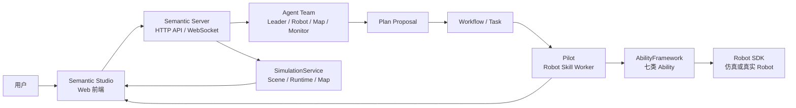

Semantic 用户手册面向使用 Semantic Studio 构建、运行和观察具身应用的用户。手册以 Project 为主线：先完成安装与登录，再配置模型和仿真环境，随后通过 Conversation 让 Agent 生成计划，并在 Studio 中观察 Workflow、Robot 和运行证据。

## 先理解整体链路

从用户角度看，Semantic 的前端是 Semantic Studio；后端是 Semantic Server。Studio 不直接控制模型、仿真或机器人，它只通过 Server API 和 WebSocket 获取状态、提交操作。

这条链路里有三个边界：

- **Studio**：展示和操作入口，负责 Project、页面布局、对话、场景查看和运行观察。
- **Server**：统一保存 Project、Conversation、Workflow、模型配置、Runtime 和 Robot 状态。
- **执行端**：Pilot、AbilityFramework、Robot SDK 和 Simulation Runtime 完成真实或仿真执行。

## 推荐阅读顺序

1. [安装与启动](getting-started/install-and-start.md)：启动 Server、Web 和必要的仿真 Runtime。
2. [最佳实践：从 Project 到规划](getting-started/best-practice.md)：按截图完成一条完整、可复现的默认流程。
3. [Project 与 Semantic Studio](workspace/project-and-studio.md)：理解前端页面结构、每个区域的作用和主要操作流。
4. [Conversation、Agent 与 Interaction](collaboration/conversation-agents-and-interactions.md)：学会向 Agent 描述目标、回答追问和理解协作结果。
5. [计划与 Workflow](workflow/planning-and-execution.md)：理解 Plan Proposal、批准执行、暂停、恢复和停止。
6. [仿真环境](environments/simulation.md)或[连接真实 Robot](environments/real-robot.md)：根据实际运行环境继续深入。

## 手册结构

| 部分 | 你会学到什么 |
|---|---|
| [快速开始](getting-started/_index.md) | 安装启动、登录和截图版最佳实践 |
| [工作空间](workspace/_index.md) | Project、Semantic Studio 页面结构、前端各区域的作用 |
| [协作](collaboration/_index.md) | Conversation、Leader、Robot Agent、结构化 Interaction |
| [计划与执行](workflow/_index.md) | Plan Proposal、Workflow、Task、恢复和停止 |
| [环境与 Robot](environments/_index.md) | MuJoCo 仿真、Runtime、真实 Robot 接入 |
| [Robot 执行](robot/_index.md) | Robot Skill、Stage、Action、Observation 和 Artifact |
| [运行维护](operations/_index.md) | 服务状态、日志、重连、Runtime 和常见维护动作 |
| [问题排查](troubleshooting/_index.md) | 登录、端口、Runtime、模型和设备异常的定位方法 |

## 使用中的核心对象

- **Project**：承载目标、资源选择、Conversation、运行历史和工作布局。
- **Semantic Studio**：用户日常使用的 Web 前端。
- **Conversation**：用户与 Leader 及其他 Agent 协作的入口。
- **Plan Proposal**：Agent 生成、由用户审阅和批准的计划。
- **Workflow**：获批计划的运行过程，由 Task 和 SubTask 组成。
- **Scene / Layout**：仿真环境及可启动的初始布局。
- **Robot Execution**：一次 Robot Skill 的实际执行及阶段证据。
- **Artifact**：执行产生的图片、文件、传感器数据和其他结果。

## GitHub 阅读说明

仓库内的文档链接统一使用相对的 `.md` 文件路径，保证在 GitHub 源码页可以直接跳转。Hugo 文档站构建时会通过链接渲染钩子自动转换为部署后的页面 URL。若 GitHub 上仍出现 404，请先确认当前分支是否已包含目标文件；未合并到 `main` 的新文档在 `main` 分支上不可访问。
