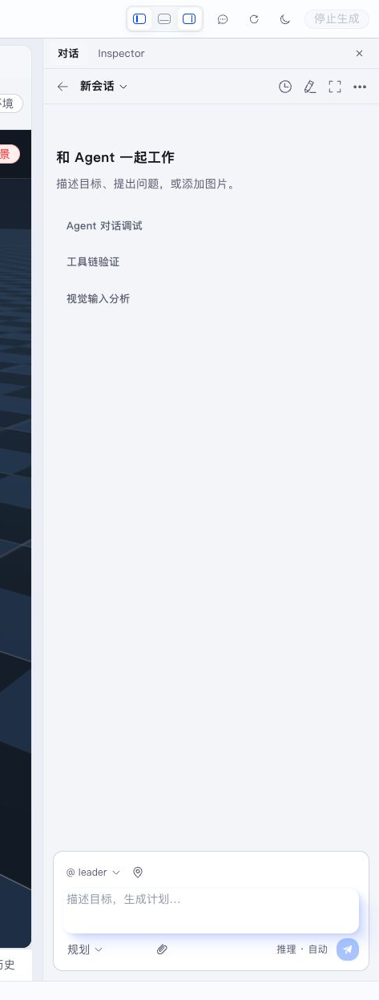

This section explains how to describe goals to Agents, review plans, answer structured questions, and read collaborative results.

- [Conversation, Agents, and Interactions](conversation-agents-and-interactions.en.md)

Use Collaboration mode for discussion and Planning mode when the task may produce physical robot actions.
