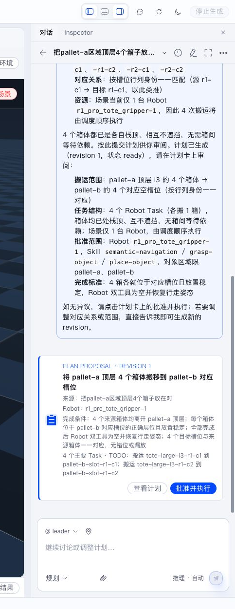
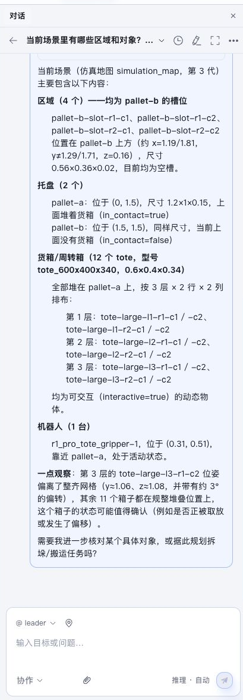
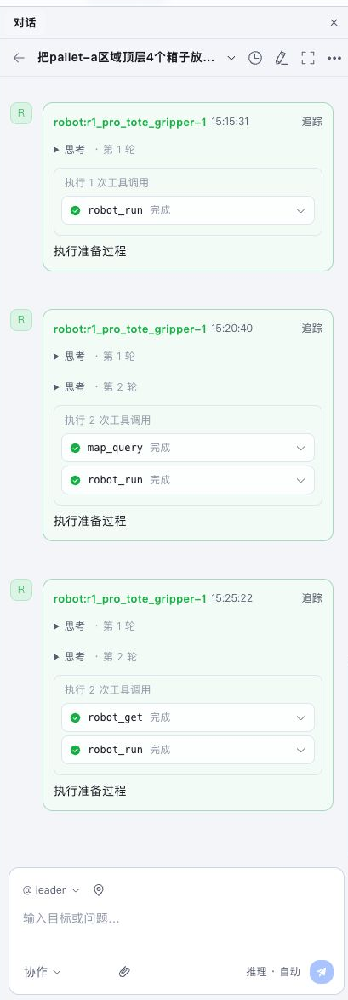
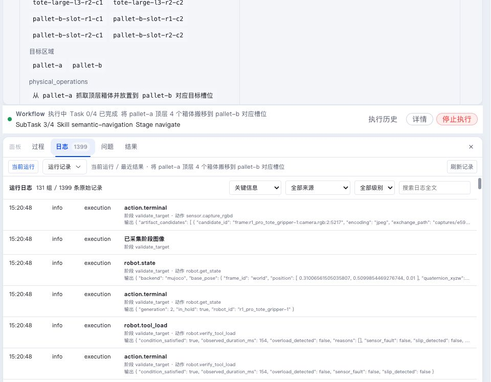

Conversation 是用户与多个 Agent 协作的主要界面。Leader 负责理解整体目标和组织工作，承担 Task 的 Agent 负责具体结果，Robot Agent 负责结合实际 Robot 推进机器人任务。



右侧 Conversation 与中央场景可以同时打开。你一边描述目标，一边观察仿真、Robot 状态和 Plan Proposal，不需要在多个页面之间来回切换。

## 协作模式与规划模式

Conversation 输入区提供两种主要模式：

- **协作**：适合问答、分析、继续讨论和让 Agent 使用工具完成一般任务。
- **规划**：适合会让 Robot 产生实际动作的任务。Agent 会先生成 Plan Proposal，等待用户审阅和批准。

下图是**协作模式**：你提一个普通问题，Leader 用多次 `map_query` 工具调用查询环境后给出回答，并可以追问"是否据此规划任务"——但它不会主动产生 Plan Proposal。



下图是**规划模式**：你描述一个会产生 Robot 动作的目标，Leader 查询环境后提交 Plan Proposal，随后出现系统活动（Plan 已批准、Task 已分配/已开始）和 Robot Agent 的执行消息。这是协作和规划最直观的区别。



规划模式不是"立即执行"。它的关键作用是先把目标、范围、Robot、Skill 和完成条件整理成计划卡，由用户决定是否进入 Workflow。

## 通过自然语言描述目标

消息可以包含：

- 业务目标和完成条件；
- 目标对象、区域或 Robot；
- 时间、资源和安全约束；
- 从 Viewer 或 Semantic Map 中选择的实体；
- 图片、文件和其他 Artifact。

目标明确时，Agent 可以直接开始查询环境、提出计划或推进当前工作。用户无需描述 Stage、Action、关节轨迹等底层执行细节。

## 多 Agent 消息

主 Conversation 展示对协作有意义的输出：

- Leader 的目标理解、计划说明和最终汇总；
- Robot、Map、Monitor、Developer 等 Agent 的任务规划摘要；
- Agent 提出的 Interaction；
- Recovery 分析和调整结果；
- Task 结果与相关 Artifact。

Task 分配、Run 启动、Robot Execution 接受和状态变化以系统活动展示。工具调用、原始模型结构和 Stage 流水位于 Trace、Execution 和调试面板。



底部"日志"页可以展开模型调用、Skill 调用、地图查询和 Plan 提交等 Trace，以及 Execution 每个 Stage 的动作和输出。普通使用时看 Conversation 即可；排障时再看这些底层记录。

## 结构化 Interaction

Agent 需要用户提供选择、参数或授权时，会在 Conversation 中插入 Interaction。常见形式包括：

- 确认；
- 表单；
- 单选和多选；
- 参数输入；
- 图片、地图实体和文件选择。

回答提交后，原 Agent 在原任务上下文中继续工作。Interaction 卡支持：

- **提交**：保存回答并继续原工作；
- **稍后处理**：折叠卡片，问题保持待处理；
- **跳过**：适用于没有必填项的问题；
- **取消询问**：通知原 Agent 用户取消本次问题，由 Agent 决定下一步。

停止 Workflow 是独立的运行控制操作，入口位于 Workflow 卡片和运行面板。

## 有效地提出任务

一个清晰请求通常包含三部分：

```text
要完成什么
使用哪个环境或对象
怎样判断完成
```

例如：

```text
把来源托盘顶层可搬运的四个周转箱放到目标托盘的空列中。
使用当前场景内可用的 Robot；保持箱体朝向。
完成后确认四个箱体稳定、工具为空，并汇总每个目标列的占用情况。
```

Agent 会按需查询 Semantic Map 和实时资源。存在多个合理业务选择时，Interaction 帮助用户确定结果。

## 协作时的阅读顺序

面对一条较长的 Agent 回复，建议按以下顺序阅读：

1. 先看最后的结论或 Plan Proposal；
2. 回看 Agent 查询到的环境事实；
3. 检查允许使用的 Robot、Skill 和对象范围；
4. 需要排障时再展开思考、工具调用和 Trace；
5. 如果要调整计划，直接说明要改哪一部分，让 Agent 生成新 revision。

不要根据单句回复直接批准执行。涉及 Robot 动作时，以 Plan Proposal 卡片中的范围为最终审阅依据。
