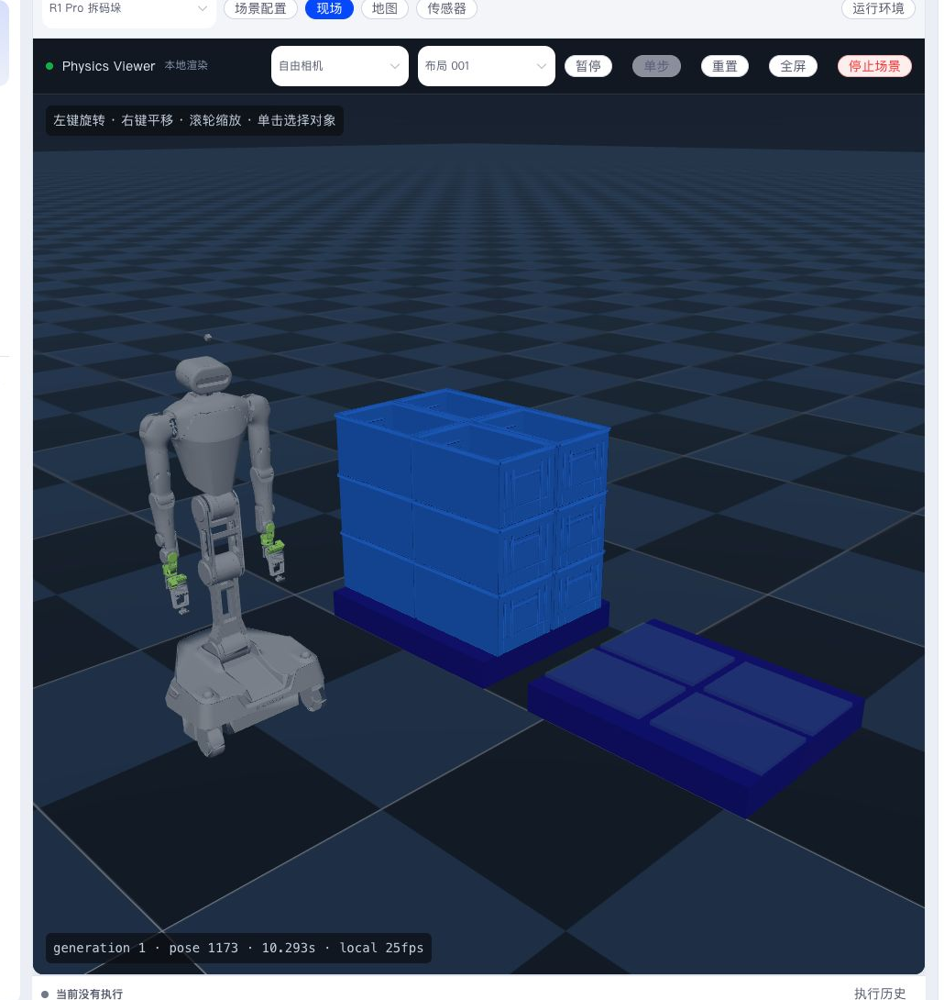

Environments provide observable space, objects, sensor data, and executable Robots for a Project. Simulation and physical Robots use the same upper-level workflow.

- [Simulation](simulation.en.md)
- [Connect a Real Robot](real-robot.en.md)

This section explains the relationship between Scene, Layout, Runtime, Semantic Map, sensors, and real robot onboarding.
