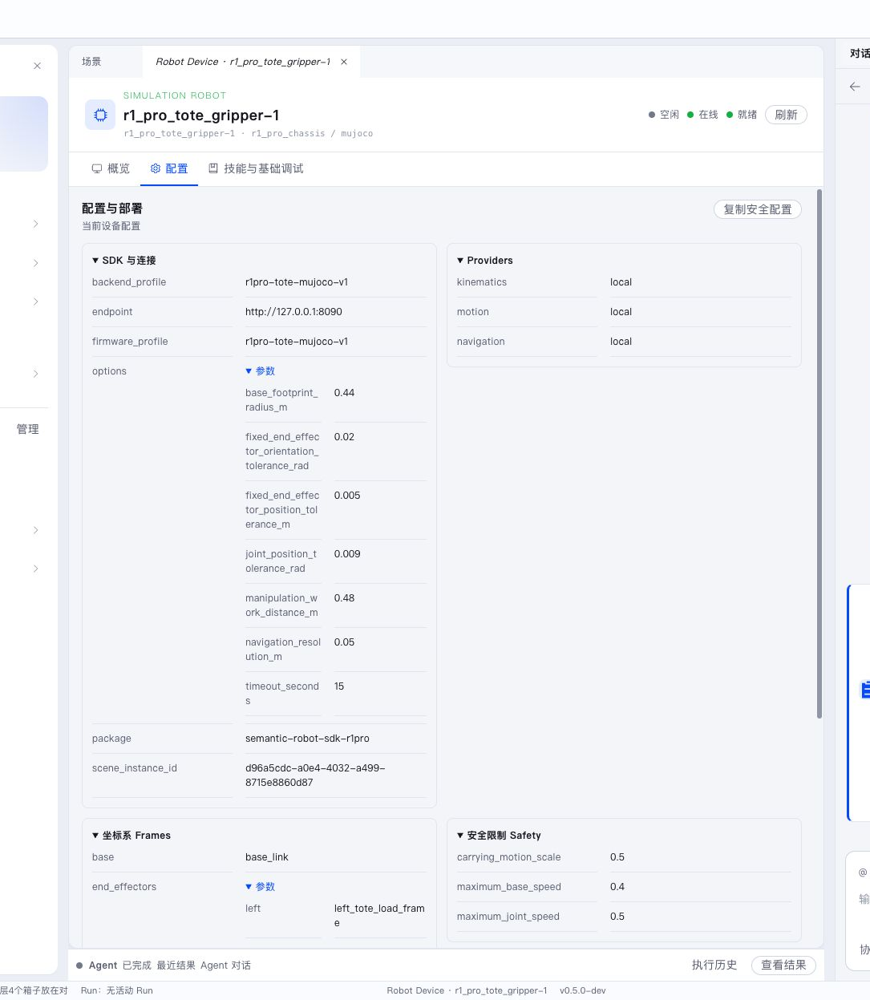

真实 Robot 通过 Robot 类型包、RobotDeployment、Pilot、AbilityFramework、Ability 和 Robot SDK 接入 Semantic。

> **没有 R1 Pro？** Semantic 的全部功能（环境、Agent 协作、Workflow、Skill 调试）都可以先在仿真中体验：MuJoCo 场景中的虚拟 Robot 使用与真机完全相同的执行链，见[仿真环境](simulation.md)和[最佳实践](../getting-started/best-practice.md)。仓库另提供 `r1pro-fake` 类型包，用于不依赖任何物理环境的设备链路验证。


设备中心是真实 Robot 接入后的全局观察入口。你可以在这里确认 Pilot 是否在线、Robot 是否空闲、Ability 是否健康、当前是否有执行，以及 Robot 是否被某个 Project 或 Scene 占用。

## 准备 Robot 实例

Robot 类型包提供：

- Robot 型号与 backend profile；
- RobotDeployment 模板；
- Pilot、AbilityFramework 和 Ability 启动资源；
- Robot SDK 与必要依赖；
- 可安装 Robot Skill 的运行环境。

用户根据设备填写 Robot ID、SDK endpoint、坐标系、安全限制、工具配置和期望 Robot Skill。



准备时重点核对：

- Robot ID 是否唯一且稳定；
- Robot SDK endpoint 是否能从运行 Pilot 的主机访问；
- 坐标系、工作区和安全限制是否符合现场；
- 工具配置是否与真实末端一致；
- desired Robot Skill 版本是否已经在 Server Registry 中发布。

## 首次加入

在全局设备中心创建 Pilot enrollment，获得短时有效的一次性加入码。在 Robot 主机上执行类型包提供的加入命令。加入成功后，程序生成专用连接配置并保存 Pilot credential。

Pilot 后续使用该 credential 重连 Server。设备页展示绑定的 Pilot、Robot、型号、backend、Ability 和 Robot Skill 状态。

加入码只用于首次配对。后续启动不要求重新输入管理员账号，也不要把 Pilot credential 放进 Project 文档或 Conversation。

## 启动与自动准备

Robot 实例启动器统一管理：

```text
AbilityFramework
→ Robot 所需 Ability
→ Pilot
→ Robot Skill 期望 / 实际状态同步
```

Robot 满足以下状态后可以接收 Task：

- Pilot 在线；
- AbilityFramework ready；
- 当前任务需要的 Ability 可用；
- Robot Skill 已安装并启用；
- Robot 空闲且处于可执行状态。

Ability 可以按需启动并在实例生命周期内复用。设备页会展示准备进度和具体失败组件。

如果设备中心显示 Pilot 在线但 Robot 不可执行，继续检查 AbilityFramework、七类 Ability、Robot Skill 期望 / 实际状态和 Project 占用。不要只看 Pilot 心跳。

## 停止 Robot 实例

停止流程先处理活动 Robot Execution，等待 Robot hold，再依次停止 Ability、AbilityFramework 和 Pilot。Robot SDK 与设备控制器的安全限制始终生效。

真机运行应遵循设备厂商和现场安全规范，并在任务执行前确认急停、工作区、负载和人员隔离状态。

页面显示“离线”不等于机器人已经安全停止。真机排障时，以现场状态、设备控制器状态和安全保持证据为准。
