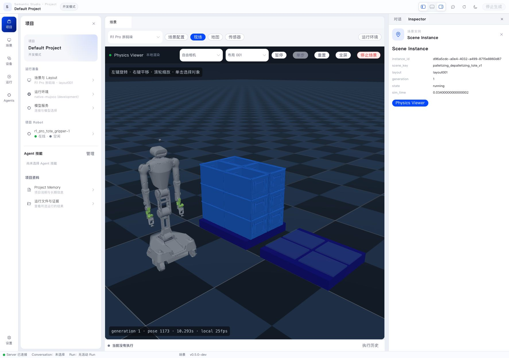
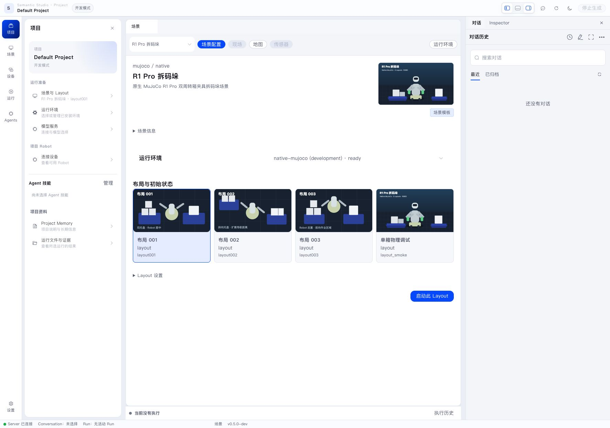
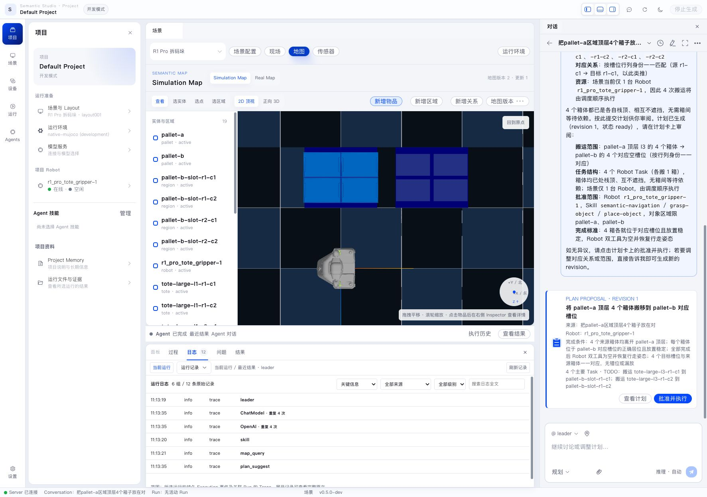
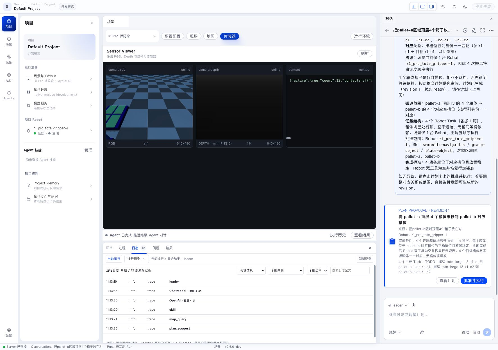

Semantic 将仿真 Scene 作为 Project 可连接的具身环境。Scene 提供空间、对象、传感数据和虚拟 Robot，虚拟 Robot 通过与真机一致的 Pilot、Ability 和 Robot Skill 链路执行任务。

仿真不是独立演示环境。它和真实 Robot 使用同一条上层链路：Project、Conversation、Workflow、Pilot、Ability、Robot SDK 和 Robot Skill 都保持一致，只是最后的物理设备由 MuJoCo Runtime 提供。

## Scene、Layout 与 Runtime

- **Scene** 描述可运行的环境类型和资源。
- **Layout** 描述一次场景中的对象、Robot 初始状态和空间布置。
- **Runtime Profile** 描述场景需要的 Runtime 能力。
- **Runtime Installation** 是当前 Server 可以连接或启动的实际 Runtime。

启动面板会根据 Profile 列出兼容的 Runtime Installation。只有一个候选时系统直接使用；有多个候选时用户选择并可保存 Project 偏好。

## 启动 Scene

在 Project 环境资源中：

1. 选择 Scene 和 Layout。
2. 确认 Runtime Installation。
3. 点击“启动此 Layout”。
4. 查看 Scene Instance、Runtime 和虚拟 Robot 启动状态。

Scene 首次状态同步完成后，Framework 会启动其虚拟 Robot 实例，包括 Pilot、所需 Ability 和 Robot Skill。Robot 满足运行条件后显示为空闲。

启动后重点看三处状态：

- Physics Viewer 是否持续刷新；
- Inspector 中的 Scene Instance 是否为 `running`；
- Project Robot 是否在线且空闲。

## Viewer 与 Semantic Map

Viewer 展示 Runtime 中的真实仿真状态。Semantic Map 表达环境中的对象、区域和空间关系，供 Agent 理解和查询。

从 Viewer 或 Map 选择实体时，Web 将实体身份提交给 Server。Agent 可以据此规划，Robot Skill 会通过 Ability 在执行时重新观察对象和 Robot 状态。

地图页用于回答“环境里有什么”：

- pallet、region、totes、Robot 等实体是否存在；
- 实体处于哪个 generation；
- 区域和对象的关系是否完整；
- Agent 查询到的名称是否与页面显示一致。

## 传感器

传感器页用于回答“Runtime 当前看到了什么”。RGB、Depth 和 Contact 等数据可以帮助判断仿真是否正常、对象是否接触、工具是否受力。

规划阶段通常不需要手动读取传感器；Agent 和 Robot Skill 会按需查询。排障时，传感器页是判断“地图事实”和“物理状态”是否一致的重要入口。

## Reset、切换和停止

- **Reset**：Robot 先进入 hold，随后场景恢复 Layout 初始状态并更新环境信息。
- **切换 Layout**：安全停止相关 Robot 执行，停止当前 Scene Instance，再启动新 Layout。
- **停止 Scene**：停止活动执行和受管 Robot 实例，然后结束 Scene Instance。

外部共享 Runtime 由其运维方管理；停止 Project Scene 只结束由 Project 创建的场景和受管实例。

## 查看启动问题

启动面板分别显示 Scene Runtime、Robot Runtime、Pilot、Ability 和 Robot Skill 状态。某台虚拟 Robot 启动失败时，Scene 仍可查看，该 Robot 显示为 degraded 并附带错误信息。

如果提示 Runtime 已被其他 Project 占用，先停止占用方的 Scene，或直接使用当前占用 Runtime 的 Project。Runtime 是实际资源，不是纯页面状态；多个 Project 不能同时独占同一个单实例 Runtime。
