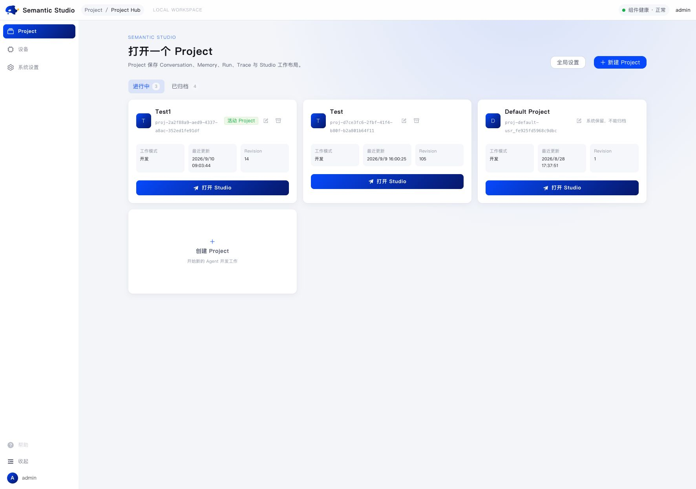
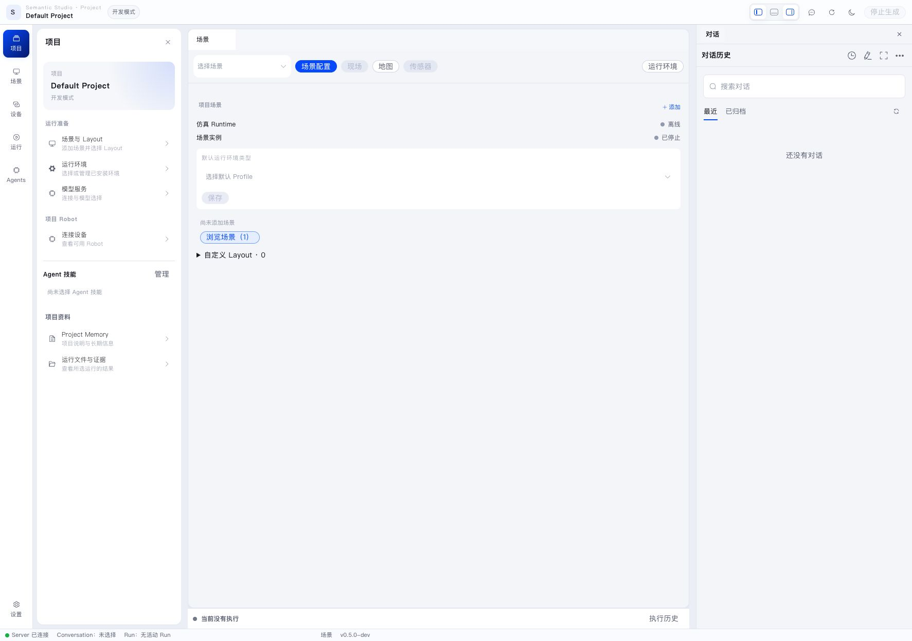
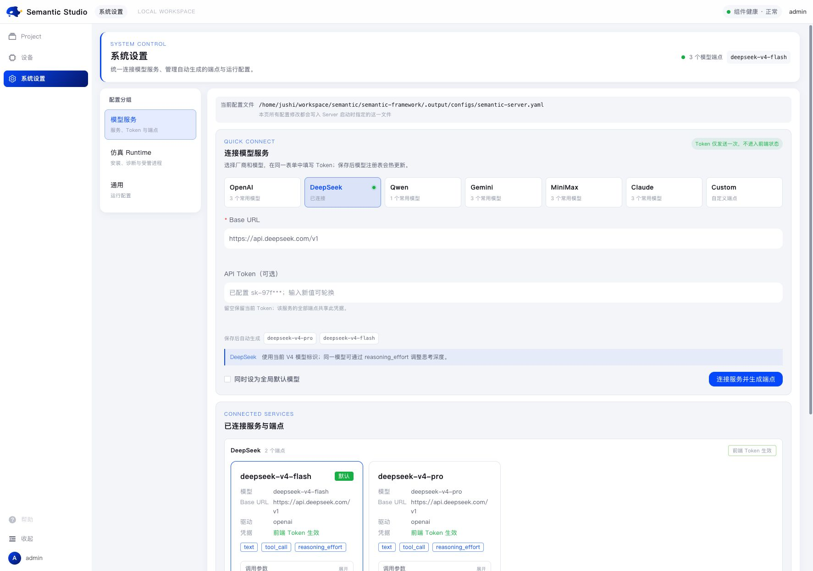
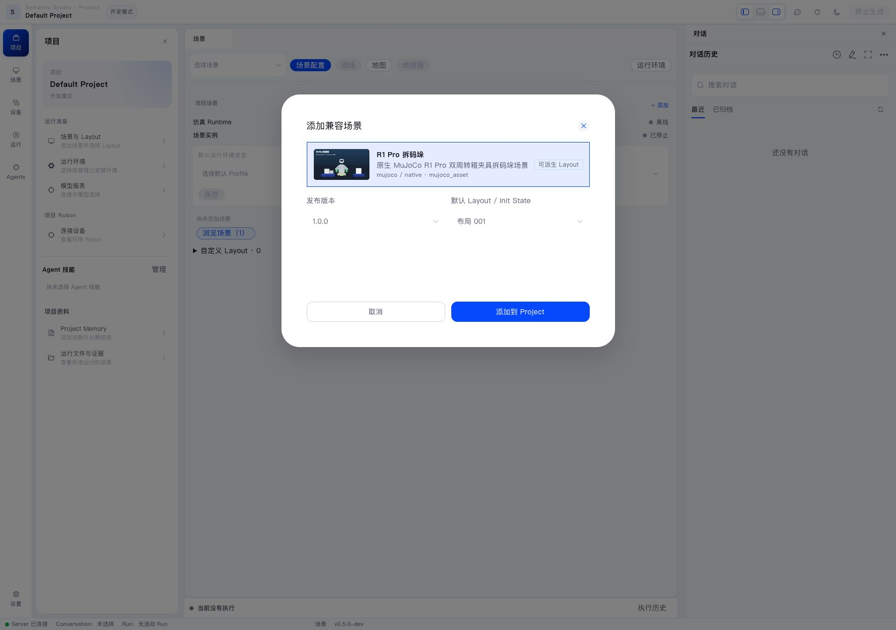
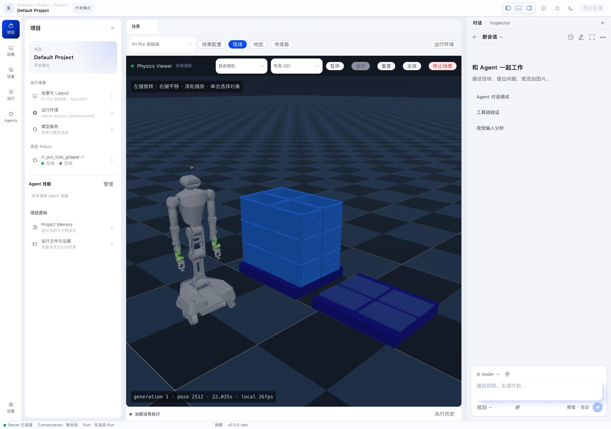
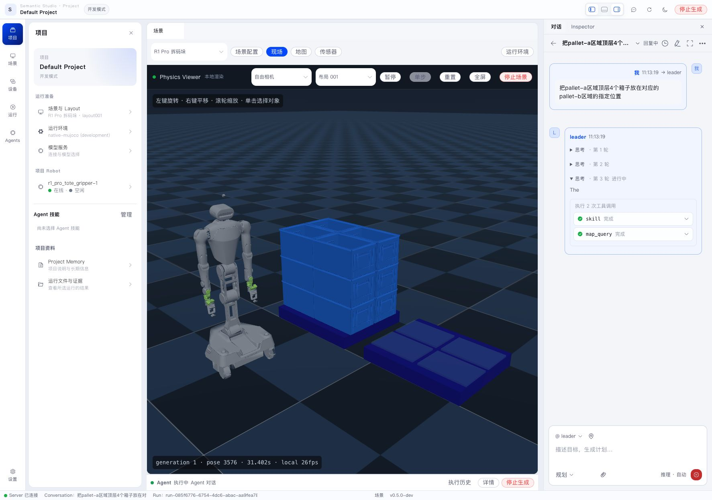
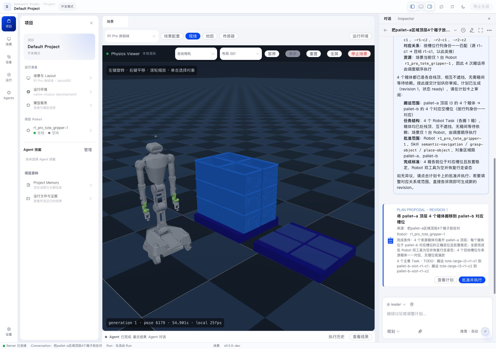
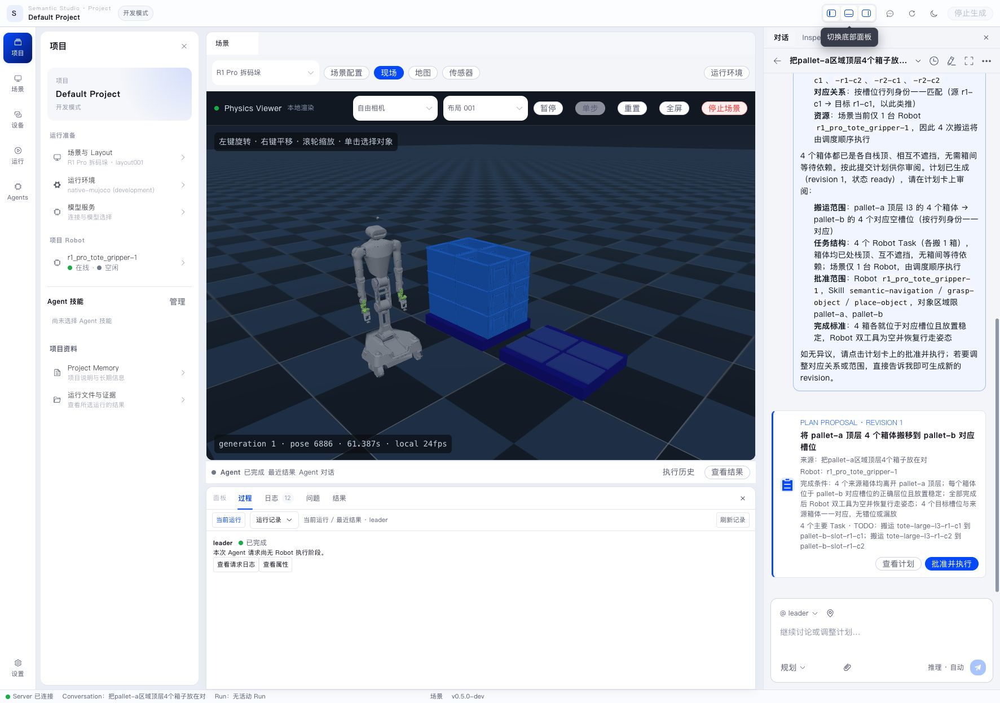
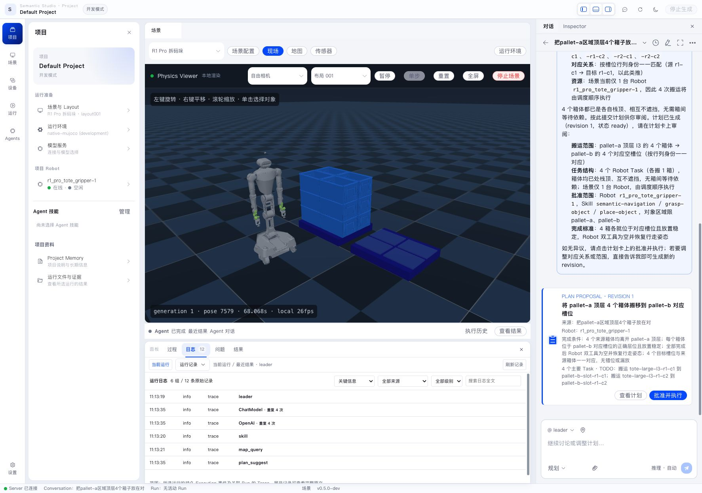

This guide gives first-time Semantic Studio users a recommended path. You do not need a physical robot or prior knowledge of Agent, Workflow, or Robot Skill internals. Completing the steps shows the full product chain from frontend page to Server, Agent, and simulated environment.

> Screenshots are from the current Semantic Studio UI. Wording may change slightly between versions, but the operation order stays the same.

## Before you start

- Semantic Server and Semantic Web are running and the browser can open Studio.
- You have an admin account and can log in.
- A MuJoCo Runtime Profile is installed and ready.
- A model service is available; DeepSeek is recommended.

For installation, see [Install and Start](install-and-start.en.md).

## Operation overview

1. Open the default Project or create a new one.
2. Select and configure a model service in system settings.
3. Browse scenes, choose the default R1 Pro depalletizing Scene, and add it to the Project.
4. Select layout 001 and start it.
5. Open the Conversation panel on the right and start a new conversation.
6. Choose Planning mode and send the depalletizing goal.
7. Watch the simulated Scene and the bottom process panel.
8. Explore devices, map, sensors, logs, and other conversations freely.

## 1. Open the default Project or create a new Project

After login you land in Project Hub. A Project is Semantic's working boundary: Conversation, Scene, Workflow, Robot Execution, and Artifacts belong to a Project.



Use the **Default Project**, or create a new Project and choose the MuJoCo default Runtime Profile for isolated experiments.

Inside a Project, the left side holds project resources, the center is the workspace, the right side is Conversation or Inspector, and the bottom can expand process and logs.



## 2. Configure a model service

Open **System settings → Model service**. Choose a model service, preferably DeepSeek. Connected services show “Connected”, and generated model endpoints appear below.



Saving hot-reloads the model registry. A Planning Conversation uses the current global default model by default, and you can adjust it per Project or conversation.

## 3. Add the R1 Pro depalletizing Scene

In the Project left side, open **Scene and Layout**, then click **Browse scenes**. Choose the default **R1 Pro depalletizing** Scene, keep the default Layout as `layout 001`, and click **Add to Project**.



Adding only records the Scene reference and default runtime; the simulation instance has not started yet.

## 4. Select layout 001 and start

Select **Layout 001** under Layouts and initial state, confirm the Runtime is a ready Native MuJoCo Runtime, and click **Start this Layout**.


After startup, the center shows Physics Viewer, Inspector shows Scene Instance `state=running`, layout, generation, and simulation time, and the Project Robot goes from offline to online.


If you see “Runtime is in use by another Project”, the Runtime is a single-instance resource. Stop that Project's Scene first, or continue in the Project that already owns the Runtime.

## 5. Open the Conversation panel and start a new conversation

Select **Conversation** in the right panel and click **New conversation**. Conversation is the main place to describe goals to Leader while Scene, Robot, and execution state remain visible.



## 6. Send a goal in Planning mode

Switch the mode to **Planning**. Planning mode makes Leader query the environment and resources first, then create a Plan Proposal; the plan only enters Workflow after user approval.

Send:

```text
Move the four top-layer boxes in the pallet-a area to the corresponding specified positions in the pallet-b area.
```



Wait for Leader to finish querying and planning. A Plan Proposal card appears with scope, Robot, Skill range, major Tasks, and completion criteria.



Do not click “Approve and execute” yet. First check that source, target, Robot, and completion criteria match your intent.

## 7. Observe the simulation and bottom process panel

While the simulation runs, Physics Viewer keeps refreshing pose and local render rate. You can pause, reset, or stop the Scene, and switch the free camera to observe pallet-a, pallet-b, and the Robot.

Open the bottom panel from the layout controls. The Process tab shows the current or latest result, execution state, run records, and properties.



Switch to the Logs tab to filter model calls, tool calls, Execution events, and Trace records by source, level, or full-text search.



When diagnosing, follow this order:

1. Process tab: confirm whether the run finished, failed, or waits for input.
2. Logs tab: expand model, tool, or Execution records.
3. Conversation Trace: read Agent reasoning and tool calls.
4. Inspector: check the selected Scene, Robot, Task, or Artifact.

## 8. Explore other features

After the flow above, continue exploring:

- **Device center**: Pilots, Robots, Ability health, and current execution.
- **Map**: objects, regions, and relations in Semantic Map.
- **Sensors**: RGB, Depth, and Contact data.
- **Run history**: Agent Runs, Workflows, Robot Executions, and Artifacts.
- **Collaboration mode**: discuss with Agents without generating a new plan.


## Recommended habits

- Validate goal phrasing, Plan, and Robot state in simulation before using physical hardware.
- Use Planning mode for tasks that produce physical actions and Collaboration mode for ordinary questions.
- Check Robot, Skill scope, object regions, and completion criteria before approving a Plan.
- Watch Physics Viewer, bottom process, and logs together during execution, not just the final message.
- When Runtime, model, or device misbehaves, open the bottom Issues and Logs tabs first, then check system settings.

Next, read [Project and Semantic Studio](../workspace/project-and-studio.en.md) to understand each page and panel in detail.
