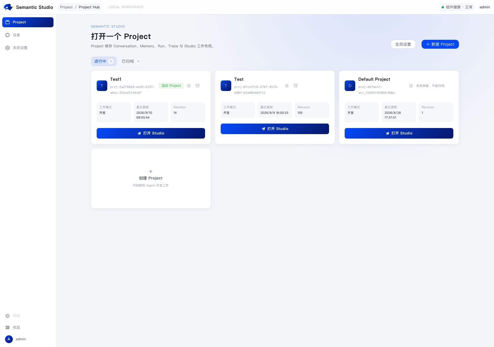
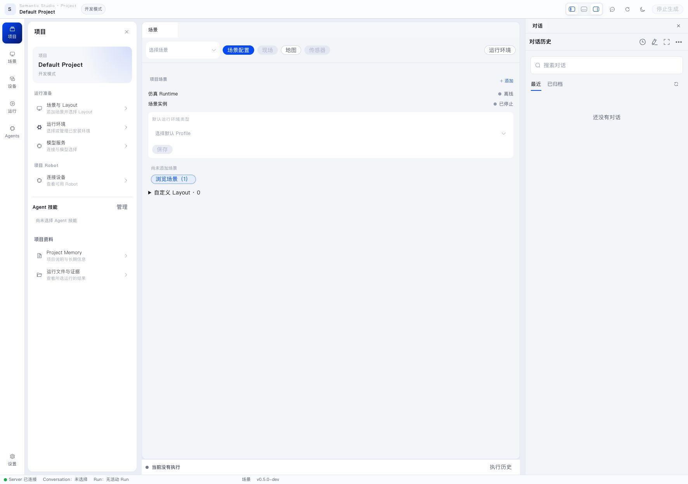
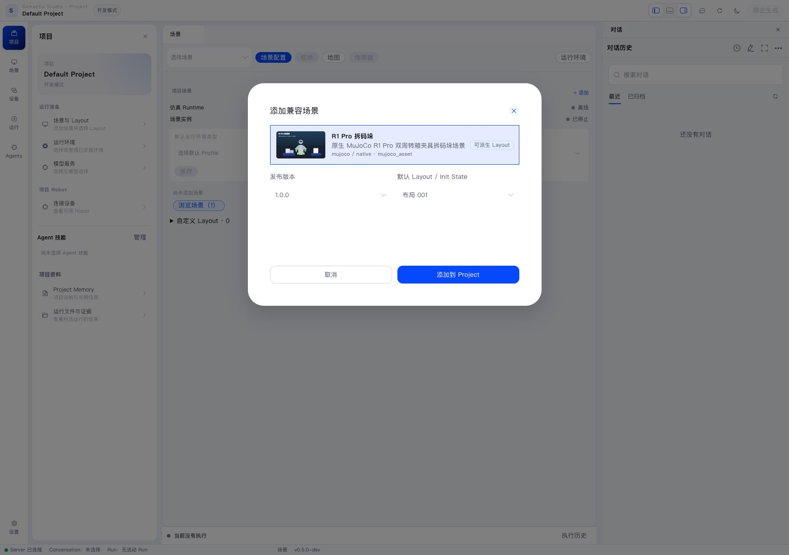
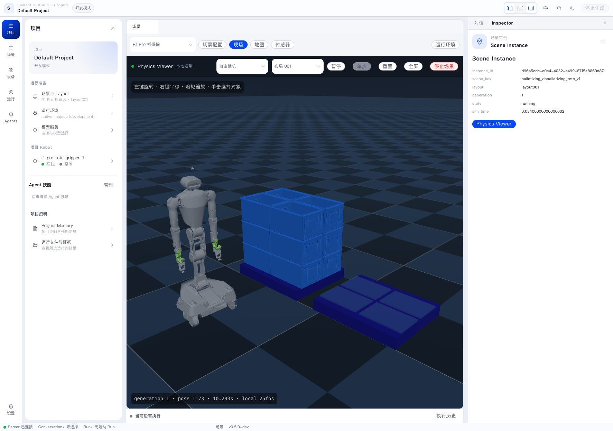
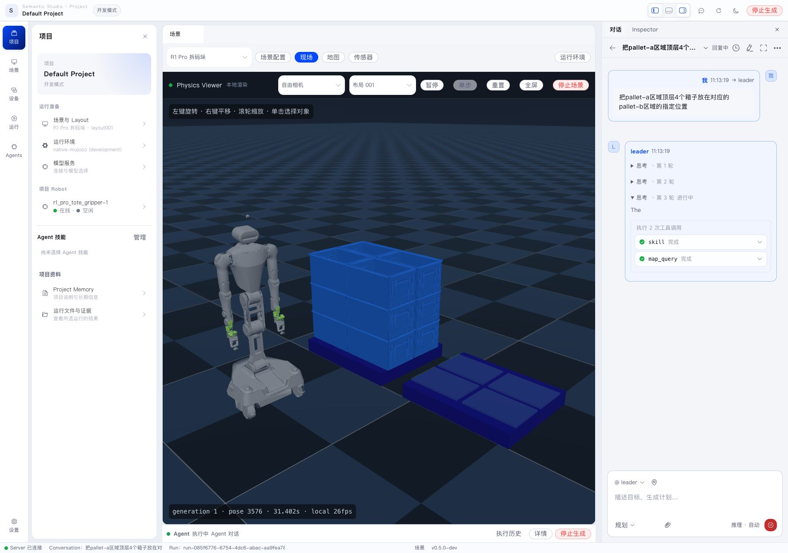
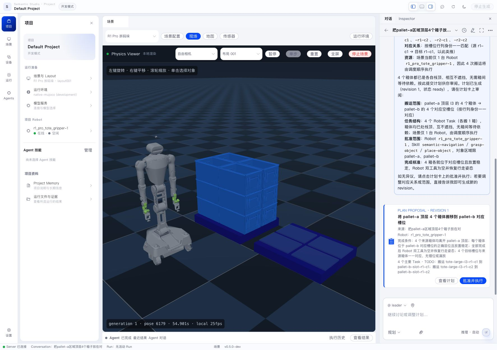
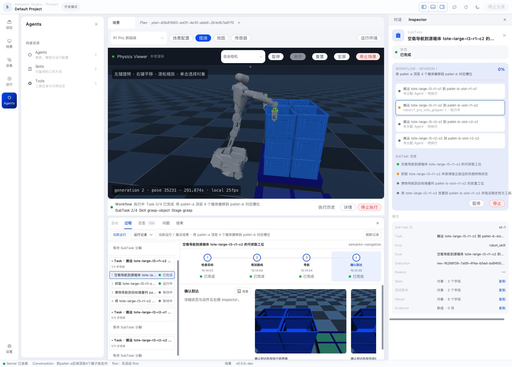
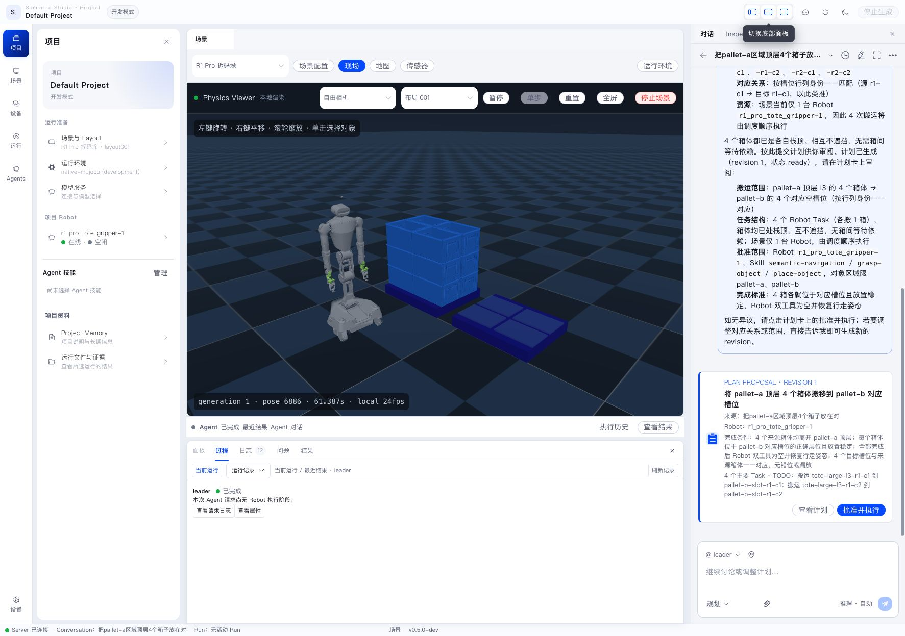

This chapter walks through a complete product chain with the default R1 Pro depalletizing Scene. When you finish, you will see how Conversation, Plan, Workflow, Robot Task, and Robot Execution connect.

> **No physical robot required.** All steps run in MuJoCo simulation and do not need a real robot or a real model key. The simulated Robot uses the same execution chain as a physical Robot. Run this flow in simulation first, then connect a real robot; see [Connect a Real Robot](../environments/real-robot.en.md). For click-by-click screenshots, see [Best Practice: From Project to Plan](best-practice.en.md).

If you have not installed or logged in yet, start with [Install and Start](install-and-start.en.md).

## 1. Create or open a Project

After login you land in Project Hub. Use the **Default Project**, or create a new Project and choose a ready MuJoCo Runtime Profile for isolated experiments.



Inside a Project, Semantic Studio restores that Project's conversations, layout, and run state. The left side holds project resources, the center is the workspace, the right side is Conversation or Inspector, and the bottom can expand process and logs.



## 2. Start the simulation

Select and connect a model service in system settings first (DeepSeek is recommended). Then, in the Project Scene resources:

- browse and add the default **R1 Pro depalletizing** Scene;
- select **Layout 001**;
- confirm the Runtime is a ready Native MuJoCo Runtime.



Click **Start this Layout**. Wait until the Scene, Robot Runtime, and Robot are available. The Project Robot in the device panel should be online and idle.



If you see that the Runtime is in use by another Project, stop that Project's Scene first, or continue in the Project that already owns the Runtime.

## 3. Describe the task

Open Conversation on the right, start a new conversation, switch the mode to **Planning**, and send:

```text
Move the four top-layer boxes in the pallet-a area to the corresponding specified positions in the pallet-b area.
```



Leader uses the Project, environment, and available Robots to understand the goal. When the information is clear, it creates a Plan Proposal directly. When a choice would change the result, it asks through an Interaction.

## 4. Review the plan

The plan card shows the goal, major Tasks, dependencies, Robot Skill scope, and completion criteria. Open **View plan** to read the full content. Before approval, check that source, target, Robot, and completion criteria match your intent.



Then click **Approve and execute**. Approval creates a Workflow from the exact revision on the card. Execution continues automatically; you do not need to send “continue”.

## 5. Observe execution

The Workflow panel should show a Robot Task. A typical depalletizing Task splits into navigation, grasp, loaded travel, and place SubTasks; use the current Plan as the source of truth.



Open Robot Execution to inspect Stage, Action, Feedback, Observation, and Artifact. Physics Viewer shows the Robot and boxes moving. The bottom Process tab shows run state; the Logs tab shows model, tool, and Execution events.



For approval, pause, and resume, see [Plans and Workflow](../workflow/planning-and-execution.en.md). For Stage evidence, see [Robot Execution and Observation](../robot/execute-and-observe.en.md).

## 6. Review the result

When the Workflow finishes, Leader summarizes in the original Conversation:

- final box pose and stability;
- Robot tool and walking posture;
- Task and Robot Execution results;
- images, depth data, or other Artifacts you can open.

If execution pauses, the Task card and Conversation show the reason, the current owner, and the available actions.

Next, read [Project and Semantic Studio](../workspace/project-and-studio.en.md) to learn each page and panel.
