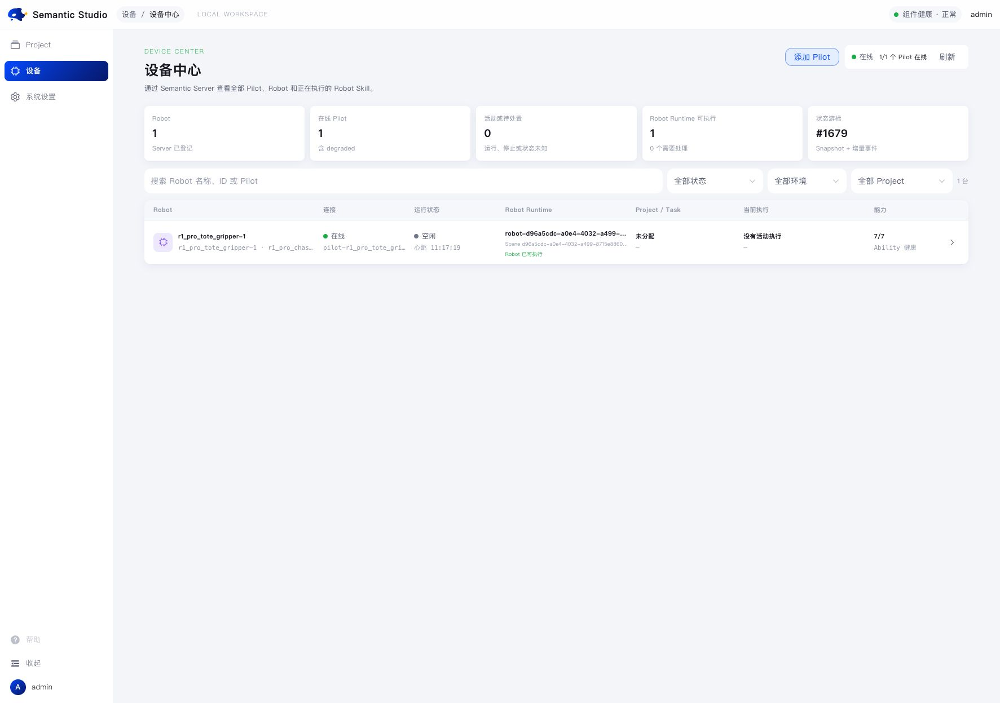
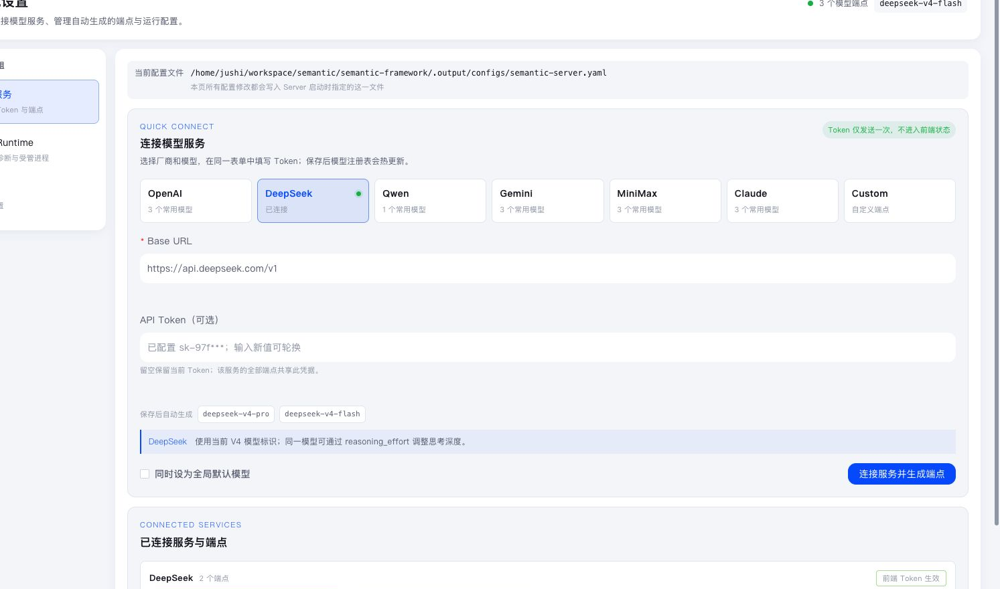
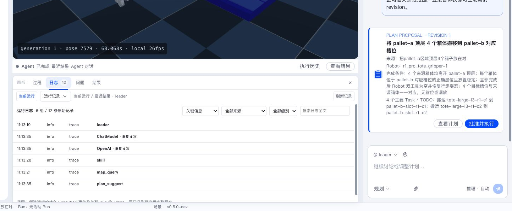

Runtime operations cover Server, Runtime, Pilot, Robot, and execution state. The global device center and Project Runs panel are the daily entry points.



Start daily checks in the device center: whether Pilots are online, Robots are idle, Abilities are healthy, and any Execution is active. It quickly separates “service unavailable”, “device offline”, and “task still occupying”.

## Daily checks

Check in order:

1. Semantic Server HTTP and WebSocket are reachable.
2. Database migration completed and model configuration is usable.
3. Runtime Installation is online.
4. Pilot heartbeat is normal.
5. AbilityFramework and required Abilities are ready.
6. Robot Skill expected and actual state match.
7. Robot is idle, not in hold or error state.

Framework development environments can use:

```bash
make doctor
make logs
```

Prebuilt instances use:

```bash
semanticctl status
semanticctl doctor
semanticctl logs
```



Use system settings to confirm model service and Runtime. For model errors, check whether the model service is connected. For Scene startup errors, check whether the Runtime Installation is ready.

## Key files and directories

The table below lists default locations for a development install created by `make init`. When Server loads another install root through `-c` or `SEMANTIC_CONFIG`, relative paths move with that root.

| Content | Default location | Notes |
|---|---|---|
| Server runtime config | `semantic-framework/.output/configs/semantic-server.yaml` | Generated by `semantic init`; frontend settings and hot reload only modify this copy |
| Binaries | `.output/bin/` (`semantic-server`, `semantic-pilot`, `semantic`) | `make build` output |
| SQLite metadata | `<install-root>/data/semantic.db`, `.output/` for dev installs | `store.sqlite_path` points to `data/semantic.db` |
| Artifact, Skill, workspace data | `.output/data/artifacts/`, `.output/data/robot-skills/`, `.output/data/workspaces/` | Under `data/` with SQLite |
| Server run log | `<install-root>/logs/semantic-server.jsonl` | Structured JSONL; 100 MB rotation, 5 files, 14 days |
| Pilot data directory | `.output/semantic-pilot` | `semantic-pilot --data-dir` default |
| Data backup directory | `<install-root>/backups/` | `semantic init --reset-data` moves the whole `data/` directory here |
| Installer service logs | `$SEMANTIC/.tui-logs/server.log`, `web.log` | quick-start stages 6/8 background services |

Only `llm.*`, `log.level`, `agents.profiles_dir`, `skills.dir`, and `mcp_servers` hot-reload. Other settings such as `server.*` and `store.*` log a warning and require a Server restart.

## State refresh and reconnection

Web first reads a snapshot over REST, then receives incremental events over WebSocket. After reconnection, Web re-fetches current Project, Workflow, Robot, and Execution state.

Pilot reconnects with a dedicated credential. Server restores device occupancy and execution views from live Robot state, active Tasks, and Executions.



Use the bottom logs for a specific Agent Run, Workflow, or Robot Execution; use the Server log file for service-level issues. Identify the layer before choosing a log.

## Update Robot artifacts

After SDK, Ability, Robot Skill, or type-package updates, generate new artifacts with the official build entry, then restart the managed Robot instance. The MuJoCo product development environment provides:

```bash
make refresh-v050-mujoco-bundle
```

After restart, Pilot reports actual Ability and Robot Skill state and Server converges toward the desired state.

## Backup and upgrade

### Back up metadata

Stop Server before backing up SQLite, then copy the whole `data/` directory including `semantic.db` and its `-wal`/`-shm` side files. The database is in WAL mode while Server runs, so copying it live can produce an inconsistent copy. Back up the Pilot data directory the same way after stopping. To rebuild development data, use `semantic init --reset-data`; old data moves into `backups/` instead of being deleted.

### Upgrade versions and artifacts

For daily artifact updates see Update Robot artifacts. To upgrade Semantic itself:

1. Read the release notes for breaking changes, config migration, and compatibility.
2. Back up metadata as described above.
3. Follow the release upgrade order, then confirm service health with the daily checks.

## First login FAQ

### Where does the first account come from

Server creates a seed user `admin` on first start. The initial password comes from `SEMANTIC_ADMIN_PASSWORD`; without it, Server uses `admin123` and logs a warning. Creation is idempotent. After creation, changing the password requires rebuilding the data directory with `semantic init --reset-data`.

### Token expired after login

Access tokens are opaque tokens stored in Server SQLite with a 24-hour validity. After expiry the API returns `AUTH_TOKEN_EXPIRED`; log in again, or call `POST /api/v1/auth/refresh` before expiry to exchange for a new token.

### What happens with no model key

With no model key, Server provides only the built-in mock model. The service still starts and does not make real model requests; Conversation works but Agent replies come from mock. Add a real model endpoint and key in Studio system settings, or provide `SEMANTIC_LLM_API_KEY_<name>` through `.env`. The `llm.*` section hot-reloads.

## Save diagnostic information

When diagnosing, record:

- Project, Workflow, Task, and Execution IDs;
- Scene Instance and Robot ID;
- Server, Pilot, Ability, and Runtime log time ranges;
- Execution Stage, Action, Feedback, and Observation;
- related Artifacts;
- user actions and observed physical behavior.

Redact model tokens, Pilot credentials, and other secrets from logs.
