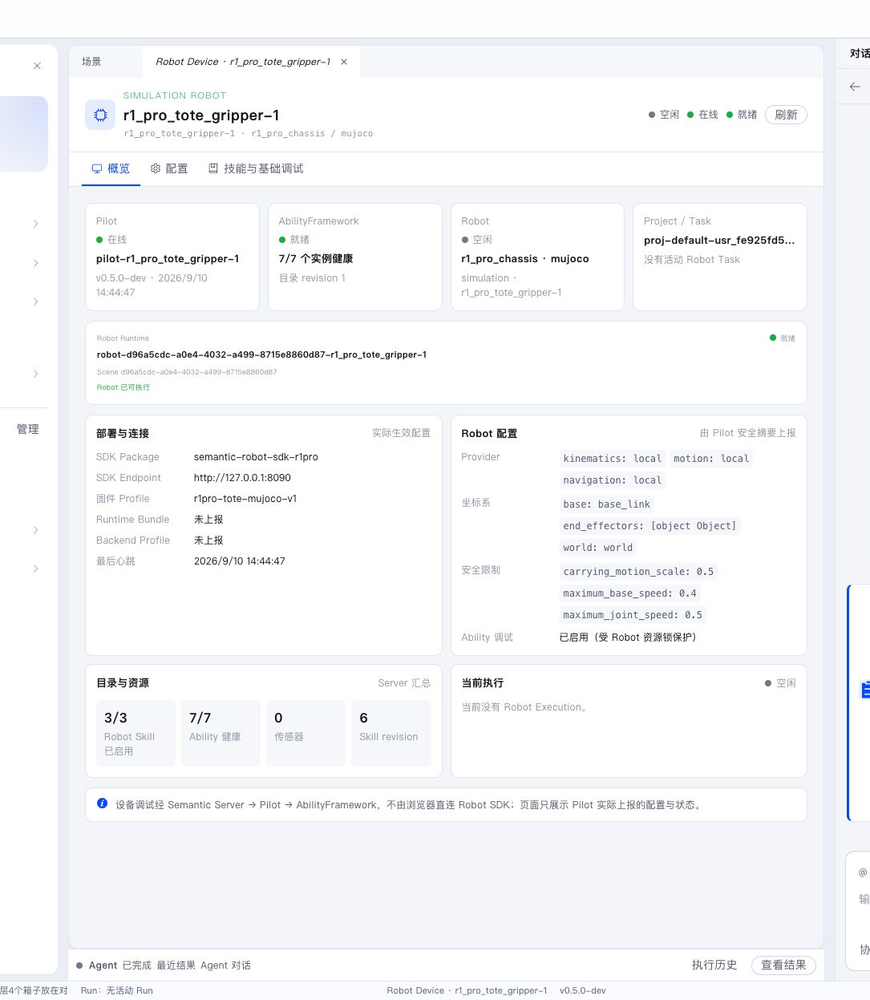
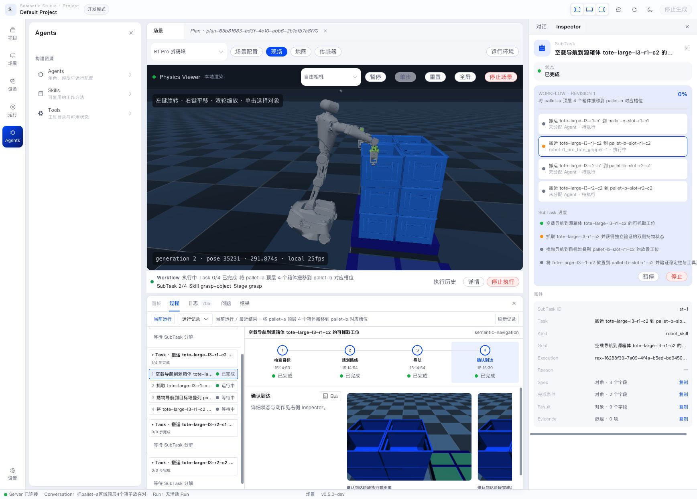
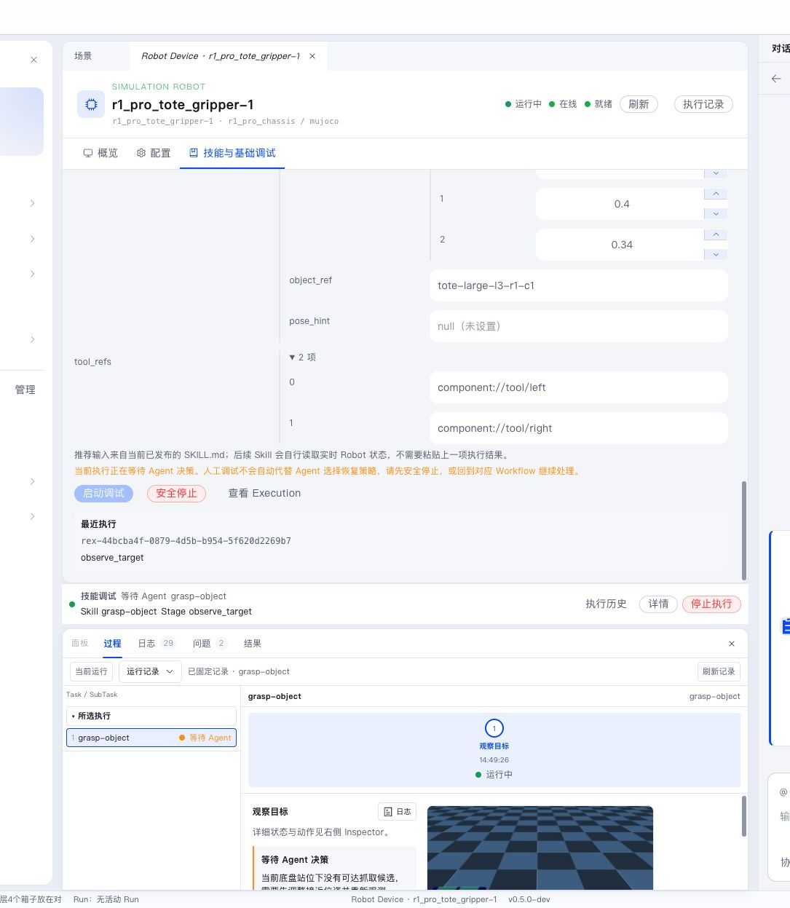

一次 Robot Skill 运行会形成 Robot Execution。它把业务步骤、Robot 动作、运行反馈、主动观察和最终结果组织为可浏览的执行记录。



观察 Robot Execution 前，先确认 Robot 在线、空闲或处于预期执行状态，并检查 Ability 是否健康。设备中心回答“能不能执行”，Execution 页面回答“正在怎样执行”。

## 执行层次

```text
Robot Execution
└── Stage
    └── Action
        └── Ability invocation
```

- **Stage**：Robot Skill 中具有明确目标和判断条件的阶段。
- **Action**：Stage 请求执行的机器人能力。
- **Ability invocation**：AbilityFramework 启动或选择 Ability 实例并执行 Action。
- **Feedback**：低层执行主动上报的进度和状态变化。
- **Observation**：为判断当前状态而发起的主动观察。
- **Artifact**：运行产生的图片、深度数据、文件和其他大体量内容。

下图是一次真实的 Robot Execution：Physics Viewer 中 Robot 正在抓取箱体，底部 Stage 时间轴显示"检查目标、规划路线、导航、确认到达"已完成，当前进入抓取阶段，右侧 Inspector 显示该 SubTask 的 Kind、Goal、Execution、Result 等属性。这是 Stage、Action、Feedback 和 Observation 最直观的呈现。



## Execution 时间线

设备执行页按时间展示 Stage。选择一个 Stage 后，Inspector 显示：

- Stage 目标、状态和持续时间；
- Action 与 Ability invocation；
- Feedback 和 Observation；
- 错误、恢复信息和 Artifact；
- 运行结果与停止状态。

Project 底部调试区使用横向时间线连接 Workflow、Task、SubTask 和 Stage，便于从业务任务定位到具体 Robot 动作。



推荐阅读顺序：

1. 先看 Execution 是否仍在运行；
2. 找最后一个推进成功的 Stage；
3. 查看当前 Stage 的 Action 和 Feedback；
4. 对照 Viewer 或传感器判断物理状态；
5. 需要深入时展开日志和 Trace。

## 从 Execution 观察 Skill 结果

人工调试入口和参数填写方式在 [Skill 的使用与调试](../skills/use-and-debug.md) 中介绍。本章关注调试启动之后，如何通过 Robot Execution 判断结果。

观察一次 Skill 执行时，重点核对：

- 当前 Stage 是否符合任务意图；
- Action 是否按预期发送到 Ability；
- Feedback 是否持续更新，还是停在某个低层执行；
- Observation 是否支持 Stage 的推进判断；
- Artifact 是否与 Viewer 中看到的物理状态一致；
- 失败发生在 Skill、Ability、Robot SDK 还是设备连接层。

人工调试和正式任务都会产生同一种 Robot Execution。区别只是来源不同：人工调试由用户在设备页直接启动，正式任务由 Workflow 中的 Robot SubTask 启动。


日志页用于查看 Skill、模型、工具、Execution 和 Trace 记录。它能帮助区分"Skill 没有启动""Action 已发出但 Ability 未返回""模型规划不符合预期"和"物理执行被安全停止"。上图展示了 grasp 阶段的关键动作：`gripper.close` 后 `robot.verify_tool_load` 确认载荷，`perception.verify_grasp` 验证抓取，最终形成"无滑移的双侧稳定承载"。

当 Execution 无法推进时，会进入等待 Agent 决策状态并给出具体原因。下图是另一个真实例子：当前底盘站位下没有可达抓取候选，需要调整接近位姿并重新观测。


## 安全停止

活动执行提供“安全停止”。Server 将停止请求发送给 Pilot，Pilot 停止当前 Action 并让 Robot 进入 hold。界面在收到实际停止状态后显示终态。

停止请求已经进入 `stopping` 后，较早产生但迟到的运行事件不会把它恢复为活动态。Pilot 离线时，Execution 显示状态未知，Robot 保持占用且原动作不会在 Server 重启后自动重放。

优先恢复 Pilot 连接并重试正常安全停止。无法恢复时，从所属 Workflow 的运行面板使用“确认现场安全并终结”：弹窗会列出 Robot 和 Execution，现场人员必须确认底盘、机械臂和工具均已停止并处于安全保持状态，同时填写原因。确认记录和停止前错误会保留在 Execution 历史中。

不要通过删除数据库记录释放 Robot，也不要把进程退出或设备离线视为安全 hold 证据。
