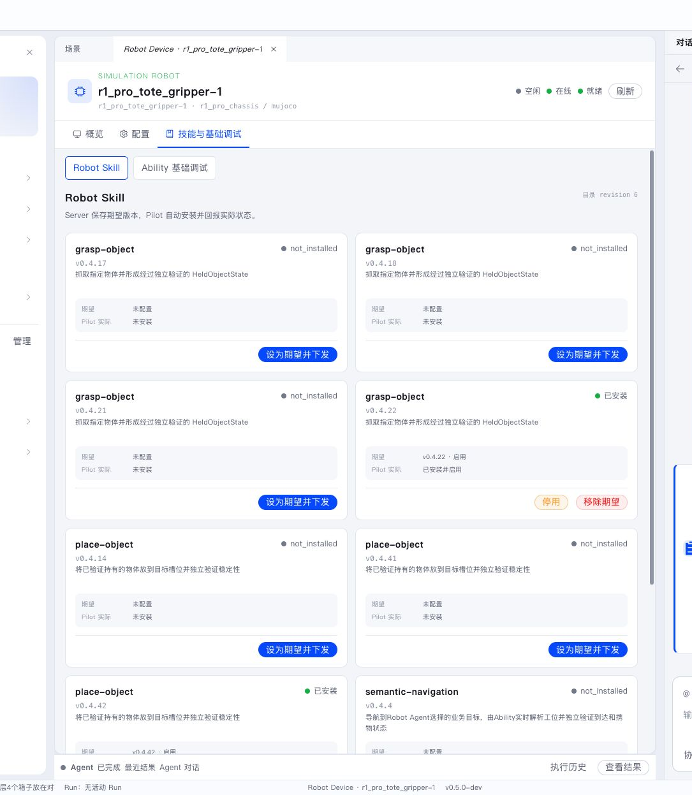
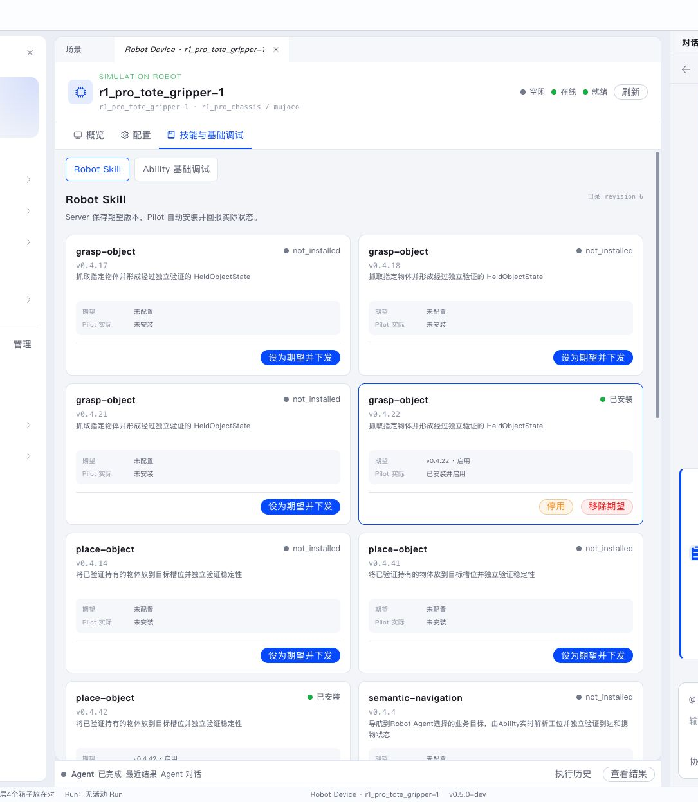

Semantic 中的 Skill 分为 Agent Skill 和 Robot Skill。它们分别帮助 Agent 理解工作方式，以及帮助 Robot 执行可复用的具身任务。

Studio 的 Agents 区域集中管理 Agent、Skill 和 Tool 等构建资源。普通用户可以先使用默认配置；需要排查“Agent 为什么这样规划”或“Robot 为什么能执行某个 Skill”时，再进入这些页面。

## Agent Skill

Agent Skill 向 Agent 提供领域说明、步骤建议、工具用法和相关资料。Project 可以选择所需 Agent Skill，并按 Agent 角色决定可见范围。

在 Skill 库中可以：

- 阅读 `SKILL.md`；
- 查看关联资料和资源；
- 查看适用 Agent；
- 将 Skill 关联到 Project；
- 在 Conversation 中观察 Agent 如何应用它。

规划过程中，Conversation 会显示 Agent 加载 Skill、查询地图和提交计划等工具调用。Agent Skill 影响的是“Agent 如何理解和组织任务”，不会直接控制 Robot。

## Robot Skill

Robot Skill 描述由 Stage 组成的机器人任务，例如抓取、导航和放置。详情页展示：

- 名称和版本；
- `SKILL.md`；
- 输入和结果模型；
- 所需 Action 与停止 Action；
- 兼容 Robot 型号；
- 各 Robot 的期望版本和实际安装状态；
- 脚本、资料和资源。

RobotDeployment 声明期望启用的 Robot Skill。Server 与 Pilot 自动完成安装、升级和启用状态同步。

Robot Skill 影响的是“Robot 如何把任务拆成 Stage 并通过 Ability 执行”。它不查询 Semantic Map 来决定物理事实，执行时必须通过 Ability 重新观测当前状态。

## 人工调试 Robot Skill

设备的 Robot Skill 页面提供人工调试入口。调试前先确认 Robot 在线、空闲，且当前 Project 没有占用同一 Robot 的活动任务。

1. 打开设备或 Project 中的 Robot Skill 页面。
2. 选择在线且空闲的 Robot。
3. 选择已安装、已启用的 Robot Skill 版本。
4. 使用由 Skill 输入模型生成的表单或 JSON 编辑器填写最小业务参数。
5. 启动调试，并打开生成的 Robot Execution。
6. 通过 Viewer、Execution 时间线、Stage、Action 和日志观察结果。

人工调试复用正常 Robot Execution、Pilot、Ability 和 Robot SDK。仿真与真机使用相同入口，Robot 的安全限制和占用规则同时生效。调试结束后，应确认 Robot 回到空闲状态，再批准正式 Workflow。

启动调试后，会生成一次真实的 Robot Execution。下图是一次 grasp-object 调试的执行画面：Stage 时间轴显示各阶段推进，右侧 Inspector 显示 SubTask 详情，底部可以看到当前阶段的证据图像。

## 调试时如何判断问题层

启动调试后，按执行链路定位问题：

1. **连接与资源**：Robot、Pilot、AbilityFramework 和所需 Ability 是否在线。
2. **输入与版本**：Skill 版本、输入模型和业务参数是否正确。
3. **Stage 推进**：当前 Stage 是否符合预期，是否等待 Action、Feedback 或 Observation。
4. **Ability 执行**：Action 是否已路由到正确的 Ability instance，返回是否符合预期。
5. **物理状态**：Viewer、传感器和实际接触是否与 Execution 判断一致。
6. **安全退出**：异常物理动作应立即使用安全停止，并确认 Robot 回到 hold 或空闲状态。

Robot Skill 输入传递业务目标和约束。精确运动、接触判断与实时状态由 Skill、Ability 和 Robot SDK 在执行过程中共同处理。日志页可以看到 grasp 阶段 `gripper.close`、`robot.verify_tool_load`、`perception.verify_grasp` 等动作及其输出，帮助判断问题出在哪一层。

## 两层 Skill 不要混淆

| 对比项 | Agent Skill | Robot Skill |
|---|---|---|
| 使用对象 | Leader、Robot Agent 等模型角色 | Pilot 中的 Robot Skill Worker |
| 主要作用 | 提供规划方法、工具说明和领域知识 | 执行可恢复的 Stage 和 Action |
| 是否控制 Robot | 否 | 间接，通过 Pilot 路由到 Ability |
| 是否查询地图 | 可以指导 Agent 查询 | 不把地图当作物理事实，执行时重新观测 |
| 调试入口 | Conversation、Trace、Project 资源 | Robot Execution、Stage、日志、Viewer |

如果计划内容不符合预期，先查 Agent Skill 和 Conversation；如果实际动作不符合预期，先查 Robot Skill Execution 和 Ability。
