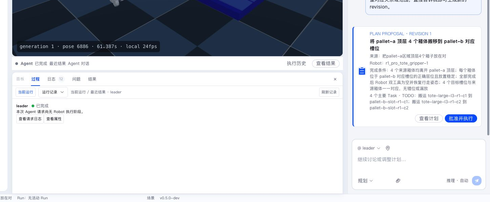

本章按系统链路定位常见问题。先确认故障发生在哪一层，再查看该层及相邻层的状态。

> **排错边界**：本章面向运行与使用问题（已部署系统的服务、操作和设备运行）。开发与集成中的问题（环境、构建、扩展开发、联调）见[开发者 FAQ](../../developer/faq/_index.md)。
>
> 升级组件版本前，先阅读[发布记录与迁移指引](../../releases/_index.md)中的破坏性变化和兼容矩阵。

## 先看状态，再看日志

推荐先打开底部“过程”页确认当前运行状态，再打开“日志”页展开详细记录。不要一开始就在完整日志中搜索关键字；先确定是模型、工具、Workflow、Robot、Runtime 还是页面连接问题。

## 按层定位

| 现象 | 优先检查 |
|---|---|
| 页面无法打开或断开 | Web 地址、Server HTTP/WebSocket、代理和端口转发 |
| Conversation 无回复或报模型错误 | 系统设置中的模型服务、Token、默认模型和模型日志 |
| Scene 无法启动 | Runtime Installation、Layout、Runtime 占用和场景日志 |
| Robot 离线 | Pilot 心跳、AbilityFramework、Ability、Robot Skill 期望 / 实际状态 |
| Plan 不符合预期 | Conversation、Agent Skill、地图查询和 Plan Proposal revision |
| Workflow 不推进 | Task 依赖、Agent/Robot 可用性、待处理 Interaction |
| Robot 动作异常 | Robot Execution Stage、Action、Feedback、Viewer 和传感器 |

## Web 无法连接 Server

检查：

- Server 是否监听 HTTP `8080` 和 WebSocket `8081`；
- `VITE_SERVER_HTTP` 与 `VITE_SERVER_WS` 是否指向正确地址；
- 浏览器控制台和 Server 日志中的连接错误；
- 代理、容器或防火墙是否允许 WebSocket。

## Scene 启动后 Robot 长时间离线

在 Scene 启动面板中分别查看：

1. Runtime 是否成功创建 Scene Instance。
2. 初始 Scene 状态是否已经同步。
3. Robot Runtime 是否启动。
4. Pilot 是否连接 Server。
5. AbilityFramework 和所需 Ability 是否 ready。
6. Robot Skill 是否完成安装和启用。

某一项失败时，优先处理它的第一条明确错误。重新启动 Scene 前先停止旧实例，避免多个 Pilot 使用同一 Robot ID。

## Workflow 一直等待分配

检查 Task 所需角色、能力和资源限制，并确认：

- 存在兼容 Agent；
- Robot 在线且空闲；
- 所需 Robot Skill 已安装启用；
- Ability 和工具满足任务；
- 依赖 Task 已完成；
- Project 中没有占用同一 Robot 的活动 Task。

Task 卡会展示具体等待原因。

## Robot Skill 一直 running 或 paused

打开 Robot Execution，找到最后一个 Stage 和 Action：

- `running`：查看 Feedback 是否持续更新，确认 Robot 和 Ability 状态。
- `waiting_agent`：查看 Conversation 中 Robot Agent 的问题或决策活动。
- `paused`：查看等待卡中的原因和操作入口。
- `execution_state_unknown`：恢复 Pilot 连接并确认 Robot 实际状态。

需要结束时使用 Execution 或 Workflow 的安全停止入口。

## 点击停止后没有立即结束

活动物理执行需要等待 Pilot 停止 Action 并确认 Robot hold。按以下顺序处理：

1. 打开 **Run & Debug → Workflows**，按目标、状态和更新时间找到原 Workflow；关闭过面板或重启过 Server 也可以从这里重新打开。
2. 状态为“停止中”时点击“重试停止”，查看 Pilot、AbilityFramework 和 Robot Runtime 是否恢复。
3. 状态为“执行状态未知”时，先尝试恢复 Pilot 连接，再次执行正常停止。
4. 如果连接无法恢复，由现场人员检查 Robot、末端工具和周边环境。确认已经停止且处于安全保持状态后，点击“确认现场安全并终结”，核对受影响的 Robot/Execution 并填写原因。

人工确认会统一终结关联的 Workflow、Task、SubTask 和 Execution，并保留原错误与确认审计。终态 Workflow 可在同一列表中继续查看。

不要删除 Workflow、Task、SubTask 或 Robot Execution 数据库记录来解除占用。设备离线、Runtime 进程退出或 Web 窗口关闭本身都不是 Robot 已安全停止的证据；现场状态未确认时应保留占用并继续排障。

## Vite 报 inotify watcher 耗尽

这是 Linux 文件监听资源被多个开发进程占用。关闭多余的 Vite、编辑器或测试 watcher。需要长期运行多个前端工程时，提高主机的 `fs.inotify.max_user_watches` 与 `fs.inotify.max_user_instances`，然后重新执行 `npm run dev`。

## 提交问题时提供什么

提供最小复现步骤、相关 ID、组件版本、日志时间范围和实际观察结果。Robot 运动问题同时附上 Viewer 录屏或图片，以及 Execution 中对应 Stage 的 Observation。
