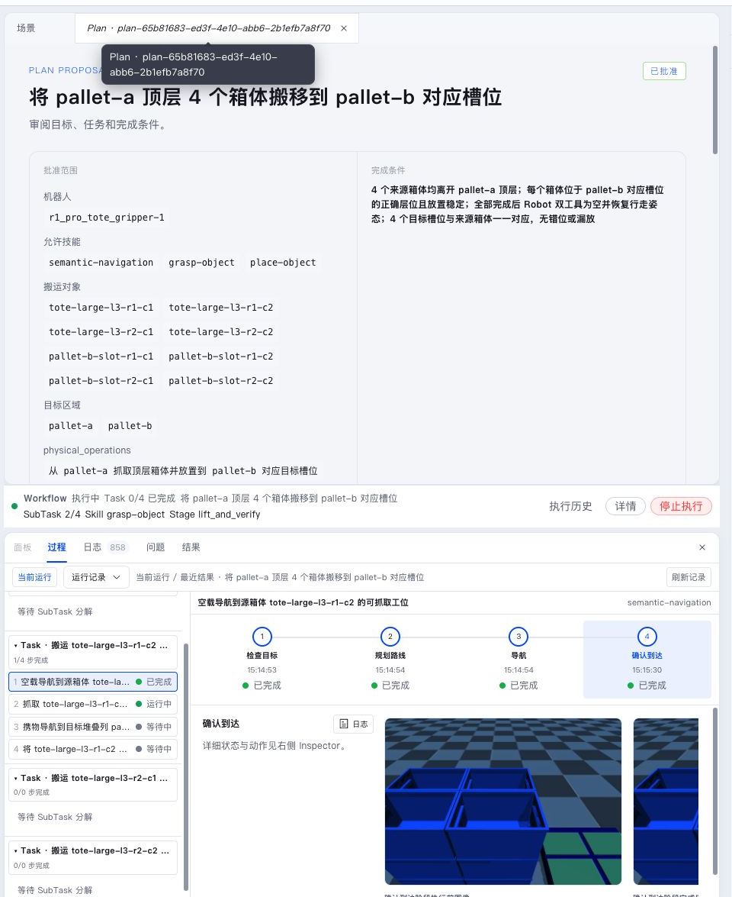

A Plan Proposal turns a natural-language goal into reviewable Tasks and dependencies. After user approval, Semantic creates a Workflow and starts assigning Agents and Robots.

The plan card is the boundary between discussion and execution. Before approval it is a changeable proposal; after approval it creates a Workflow from an exact revision.

## Generate a Plan Proposal

Leader generates a plan from Conversation, Project resources, and tool results. A plan card contains:

- goal and summary;
- major Tasks;
- Task dependencies;
- required roles, Robot capabilities, and resource scope;
- constraints and completion criteria;
- Proposal revision.

Continue the discussion if something is wrong. Leader can submit a new revision while older revisions remain in history.

Review these items before approval:

- source and target regions;
- allowed Robot;
- allowed Robot Skill scope;
- whether all major Tasks cover the goal;
- whether completion criteria are observable;
- objects, regions, or lower layers that must not be touched.

## Approve and execute

“Approve and execute” creates a Workflow from the exact revision shown on the card.

After creation:

1. Tasks whose dependencies are satisfied become assignable.
2. The system selects compatible and available Agents and Robots.
3. The Task-owning Agent plans SubTasks.
4. SubTasks advance based on actual results.
5. When all Tasks converge, Leader summarizes the Workflow.

Independent Tasks may run in parallel. Robot SubTasks inside one Task advance according to execution results.

The Runs sidebar keeps Workflow, Agent requests, execution outputs, and pending requests together. Before a Workflow exists, you can inspect the Agent Run; after approval, this area shows Task and Execution progress.

## Observe Tasks

A Task card shows:

- current state and dependencies;
- required roles and capabilities;
- assigned Agent and Robot;
- waiting or pause reason;
- SubTask progress.

Selecting a Task opens its input, completion criteria, SubTasks, latest Agent Run, Robot Execution, result, and Artifacts in Inspector.

The bottom Process tab confirms whether the current run is complete, failed, waiting for user input, or still advancing. It reads the same execution state as the Task card but is optimized for timeline debugging.

## Pause and resume

A paused Workflow is waiting for a specific condition. The UI explains:

- why it paused;
- who is handling it;
- which input or runtime state it is waiting for;
- which action can resume it.

Typical causes include user Interaction, Recovery analysis, Robot state confirmation, environment changes, and manual pause.

## Stop a Workflow

Use **Run & Debug → Workflows** to open current and historical Workflows. Selecting a record reopens the full run by Workflow ID, so you can continue after a page refresh, panel close, or Server restart.

Stopping a Workflow:

1. prevents new Tasks and SubTasks from starting;
2. cancels related Agent Runs;
3. requests safe stop for active Robot Executions;
4. waits for Robot stop and hold evidence;
5. converges Task and Workflow state.

If Pilot is offline or execution state is unknown, Semantic keeps the Robot and Task occupied and does not replay the action automatically. Restore connectivity and retry stop first. Use manual finalization only after on-site staff confirm the robot is stopped and safely held.

Terminal Workflows such as `completed`, `failed`, and `stopped` are read-only history.
