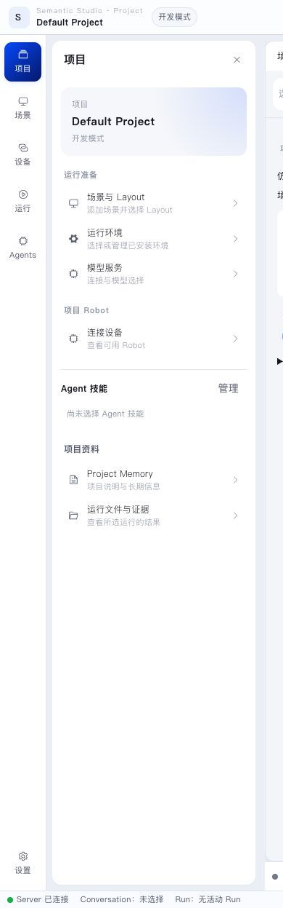

A Project is Semantic's working boundary. Studio organizes Conversation, environments, Robots, Workflow, and Execution inside that Project.

- [Project and Semantic Studio](project-and-studio.en.md)

This section explains what a Project contains and which part of Studio is responsible for each kind of work.
