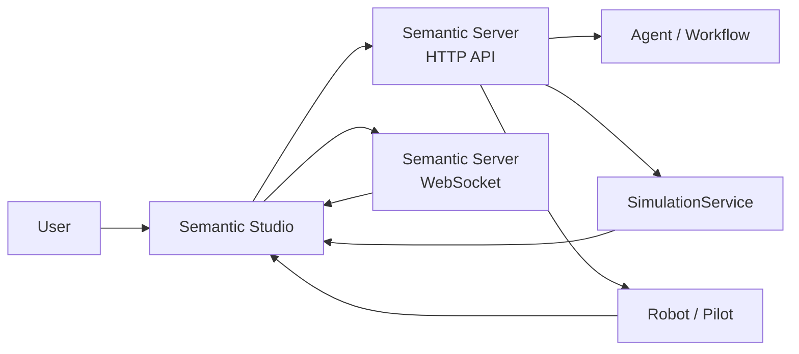
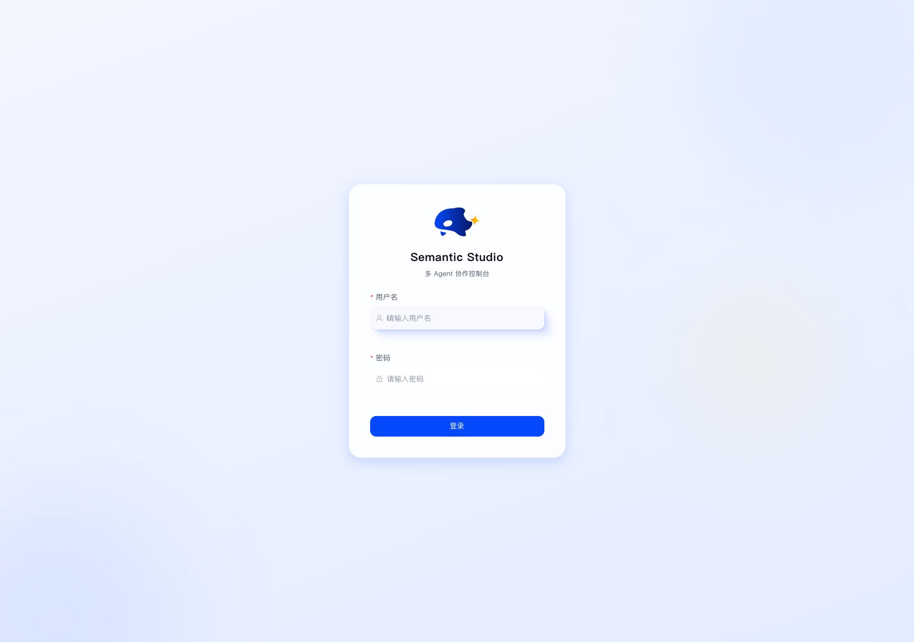
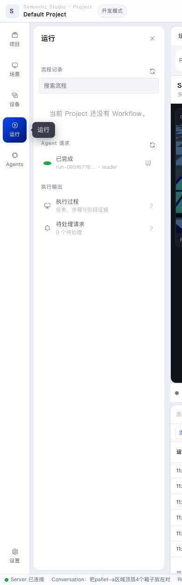

Semantic Studio is the main interface users work with. It organizes Project, Conversation, simulation Scenes, Robots, Workflow, logs, and run evidence in one workspace. Studio itself does not run models, simulation, or robots; every state and action goes through Semantic Server.

## Where the frontend sits

Users see pages and state. Server persists and schedules. The execution layer performs model inference, simulated physics, and robot actions.

## Page map

| Page / region | Purpose | When to use |
|---|---|---|
| Login | Enter Studio with a Server-issued account | First use or after token expiry |
| Project Hub | Open, create, and archive Projects | Start or switch workspace |
| System settings | Configure model services, Runtime, and general settings | First setup or Runtime/model issues |
| Device center | View all Pilots, Robots, Abilities, and executions | Check whether devices are online or occupied |
| Studio main sidebar | Inspect Project resources, Scenes, Robots, and Skills | Prepare a runnable environment |
| Studio center | Show Scene, Conversation, Workflow, Execution, and more | Primary operation and observation |
| Studio right panel | Conversation or Inspector | Collaborate with Agents or inspect details |
| Studio bottom panel | Process, logs, issues, and results | Diagnose execution, model calls, and traces |

## Login

Login only brings the user into the Server-protected Studio. After login, the frontend keeps a session token and pulls initial Project, device, and settings state over the HTTP API.

If the correct credentials still fail, check whether the Web address proxies to the intended Server. With port forwarding to a remote environment, you are logging into that remote Server's accounts, not a local development database.

## Project Hub

Project Hub is the entry for all workspaces. You can open the default Project, create new Projects, archive old ones, and see each Project's last update and revision.

A Project stores working context:

- Conversation and Agent collaboration history;
- Scene, Layout, Runtime Profile, and Semantic Map;
- Plan Proposal, Workflow, Task, and SubTask;
- Robot Execution, Observation, logs, and Artifacts;
- selected Agent Skills, Robot Skills, and device resources.

Robots, Runtime Installations, and the Robot Skill Registry can serve multiple Projects. A Project selects compatible resources when it runs.

## System settings

System settings connect model services, show Runtime installation state, and adjust general configuration. On first use, confirm the model service before entering a Project.

The model service page turns the form into Server model endpoints. Tokens are sent only to Server and are not kept in frontend state. Saving hot-reloads the registry.

## Device center

The device center shows all Pilots, Robots, Ability health, and current execution. It answers:

- whether a Robot is online;
- whether it is idle, running, stopped, or degraded;
- whether it is occupied by a Project, Scene, or Task.

The global device center is for device management; the in-Project device entry focuses on Robots available to the current Project. Both read the same Server state.

## Studio workspace structure

Inside a Project, Studio has five stable regions.

### 1. Left activity bar

The activity bar switches resource categories:

- **Project**: run preparation, Project Robot, Agent Skills, and project material;
- **Scene**: Scene, Layout, map, sensors, and Runtime;
- **Devices**: Robots relevant to the Project;
- **Runs**: Workflow, Execution, and run history;
- **Agents**: Agent configuration and collaboration resources;
- **Settings**: Project-level settings.

### 2. Main sidebar

The main sidebar lists objects in the active category. When preparing to run, you usually:

1. select Scene and Layout;
2. select the Runtime;
3. confirm the model service;
4. check the Project Robot;
5. manage Agent Skills and project material.

### 3. Center Dock

The center Dock is the primary workspace. Scene Viewer, Conversation, Workflow, Execution, map, and sensors open as panels. Layout is saved per Project and restored next time.

### 4. Right panel

The right panel shows Conversation by default and can switch to Inspector. Conversation is for Agent collaboration; Inspector shows the selected object's state, properties, and related entries.

### 5. Bottom panel

The bottom panel observes execution through Process, Logs, Issues, and Results tabs. It can be collapsed without affecting background work.

## Scene and simulation

After a Scene starts, the center shows Physics Viewer. It supports pause, reset, stop, camera switching, and local render rate.

Inspector's Scene Instance shows instance ID, Scene Key, Layout, generation, running state, and simulation time. Generation tells you whether the map or scene was rebuilt.

## Semantic Map and sensors

The Map page shows entities, regions, relations, and map generation. When planning, Agents query this structured state rather than guessing from pixels.

The Sensors page shows RGB, Depth, and Contact data for checking simulation health, object contact, and tool state.

## Conversation and planning

Conversation is the collaboration surface. Collaboration mode suits discussion; Planning mode suits tasks that may produce robot actions because it first creates a Plan Proposal for review.

A Plan Proposal card usually contains:

- task goal and source message;
- allowed Robot;
- allowed Robot Skills;
- major Tasks and completion criteria;
- “View plan” and “Approve and execute”.

A Workflow is created only after approval. Before approval, the Conversation alone does not make the simulation or Robot execute.

## Process, logs, and results

The bottom Process tab shows the current or latest result for a quick check of whether an Agent, Workflow, or Robot is still running.

The Logs tab expands model calls, tool calls, Execution events, and Trace, with source, level, and full-text filters.

Recommended diagnosis order:

1. Process tab: current run state;
2. Issues tab: anything needing user action;
3. Logs tab: model, tool, or Execution errors;
4. Inspector: selected object state and configuration;
5. Conversation: let the Agent continue from what you observed.

## Runs and Agents panels

The Runs panel keeps Workflow, Agent requests, execution outputs, and pending requests in one sidebar. Before a Workflow exists you can still inspect finished Agent Runs.

The Agents area manages Agent, Skill, and Tool resources. Most users do not need to configure them; the default Team and Skills are enough for the first depalletizing plan.

## Typical flows

### Flow A: prepare a runnable Project

1. Open Project Hub.
2. Open the default Project or create a new one.
3. Confirm the model service in system settings.
4. Add a Scene in Studio.
5. Select Runtime Profile and Layout.
6. Start the Layout and confirm the Robot is online.

### Flow B: ask an Agent for a plan

1. Open Conversation.
2. Start a new conversation.
3. Switch to Planning mode.
4. Describe goal, scope, and completion criteria.
5. Wait for a Plan Proposal.
6. Review the card before approving.

### Flow C: observe and diagnose execution

1. Keep Physics Viewer open and watch for refresh.
2. Open the bottom Process tab.
3. Switch to Logs and expand model, tool, and Execution records.
4. Check device center and Project Robot if needed.
5. Use the Runs panel as the source of truth when stopping or resuming Workflows.

## Recommended reading

- Screenshot-based flow: [Best Practice: From Project to Plan](../getting-started/best-practice.en.md)
- Describe goals to Agents: [Conversation, Agents, and Interactions](../collaboration/conversation-agents-and-interactions.en.md)
- Approval, pause, and resume: [Plans and Workflow](../workflow/planning-and-execution.en.md)
- Runtime or device issues: [Troubleshooting](../troubleshooting/_index.en.md)
