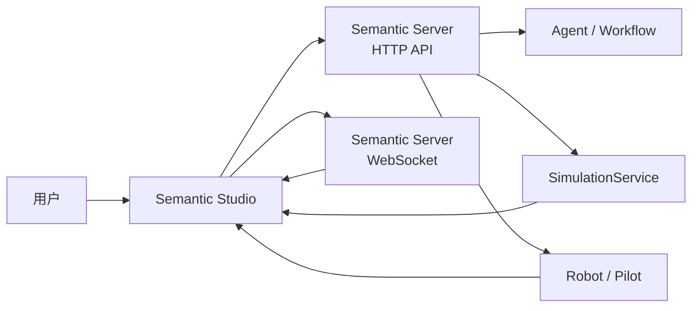

Semantic Studio 是用户接触 Semantic 的主要界面。它把 Project、Conversation、仿真场景、Robot、Workflow、日志和运行证据组织在同一个工作台中。Studio 本身不直接运行模型、仿真或机器人；所有状态和操作都经过 Semantic Server。

## 前端在整体架构中的位置

用户看到的是页面和状态；Server 负责持久化和调度；执行端负责模型推理、仿真物理和 Robot 动作。

## 页面地图

| 页面 / 区域 | 主要作用 | 你什么时候使用它 |
|---|---|---|
| 登录页 | 使用 Server 颁发的账号进入 Studio | 首次使用、Token 过期后 |
| Project Hub | 打开、创建、归档 Project | 开始工作或切换工作空间 |
| 系统设置 | 配置模型服务、仿真 Runtime、通用运行配置 | 首次配置环境、模型或 Runtime 异常时 |
| 设备中心 | 查看全部 Pilot、Robot、Ability 和执行状态 | 检查设备是否在线、是否被 Project 占用 |
| Studio 主侧栏 | 查看当前 Project 的资源、场景、Robot 和技能 | 准备运行环境、选择资源 |
| Studio 中央工作区 | 展示场景、Conversation、Workflow、Execution 等内容 | 主要操作和观察区域 |
| Studio 右侧面板 | Conversation 或 Inspector | 与 Agent 协作、查看对象详情 |
| Studio 底部面板 | 过程、日志、问题、结果 | 排查执行状态、模型调用、工具 Trace |

## 登录页

登录页只负责把用户带入 Server 保护的 Studio。登录成功后，前端会保存会话 Token，并通过 HTTP API 拉取 Project、设备、设置等初始状态。

如果确认账号密码正确但仍无法登录，先检查浏览器访问的 Web 地址是否代理到目标 Server；端口转发到远端环境时，登录的是远端 Server 的账号体系，而不是本机开发数据库。

## Project Hub

Project Hub 是所有工作空间的入口。你可以打开默认 Project、创建新 Project、归档不再使用的 Project，并查看每个 Project 的最近更新时间和 Revision。

Project 保存的是“工作上下文”：

- Conversation 和 Agent 协作历史；
- Scene、Layout、Runtime Profile 和 Semantic Map；
- Plan Proposal、Workflow、Task 和 SubTask；
- Robot Execution、Observation、日志和 Artifact；
- Project 选择的 Agent Skill、Robot Skill 和设备资源。

Robot、Runtime Installation 和 Robot Skill Registry 可以服务多个 Project。Project 在运行时选择与当前任务兼容的资源。

## 系统设置

系统设置用于连接模型服务、查看仿真 Runtime 安装状态和调整通用运行配置。首次使用时，推荐先确认模型服务已连接，再进入 Project。

“模型服务”页会把用户填写的服务信息转换为 Server 中的模型端点。Token 只提交给 Server，不进入前端长期状态。保存后模型注册表会热更新，新的 Conversation 可以使用这些端点。

## 设备中心

设备中心展示 Server 下全部 Pilot、Robot、Ability 健康状态和当前执行。它回答三个问题：

- Robot 是否在线；
- Robot 当前是否空闲、运行、停止或异常；
- Robot 是否被某个 Project、Scene 或 Task 占用。

全局设备中心用于设备管理；Project 内的“设备”入口用于查看当前 Project 可用或正在使用的 Robot。两处读取同一份 Server 状态。

## Studio 工作区结构

进入 Project 后，Studio 分为五个稳定区域。

### 1. 左侧活动栏

活动栏切换当前要处理的资源类别：

- **项目**：运行准备、Project Robot、Agent 技能、项目资料；
- **场景**：Scene、Layout、地图、传感器、Runtime；
- **设备**：当前 Project 相关 Robot；
- **运行**：Workflow、Execution、运行历史；
- **Agents**：Agent 配置与协作相关入口；
- **设置**：Project 级设置。

### 2. 主侧栏

主侧栏显示当前活动类别下的对象。准备运行时，通常在这里完成：

1. 选择场景与 Layout；
2. 选择运行环境；
3. 确认模型服务；
4. 查看 Project Robot；
5. 管理 Agent Skill 和项目资料。

### 3. 中央 Dock

中央 Dock 是主要工作区。Scene Viewer、Conversation、Workflow、Execution、地图和传感器都可以作为面板打开。布局会随 Project 保存，下次进入时恢复。

### 4. 右侧面板

右侧面板默认展示 Conversation，也可以切换到 Inspector。Conversation 用于与 Agent 协作；Inspector 用于查看当前选中对象的属性、状态和关联入口。

### 5. 底部面板

底部面板用于观察运行过程，包含“过程、日志、问题、结果”等页签。面板可以收起，不影响后台运行。

## 场景与仿真页面

启动 Scene 后，中央区域显示 Physics Viewer。它可以查看仿真画面、暂停、重置、停止场景、切换相机和查看本地渲染帧率。

Inspector 中的 Scene Instance 显示当前实例 ID、Scene Key、Layout、generation、运行状态和仿真时间。排障时，`generation` 可以判断地图或场景是否发生了重建。

## Semantic Map 与传感器

“地图”页展示当前环境的 Semantic Map：实体、区域、关系和地图版本。规划时，Agent 查询的就是这类结构化事实，而不是直接根据画面猜测对象位置。

“传感器”页展示 RGB、Depth、Contact 等传感数据。它适合检查仿真正常运行、对象接触关系和机器人工具状态。

## Conversation 与规划

Conversation 是用户和 Agent 协作的入口。协作模式适合普通问答和持续讨论；规划模式适合会让 Robot 产生动作的任务，因为它会先生成 Plan Proposal，等待用户审阅。

Plan Proposal 卡片通常包含：

- 任务目标和来源消息；
- 允许使用的 Robot；
- 允许使用的 Robot Skill；
- 主要 Task 和完成条件；
- “查看计划”和“批准并执行”操作。

计划只有在用户批准后才会创建 Workflow。未批准前，仿真和 Robot 不会因为这段对话自动执行搬运任务。

## 过程、日志与结果

底部“过程”页显示当前运行或最近结果，适合快速确认 Agent、Workflow 或 Robot 是否仍在运行。

“日志”页用于展开模型调用、工具调用、Execution 事件和 Trace。可以按来源、级别和全文搜索过滤。

推荐排查顺序：

1. 看过程页：当前运行处于什么状态；
2. 看问题页：是否有需要用户处理的问题；
3. 看日志页：模型、工具或 Execution 是否报错；
4. 看 Inspector：选中对象的配置和状态是否正确；
5. 回到 Conversation：让 Agent 基于你看到的现象继续分析。

## 运行与 Agents 面板

“运行”页把 Workflow、Agent 请求、执行输出和待处理请求放在同一侧栏中。没有 Workflow 时，也可以先查看已完成的 Agent Run 和相关日志。

“Agents”页集中管理 Agent、Skill 和 Tool 等构建资源。普通用户通常不需要先配置这些资源；默认 Team 和默认 Skill 已经足够完成第一轮拆码垛规划。

## 典型操作流

### 流程 A：准备一个可运行 Project

1. 打开 Project Hub；
2. 打开默认 Project 或新建 Project；
3. 在系统设置中确认模型服务；
4. 在 Studio 中添加 Scene；
5. 选择 Runtime Profile 和 Layout；
6. 启动 Layout，确认 Robot 在线。

### 流程 B：让 Agent 生成计划

1. 打开右侧 Conversation；
2. 新建对话；
3. 切换为规划模式；
4. 描述目标、范围和完成条件；
5. 等待 Plan Proposal；
6. 审阅计划卡，再决定是否批准执行。

### 流程 C：观察执行和排障

1. 保持 Physics Viewer 打开，观察场景是否正常刷新；
2. 打开底部过程页，查看当前运行；
3. 切换日志页，展开模型、工具和 Execution 记录；
4. 必要时查看设备中心和 Project Robot；
5. 停止或恢复 Workflow 时，以运行面板的实际状态为准。

## 推荐阅读

- 按截图完成完整流程：[最佳实践：从 Project 到规划](../getting-started/best-practice.md)
- 学会与 Agent 表达目标：[Conversation、Agent 与 Interaction](../collaboration/conversation-agents-and-interactions.md)
- 理解批准、暂停和恢复：[计划与 Workflow](../workflow/planning-and-execution.md)
- 排查 Runtime 或设备问题：[问题排查](../troubleshooting/_index.md)
